# AULA F87 Pro 구성품 및 리뷰

::: info 제품 구매
구매 후 거의 3주만에 제품을 수령했습니다.\
**블루(스타트렉) 색상의 황축(옐로우축 V3) 제품**과\
**그린 색상의 회목축(그레이축 V4) 제품**을 함께 구매했습니다.
:::

## 제품 패키지 정면
**F87**이라는 제품명이 패키지에 크게 프린트되어 있습니다.\
내수용 제품 특성상 대부분 안내 문구 및 제품 정보가 중국어와 영어로 되어있습니다.
|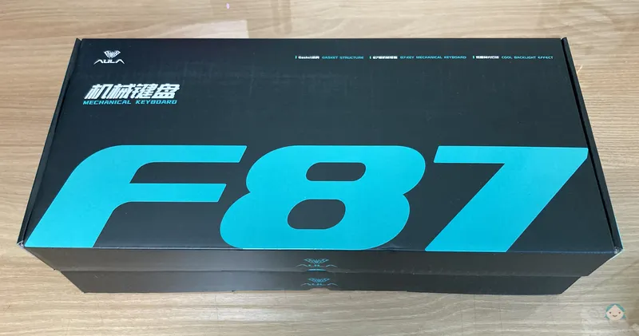{:class='image'}|
|:--:|
| *제품 패키지 정면*{:class='caption'} |

## 개봉
간혹 수신기가 동봉되지 않거나 동일한 키 캡이 꼽혀있다든지 하는 문제들이 보고되었지만,\
제가 수령한 두 제품에는 특별한 이상이 없었습니다.
|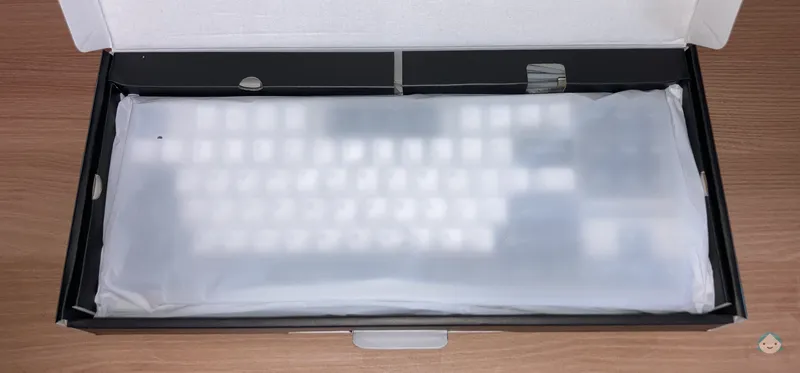{:class='image'}|
|:--:|
| *패키지 개봉*{:class='caption'} |

## 구성품
내용물은 키보드(본품), 투명 루프, USB 케이블, 키 캡&스위치 리무버, 샘플 스위치 2개, 매뉴얼 및 보증서\
로 알차게 구성되어 있습니다.\
**이 가격대 키보드에서 절대 볼 수 없는 알찬 구성에 놀랐습니다.**
|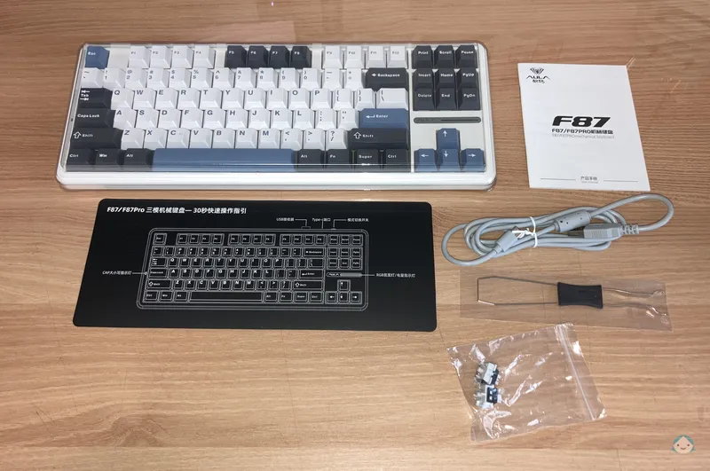{:class='image'}|
|:--:|
| *구성품*{:class='caption'} |

## 블루(스타트렉) 색상 제품
이미지나 영상으로 접했을 때는 블루 색상이 이뻤던 것 같은데 실물은 평범했습니다.
|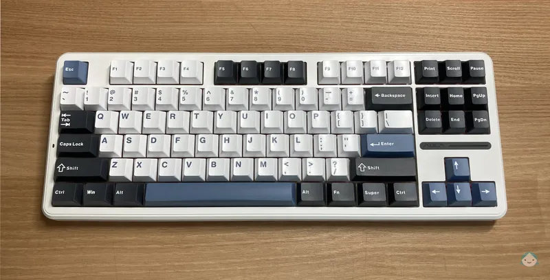{:class='image'}|
|:--:|
| *AULA F87 Pro 블루(스타트렉)*{:class='caption'} |

## 그린 색상 제품
사실 블루(스타트렉) 색상의 황축 제품만 구매하려 했지만, 기본인 회목축이 궁금해서 추가 구매한 제품입니다.\
단순히 색상만 녹색 계열인 것만 차이가 있을 거라 생각하고 아무 생각 없이 구매했는데 **실물은 그린 색상이 훨씬 깔끔하고 이쁩니다.**\
(키캡 폰트와 폰트 위치 때문에 더욱 그런듯 합니다.:heart:)
|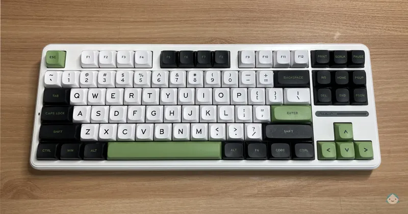{:class='image'}|
|:--:|
| *AULA F87 Pro 그린*{:class='caption'} |

## 바닥면
2개의 받침대가 제공되며 그에 맞게 총 3단의 높이로 조절이 가능합니다.\
총 4개의 고무 패드가 있어 타건 시 미끄러짐을 방지해 줍니다.\
키보드 바닥면을 촬영하려고 뒤집으면서 **묵직함에 한 번 더 놀랐습니다.**
|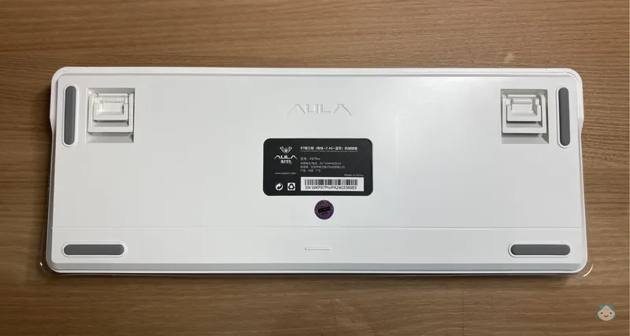{:class='image'}|
|:--:|
| *바닥면*{:class='caption'} |

## 후면
키보드 후면에는
::: info AULA F87 Pro 후면
* 블루투스, 직결, 2.4 무선 연결 스위치
* USB-C 단자
* USB 수신기 보관함
:::
순서대로 위치하고 있습니다.\
**USB 수신기 보관함**은 분실 방지를 위해 수신기를 고정할 수 있도록 <u>약한 자성</u>을 띄도록 설계되어 있습니다.
|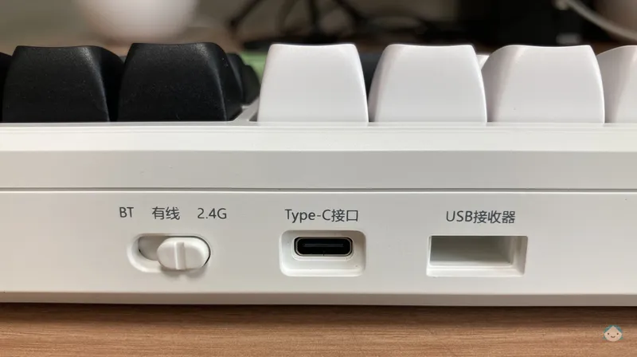{:class='image'}|
|:--:|
| *후면*{:class='caption'} |

## 조명
AULA F87 Pro 키보드에는
::: info AULA F87 Pro 조명
* 앰비언트 바
* 측면
* 백라이트
:::
총 3가지의 조명을 제공합니다.

### 앰비언트 바
방향키 위에 AULA 로고와 함께 위치하고 있습니다.
|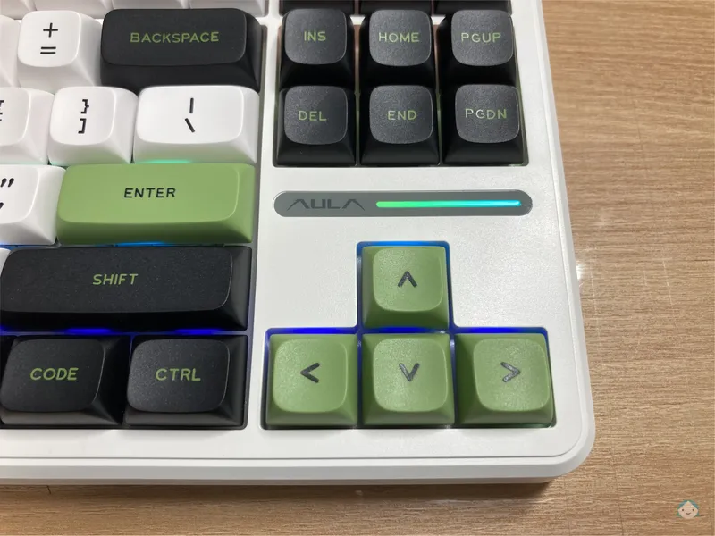{:class='image'}|
|:--:|
| *앰비언트 바*{:class='caption'} |
::: tip 앰비언트 바 조명 조합키
| 조합 | 기능 |
| :--: | :--: |
| **Fn + 좌측 Shift** | 조명 모드 전환 |
| **Fn + Z** | 조명 색상 전환 |
| **Fn + B** | 배터리 잔량 표시 모드 |
:::

### 측면
좌우 측면에 위치하고 있습니다.
|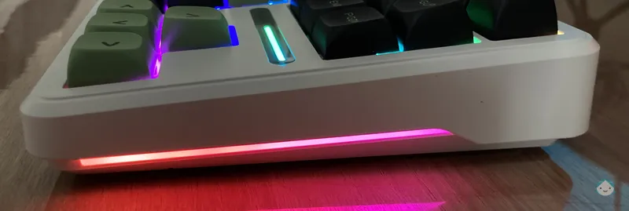{:class='image'}|
|:--:|
| *측면*{:class='caption'} |
::: tip 측면 조명 조합키
| 조합 | 기능 |
| :--: | :--: |
| **Fn + 우측 Shift** | 조명 모드 전환 |
| **Fn + / or ?** | 조명 색상 전환 |
| **Fn + 우측 Alt** | 조명 밝기 전환 |
| **Fn + 우측 Ctrl** | 조명 효과 속도 전환 |
:::

### 백라이트
각 키마다 따로 처리됩니다.
|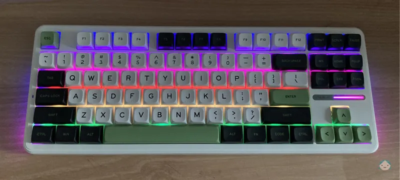{:class='image'}|
|:--:|
| *백라이트*{:class='caption'} |
::: tip 백라이트 조명 조합키
| 조합 | 기능 |
| :--: | :--: |
| **Fn + Insert** | 조명 모드 전환 |
| **Fn + Delete** | 조명 색상 전환 |
| **Fn + ↑** | 조명 밝게 |
| **Fn + ↓** | 조명 어둡게 |
| **Fn + ←** | 조명 효과 느리게 |
| **Fn + →** | 조명 효과 빠르게 |
:::

### 조명 영상
앰비언트 바

  <video width="800" muted autoplay loop playsinline>
    <source src="./videos/right.mp4" type="video/mp4" >
  </video>

 

백라이트

  <video width="800" muted autoplay loop playsinline>
    <source src="./videos/top.mp4" type="video/mp4" >
  </video>

## 스위치 교체하기 (핫스왑)
구성품에 포함된 키 캡&스위치 리무버와 샘플 스위치를 이용해 핫스왑을 해보도록 하겠습니다.

리무버의 와이어 부분을 제거할 키 캡에 걸어 위로 살짝만 당겨주면 키 캡이 쉽게 제거됩니다.
|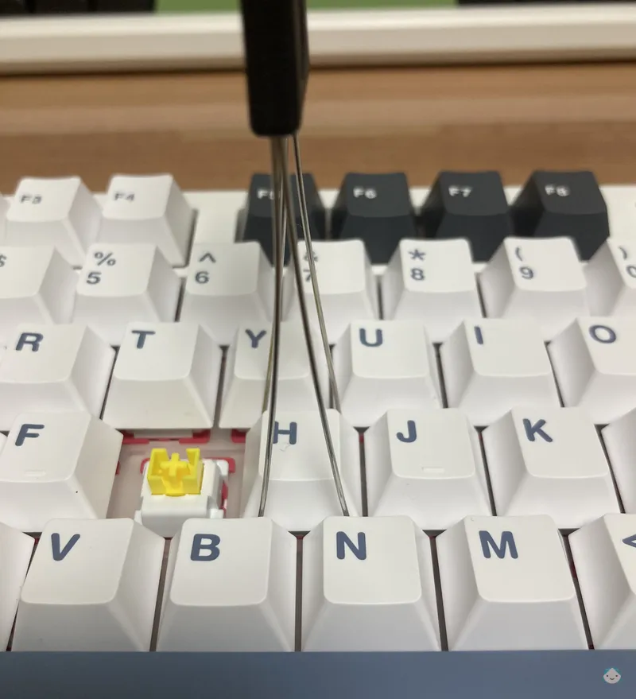{:class='image'}|
|:--:|
| *키 캡 제거*{:class='caption'} |

리무버의 집게 부분을 제거할 스위치 접촉 바닥면에 닿도록 하여 찝어 당겨주면 스위치가 제거됩니다.
|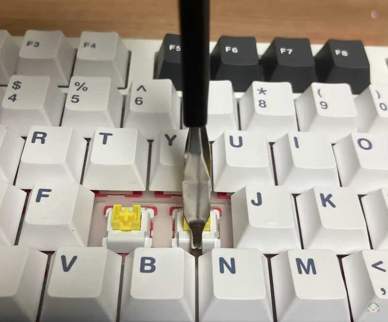{:class='image'}|
|:--:|
| *스위치 제거*{:class='caption'} |

샘플 스위치를 핀 모양에 맞춘 상태로 올려두고 위에서 키보드 방향으로 가볍게 눌러줍니다.
|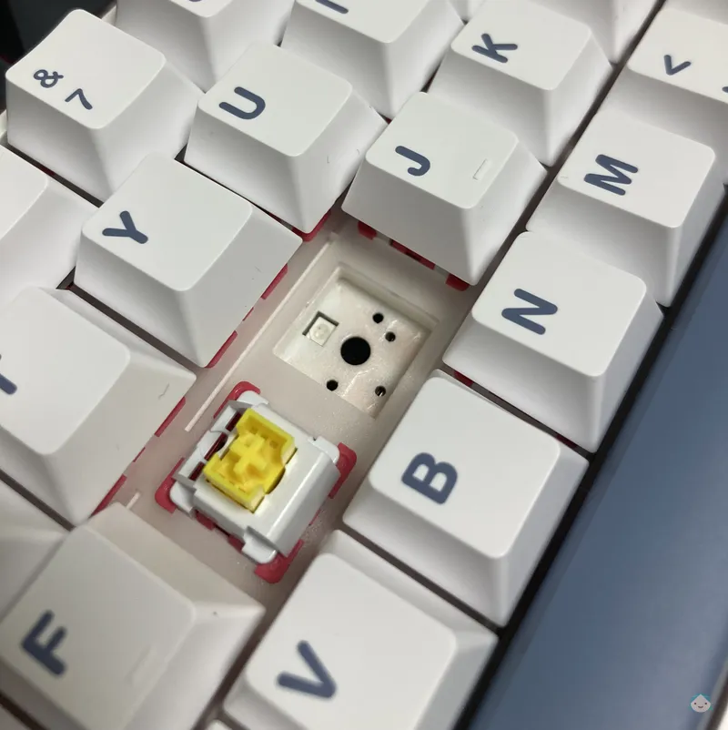{:class='image'}|
|:--:|
| *스위치가 제거된 상태*{:class='caption'} |

스위치 교체가 완료되었습니다.
|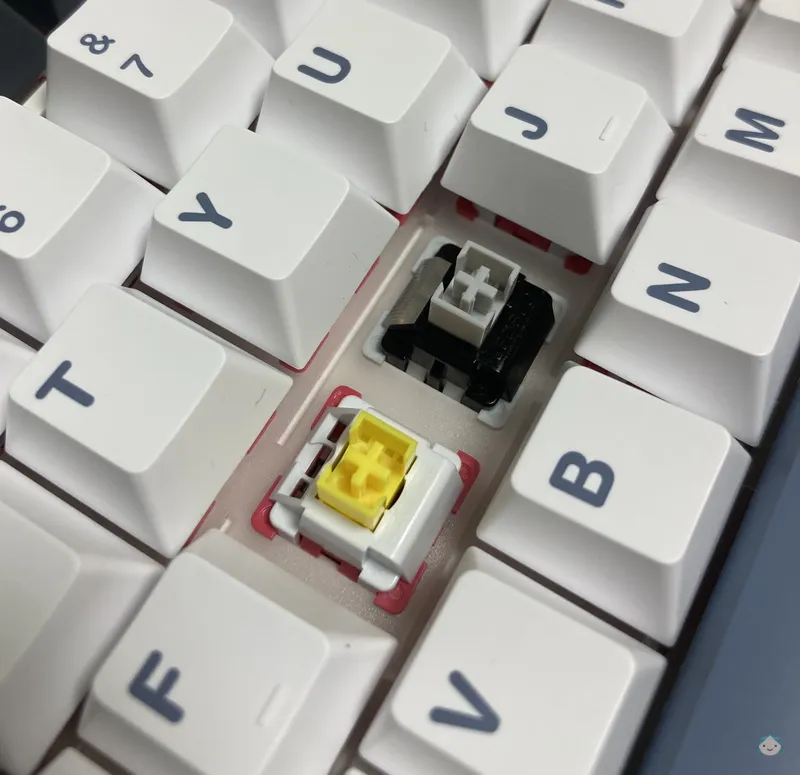{:class='image'}|
|:--:|
| *스위치가 교체된 상태*{:class='caption'} |

## 타건 음
::: info 키 입력 순서 
1. k * 3
1. b * 3
1. d * 3
1. Enter * 3
1. Shift * 3
1. Space * 3
1. 무작위
:::

 

회목축(그레이 축 V4:Grey V4)

  <audio controls preload="none">
    <source src="./audio/grey.mp3" type="audio/mpeg" >
    <source src="./audio/grey.ogg" type="audio/ogg" >
  </audio>

 

황축(옐로우 축 V3:Yellow V3)

  <audio controls preload="none">
    <source src="./audio/yellow.mp3" type="audio/mpeg" >
    <source src="./audio/yellow.ogg" type="audio/ogg" >
  </audio>

## 그 외 유용한 조합키
::: tip 운영체제 모드 전환 조합키
| 조합 | 기능 |
| :--: | :--: |
| **Fn + Q** | Android 모드 |
| **Fn + W** | Windows 모드 |
| **Fn + E** | Mac 모드 |
| **Fn + R** | iOS 모드 |
:::

::: tip 특수 조합키
| 조합 | 기능 |
| :--: | :--: |
| **Fn + ESC (3초간 길게)** | 공장 출고 설정으로 초기화 |
| **Fn + `~ (3초간 길게)** | 2.4G 무선 수신기 수동 페어링 |
| **Fn + Win** | Windows 키 잠금/해제 |
| **Fn + 1** | 블루투스 기기 #1 |
| **Fn + 2** | 블루투스 기기 #2 |
| **Fn + 3** | 블루투스 기기 #3 |
:::

## AULA(펀키스) 지원
매뉴얼
* [퀵 가이드](https://funkeys.co.kr/bbs/download.php?bo_table=download&wr_id=266&no=1&sfl=wr_subject&stx=f87&sop=and)
* [설명서](https://funkeys.co.kr/bbs/download.php?bo_table=download&wr_id=266&no=3&sfl=wr_subject&stx=f87&sop=and)

 

소프트웨어
* [전용 소프트웨어 (AULA F87 PRO 설치 파일 선택 다운로드)](https://mybox.naver.com/share/list?shareKey=9o9oO0SmY48FmXaJ44rRNYTVomeRmi7wl2TTVLzuO2AE)

 

펌웨어
* [펌웨어 파일](https://funkeys.co.kr/bbs/download.php?bo_table=download&wr_id=287&no=0&sfl=wr_subject&stx=f87&sop=and)

::: danger 펌웨어 설치 경고
현재 사용하시는 제품에 이상이 없다면 <u>**펌웨어 업데이트를 진행하지 마세요.**</u>
:::

## 짤막 리뷰
* 장점
    1. 저렴한 가격
    1. 깔끔한 마감과 묵직함
    1. 다양한 기능
    1. 독립적으로 작동하는 백라이트
    1. 정숙한 타건감
    1. 다양한 무선 연결 지원

* 단점
    1. 살짝 아쉬운 품질관리(QC)
    1. 낮은 키압

## 총평
* 기계식 키보드에 입문하는 분들께 강력 추천해 드리며, 꼭 입문자가 아니더라도 충분히 만족할 만한 좋은 제품입니다.