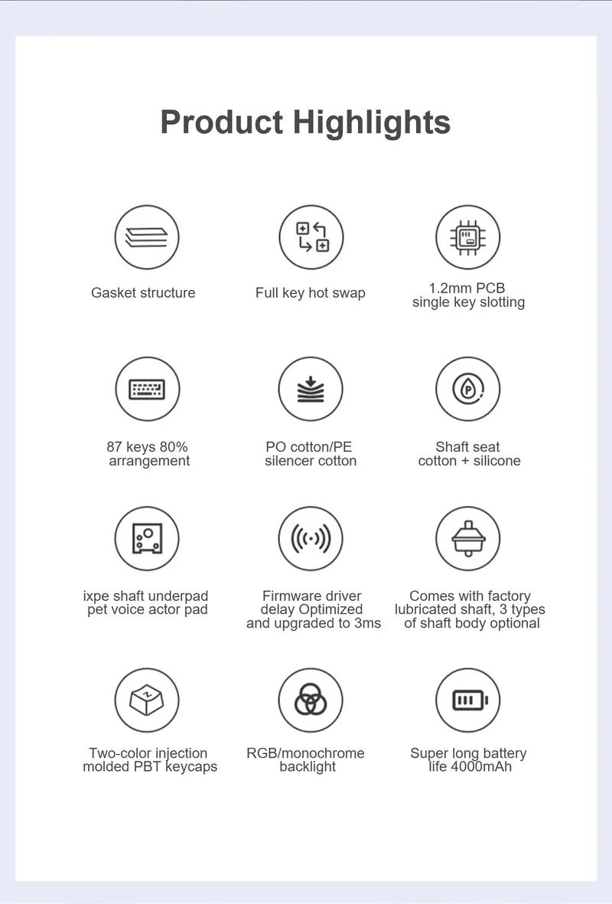
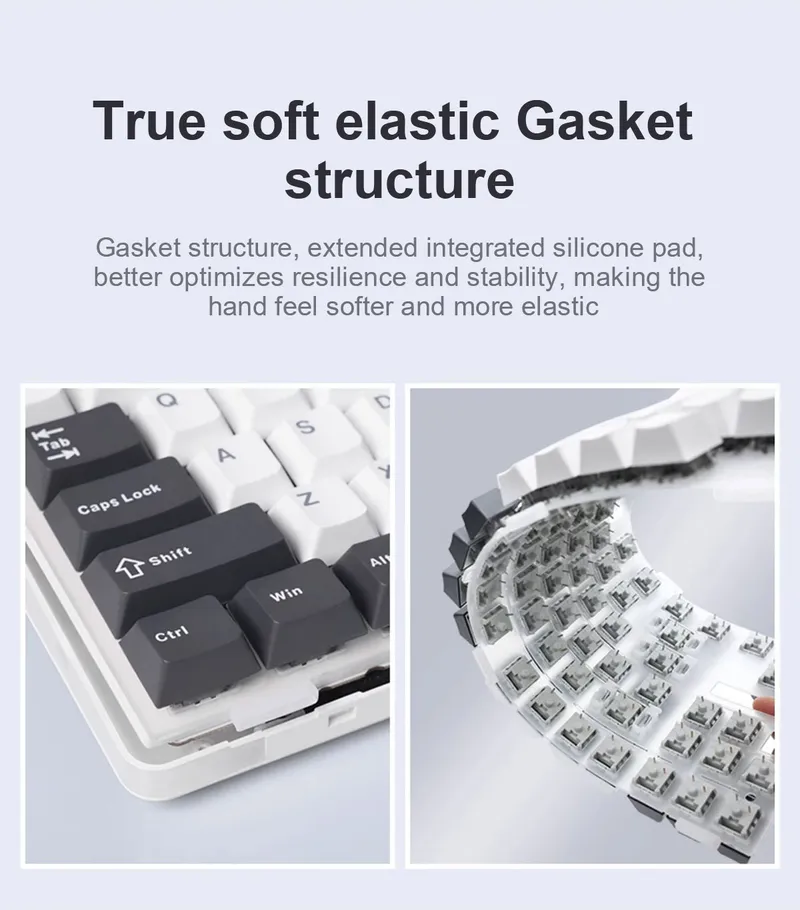

# AULA F87 Pro 소개

|{:class='no-border'}|
|:--:|
| *출처 : AULA 공식 홈페이지*{:class='caption'} |

## 제품 주요 기능
::: info 제품 주요 기능
- 텐키리스(87키) 레이아웃 
- 섀도 블랙, 화이트 두 가지 색상(정식 발매 제품에 해당)
- 탄성감 있는 타건감을 위한 가스켓 마운트 및 Flex-cut PCB 설계
- 5중 흡음 처리로 불필요한 잡음 억제
- PBT 이중 사출 한글+영문 키 캡 적용
- 부드러운 폴리카보네이트(PC) 보강판 적용
- 정방향 스위치 체결 및 핫스왑(축 변경) 가능
- 백라이트 RGB LED 적용 및 다양한 효과
- 키보드에 수납 가능한 2.4G 무선 USB 수신기
- 4000mAh 대용량 배터리 내장

*출처 : 펀키스 공식 스마트 스토어*
:::

|{:class='image'}|
|:--:|
| *출처 : AULA 공식 홈페이지*{:class='caption'} |

## 다양한 색상
AULA F87 Pro는 멋진 외관과 더불어 견고함을 자랑합니다.
|{:class='image'}|
|:--:|
| *출처 : AULA 공식 홈페이지*{:class='caption'} |

## 87키의 간소화된 레이아웃
AULA F87 Pro는 심플하고 스타일리시한 모바일 오피스는 공간을 절약하고 코딩을 더욱 편안하게 하며 데스크톱에 더 많은 공간을 제공합니다.
|{:class='image'}|
|:--:|
| *출처 : AULA 공식 홈페이지*{:class='caption'} |

## 5중 흡음 처리
AULA F87 Pro는 기판(PCB), 보강판, 축 사이의 틈을 메워 축이 보강판에 부딪히는 소음에 효과적으로 대응하고 견고한 느낌을 제공합니다.
|{:class='image'}|
|:--:|
| *출처 : AULA 공식 홈페이지*{:class='caption'} |

## 기판(PCB) 단일 키 슬롯
PCB 단일 키 1.2mm 슬롯은 천위안 지폐 공정 구성과 비슷합니다. 한 축당 한 슬롯 설계는 일관성을 더 잘 최적화하고 부드러운 탄성을 보장합니다.
|{:class='image'}|
|:--:|
| *출처 : AULA 공식 홈페이지*{:class='caption'} |

## 폴리카보네이트(PC) 보강판
슬롯형 보강판은 키를 누를 때 생기는 문제를 해결하고 주변 키의 안정성 및 사용감을 개선합니다.
|{:class='image'}|
|:--:|
| *출처 : AULA 공식 홈페이지*{:class='caption'} |

## 부드러운 탄성의 가스켓 구조
가스켓 구조, 확장된 통합 실리콘 패드, 탄력성과 안정성을 더욱 최적화하여 좀 더 부드럽고 탄력 있게 느껴집니다.
|{:class='image'}|
|:--:|
| *출처 : AULA 공식 홈페이지*{:class='caption'} |

## 전체 키축 핫 스왑 가능
키축 본체를 자유롭게 교체하여 사용자의 취향에 맞는 키보드를 커스터마이징할 수 있습니다.
|{:class='image'}|
|:--:|
| *출처 : AULA 공식 홈페이지*{:class='caption'} |

## 스테빌라이저 미세 조정
공장 출고 시 정교하고 세심하게 조정된 스테빌라이저가 제공되어 큰 크기의 키의 균형감을 높이고 소음을 줄입니다.
|{:class='image'}|
|:--:|
| *출처 : AULA 공식 홈페이지*{:class='caption'} |

## RGB 다이나믹 뮤직 그루브
독립된 RGB 백라이트, 약 1,600만개의 색상, 16가지 드라이버 프리 조명 모드를 설정할 수 있으며 10가지 음악 리듬 RGB 조명 효과를 드라이버로 구현 가능합니다.
|{:class='image'}|
|:--:|
| *출처 : AULA 공식 홈페이지*{:class='caption'} |

## 2색 PBT 키캡
ABS 소재보다 훨씬 높은 내구성과 오랜 시간 사용해도 키 표면이 번질거리지 않아 편안한 작업 환경을 제공합니다.
|{:class='image'}|
|:--:|
| *출처 : AULA 공식 홈페이지*{:class='caption'} |

## RGB 측면 조명
키보드 좌우 측에 새 조명 스트립이 추가되어 다양한 색상으로 동적/정적 조명 효과를 설정하여 멋진 게임 분위기를 연출할 수 있습니다.
|{:class='image'}|
|:--:|
| *출처 : AULA 공식 홈페이지*{:class='caption'} |

## 상세 스펙
|||
| :-------------: | -------------- |
| **연결** | Type-C 유선 및 2.4G 무선 및 BT |
| **키 개수** | 87키 |
| **크기** | 365.9 x 139 x 41.1mm|
| **무게** | 약 916g(케이블/수신기 제외) / 약 935g(케이블/수신기 포함) |
| **충전 전압/전류** | DC 5V 600mA |
| **정격 전압** | DC 3.7V(전체 4.2V) |
| **정격 전류** | 180mA @37V(기본 조명 효과) / 15mA(모든 조명 꺼짐) |
| **배터리** | 약 22시간(기본 조명 효과) / 약 266시간(모든 조명이 꺼진 상태) |
| **운영 체제** | WIN XP/7/8/10/Android/IOS/MAC(소프트웨어 포함) |
| **기타** | 핫스왑 가능, FN 키 다기능 |