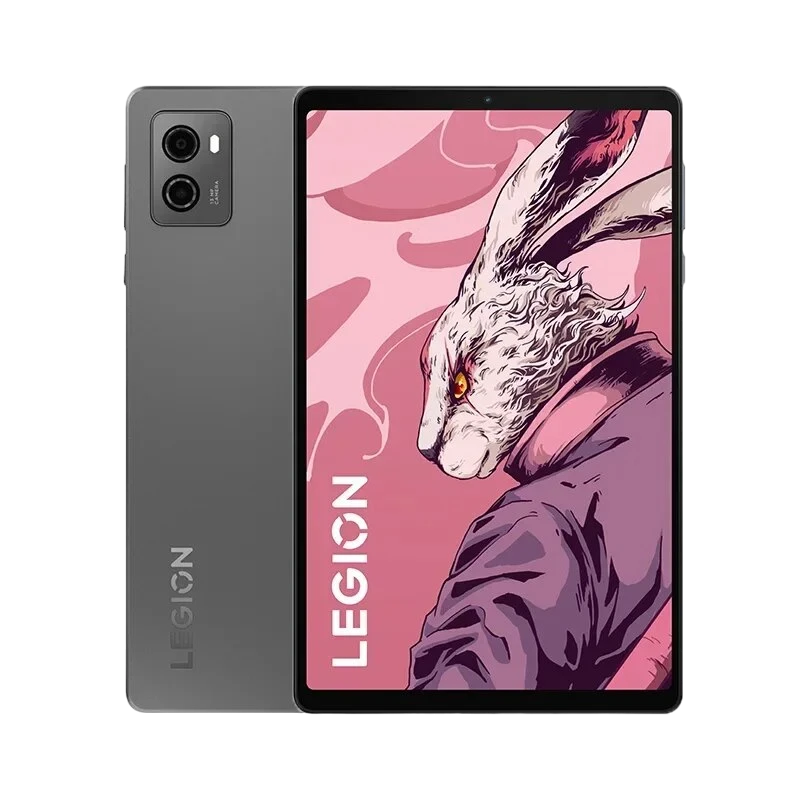

# 레노버 리전 Y700 2세대 소개

::: info 기본 정보
레노버 리전 Y700 2023은 8.8인치 IPS LCD 스크린을 탑재하여 사진과 동영상에 생동감을 불어넣습니다. 안드로이드 13 OS는 더욱 멋진 사용자 경험을 보장합니다. 스냅드래곤 8+ 1세대 옥타코어 프로세서와 256GB/512GB의 UFS 3.1 스토리지로 구동되며 부드러운 작동과 안정적인 멀티태스킹 환경을 제공합니다.
:::

## 상세

### 제품 주요 기능
안드로이드 13 OS
레노버 리전 Y700 2023은 이동 중에도 연결성과 생산성을 유지할 수 있는 새롭고 빠른 플랫폼을 제공하는 안드로이드 13 운영 체제 기반의 ZUI 15에서 실행됩니다.

### 다국어 지원
영어, 중국어 등 다국어를 제공합니다.

### 8.8인치 LCD 화면
레노버 리전 Y700 2023은 2560*1600 해상도의 8.8인치 2.5K LCD 디스플레이를 갖추고 있으며 144Hz 재생률, 500nit 밝기, DC 디밍, 100% DCI-P3 색 재현율 및 Dolby Vision 등을 지원합니다.

### 퀄컴 스냅드래곤 8+ 1세대 칩셋
레노버 리전 Y700 2023은 스냅드래곤 8+ 1세대 옥타코어 프로세서로 구동됩니다.

### 12GB/16GB LPDDR5 RAM 및 128GB/256GB 스토리지
레노버 리전 Y700 2023은 12GB/16GB의 LPDDR5 RAM과 256GB/512GB의 UFS 3.1 스토리지가 장착되어 있으며, 스토리지 확장을 위한 MicroSD 카드 슬롯이 있습니다. 

### 사진 및 화상 채팅을 위한 듀얼 카메라
레노버 리전 Y700 2023에는 1300만 화소 후면 카메라와 안면인식을 지원하는 800만 화소 전면 카메라 등 두 개의 카메라가 탑재되어 있습니다.

### 안면인식
레노버 리전 Y700 2023은 안면인식을 지원합니다.

### 6550mAh 장시간 대기 배터리
레노버 리전 Y700 2023은 45W 고속 충전을 지원하는 6550mAh 배터리를 탑재하고 있습니다. 초절전 모드를 사용하면 충전 사이에 휴대폰 전원을 더 오래 켤 수 있습니다.

### 호환 장치와 동기화되는 블루투스 5.3 인터페이스 
컴퓨터와의 블루투스 지원 휴대폰 또는 MP3 플레이어 간에 사진, 음악 및 기타 미디어를 무선으로 전송하거나 블루투스 무선 액세서리를 연결할 수 있습니다.

### 듀얼 밴드, Wi-Fi Direct
802.11 a/b/g/n/ac/ax 무선 인터넷으로 사용 가능한 무선 네트워크 범위 내에서 웹에 연결할 수 있습니다.

### 기타 기능
레노버 리전 Y700 2023에는 듀얼 JBL 스피커, Dolby Atmos, 듀얼 밴드 Wi-Fi 및 Bluetooth 5.1이 탑재되어 있습니다. 충전 및 연결을 위한 두 개의 USB Type-C 3.1 2세대 Type-C 포트가 있습니다.

## 추가 정보

| **모델** | 레노버 리전 Y700 2023 |
| :-------------: | :------------- |
| **색상** | 크리스탈 그레이, 그레이셔 블루 |
| **운영 체제** | 안드로이드 13 기반 ZUI 15 |
| **네트워크** | 무선 Wi-Fi 6 (802.11 a/b/g/n/ac/ax), 블루투스 5.3 |
| **밴드** | 없음 |
| **캐리어** | 해제됨 |
| **언어** | 다국어 |
| **구글 플레이** | 예 |
| **화면** | 8.8 인치 LCD 화면, 144Hz 주사율, 500nit 밝기, DC 디밍 및 Dolby Vision |
| **프로세서** | CPU: 퀄컴 스냅드래곤 8+ 1세대 옥타코어 프로세서 |
| **메모리** | 12GB/16GB LPDDR5 |
| **저장장치** | 256GB/512GB, support 1TB Micro SD card (not included) |
| **후면 카메라** | 1300만 화소 |
| **전면 카메라** | 800만 화소 |
| **배터리** | 6550mAh (Bypass 충전지원, 최대 충전속도 45W) |
| **슬롯** | 1TB 마이크로 SD 카드 지원 |
| **크기** | 208.54 x 129.46 x 7.6mm |
| **무게** | 350g |
| **구성품** | 본품, 충전기, USB C타입 케이블 |