# 레노버 리전 Y700 2세대 전용 액세서리 리뷰

::: info 전용 액세서리

- 투명 젤리 케이스
- 좀비 베리어 로열 AR 고화질 무반사 액정 보호 필름
- 윌비 클립온2 노패드 미니 태블릿용 스트랩
  :::

## 케이스

Y700 2세대를 구입하면서 다양한 케이스를 검색해 봤지만 마음에 드는 실리콘 케이스를 찾지 못했습니다.\
처음에는 이미지와 같이 휴대 전화에 많이 사용되는 재질로 덮개가 있는 실리콘 케이스(마그네틱을 지원하는)가 당연히 있을 거라 생각했는데 없기도 했지만 Y700 2세대 전용 케이스 자체가 종류가 몇 없었습니다.\
(생각 보다 많이 팔리진 않았나 봅니다. :()
|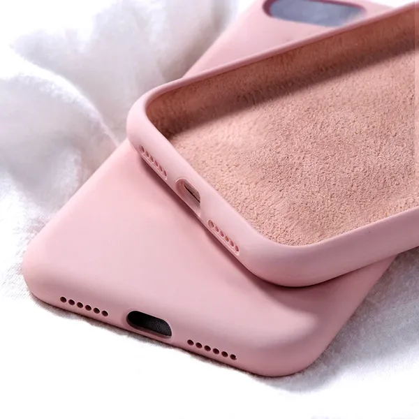{:class='image'}|
|:--:|
| _출처 : 알리익스프레스_{:class='caption'} |

아래와 같이 몇가지 제품을 추려서,

- 레노버 Y700 2세대 정품 케이스
- TPU 재질의 케이스
- **투명 젤리 케이스**

그중 구매하기로 결정한 것이 **투명 젤리 케이스**입니다.\
투명 젤리 케이스 구매 이유는 일단 가장 저렴하면서 케이스 본연의 역할인 태블릿 보호를 잘해줄 것으로 생각되었고, 이미지와 같은 원하는 색상의 실리콘 케이스 제품이 출시되면(나올지 알 수 없지만...) 바로 갈아탈 생각으로요.

저렴한 가격에 딱 맞는 품질의 일반 투명 젤리 케이스입니다.\
(제품 카탈로그는 왜 아이패드 모양을??)
|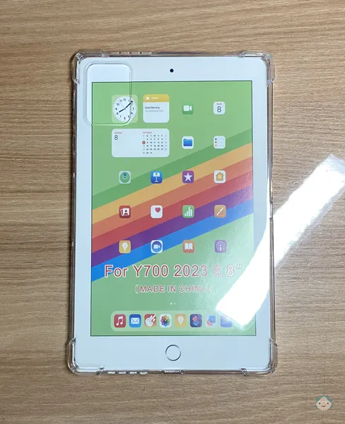{:class='image'}|
|:--:|
| _Y700 2세대 젤리 케이스_{:class='caption'} |

| 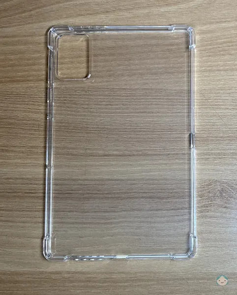{:class='image'} |
| :------------------------------------------------------------------------------------------: |
|                          _Y700 2세대 젤리 케이스_{:class='caption'}                          |

헐겁다거나 너무 타이트하지 않게 잘 장착됩니다.\
두께는 일반 투명 젤리 케이스들이 그렇듯이 두텁습니다.\
측면과 하단 충전 단자 부분 그리고 스피커가 있는 부분은 정상적으로 오픈되어 있고, 전원과 음량 버튼 부분은 보호를 위해 밀폐된 형식입니다.
|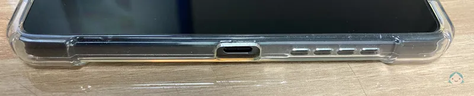{:class='image'}|
|:--:|
| _케이스 하단_{:class='caption'} |

| 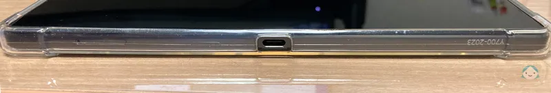{:class='image'} |
| :--------------------------------------------------------------------------------------------------: |
|                                  _케이스 좌측면_{:class='caption'}                                   |

| 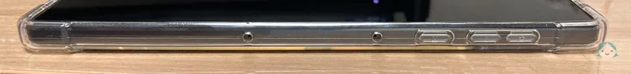{:class='image'} |
| :---------------------------------------------------------------------------------------------------: |
|                                   _케이스 우측면_{:class='caption'}                                   |

| 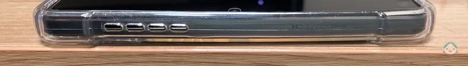{:class='image'} |
| :-----------------------------------------------------------------------------------------------: |
|                                  _케이스 상단_{:class='caption'}                                  |

### 총평

- 나는 디자인은 신경 쓰지 않는다.
- 오직 제품의 보호를 위해 케이스를 사용한다.

하시는 분들은 구매하셔도 좋습니다.

## 액정 보호 필름

태블릿 구매 전부터 액정이 거울처럼 비춰서 부담스럽다는 이야기들이 많아\
무려 2만원이 넘는 고가의 좀비 베리어 로열 AR 고화질 무반사 액정보호필름을 구매했습니다.\
 
[좀비 베리어 로열 AR 고화질 무반사 액정보호필름 제품 링크](https://zombibarrier.com/product/detail.html?product_no=4584&cate_no=345&display_group=1)
|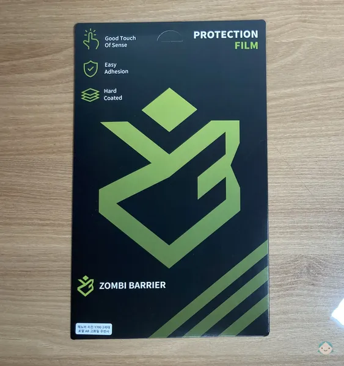{:class='image'}|
|:--:|
| _좀비 베리어 로열 AR 고화질 무반사 액정 보호 필름_{:class='caption'} |

 

내용물은 필름 1매, 설명서, 먼지 제거 스티커, 기포 제거용 헤라, 청소 티슈로 구성되어 있습니다.\
부착 난이도는 **휴대폰보다 어렵지만 대형 사이즈의 태블릿에 비하면 쉽게** 작업할 수 있었습니다.
|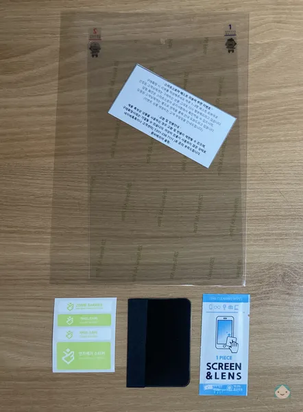{:class='image'}|
|:--:|
| _좀비 베리어 로열 AR 고화질 무반사 액정 보호 필름_{:class='caption'} |

 

고가의 필름이라 성능에 큰 기대를 걸었지만, **원초적으로 강력한(?) 액정 반사**를 막아주진 못합니다.\
<ins>**그런데 정말 신기하게도 사용하면서 내 얼굴이 비쳐 깜놀한적은 없다는 게 신기했습니다.**</ins>
|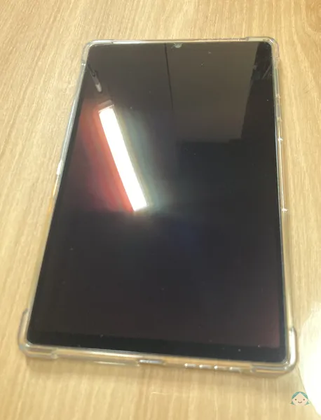{:class='image'}|
|:--:|
| _좀비 베리어 로열 AR 고화질 무반사 액정 보호 필름_{:class='caption'} |

### 총평

- 태블릿으로 영상을 볼 때 어두운 화면으로 바뀌는 경우 비치는 비주얼에 깜짝 깜짝 놀라는 분들에게 **매우** 유용합니다.

## 스트랩

휴대폰을 쓸 때 스트랩을 정말 유용하게 썼던 기억이 있어서 많은 종류의 스트랩을 검색해 보았습니다.\
그중 촌스럽지 않고 제 기능을 해줄 것 같은 제품인 윌비 제품을 선택했습니다.\
**윌비 태블릿 용 <u>스트랩 제품의 종류가 굉장히 많고 제각각 사이즈와 기능이 다르니</u> 구매하실 경우 잘 확인하고 구매하시기 바랍니다.**
|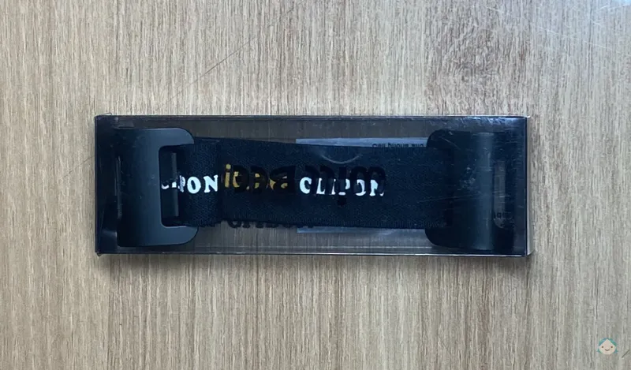{:class='image'}|
|:--:|
| _윌비 클립온2 노패드 미니 태블릿용_{:class='caption'} |

 

[윌비 클립온2 노패드 미니 태블릿용 제품 링크](https://www.coupang.com/vp/products/6245901600?itemId=12634085461&vendorItemId=87090070189&src=1032034&spec=10305198&addtag=400&ctag=6245901600&lptag=I12634085461&itime=20240409232420&pageType=PRODUCT&pageValue=6245901600&wPcid=17126726602454270534666&wRef=prod.danawa.com&wTime=20240409232420&redirect=landing&mcid=21a8a258662d431dbd6c4e2f6e8aeb27&isAddedCart=)\
이상한 점은 해당 제품은 **쿠팡**에서만 판매되고 있습니다.

| {:class='image'} |
| :-------------------------------------------------------------------: |
|         _윌비 클립온2 노패드 미니 태블릿용_{:class='caption'}         |

 

태블릿의 좁은 축으로 장착한 경우 좀 느슨하게 체결됩니다.
긴 축으로 장착한 경우 굉장히 타이트하게 체결됩니다.
(길이 조절도 가능한 스트랩 제품도 있지만 디자인이 끌리지 않아서 구매하지 않았습니다.)\
\
휴대폰과 함께 스트랩을 쓸 땐 자연스럽게 손가락을 껴 안정감을 느꼈다면, Y700 2세대에 스트랩을 사용 시에는 이상하리 만큼 그 존재감을 느끼지 못했습니다.\
(아직 외출용으로 사용한 적이 없어서 더 그렇게 느껴진 것 같네요.)
|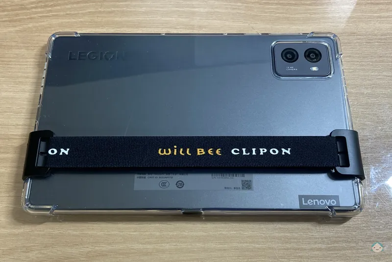{:class='image'}|
|:--:|
| _윌비 클립온2 노패드 미니 태블릿용_{:class='caption'} |

### 총평

- 외출용으로 사용할 경우 유용
- 얇은 축으로 장착할 경우 좀더 짧은 스트랩 구매
- 기존에 사용하는 기기에서 스트랩을 사용하는 경우 유용
