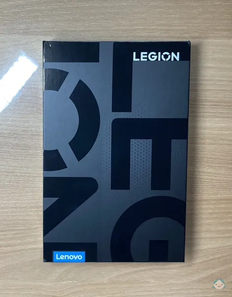

# 레노버 리전 Y700 2세대 구성품 및 리뷰

::: info 요약
저렴한 가격과 높은 휴대성, 그리고 강력한 성능의 삼박자를 두루 갖췄다는 평이 많아 구매하였고, 거의 3주만에 제품을 수령했습니다.
추가로 태블릿에 사용할 액세서리들도 함께 구매했으며 액세서리들에 대한 후기는 [전용 액세서리 리뷰](./accessories.md)에서 확인할 수 있습니다.\
이 포스트는 **레노버 리전 Y700 2세대**의 비전문적이고 간략한 후기입니다.
:::

## 제품 패키지 정면

패키지 외관은 고급스럽게 처리되어 있습니다.
|{:class='image'}|
|:--:|
| _제품 패키지 정면_{:class='caption'} |

## 제품 패키지 후면

| {:class='image'} |
| :-----------------------------------------------------------------------------------------: |
|                            _제품 패키지 후면_{:class='caption'}                             |

## 이중 씰 문제

동일한 시기에 수령한 구매자들의 이중 씰 의심 문제가 있었고 제가 구매한 제품도 자세히 확인해 보니 씰 부분이 깔끔하지 않은 것을 확인할 수 있었습니다.\
제품에 이상이 없다면 크게 문제 삼지 않아도 될 것 같아 일단 개봉했습니다.
|{:class='image'}|
|:--:|
| _패키지 씰_{:class='caption'} |

## 구성품

그럴듯한 패키지 외관과 달리 패키지 내부는 엉성한 느낌이 들었습니다.\
특히나 우측에 종이 손잡이는 잡아당기니 그대로 찢어졌습니다 :(
|{:class='image'}|
|:--:|
| _패키지 개봉 1_{:class='caption'} |

 

| {:class='image'} |
| :-------------------------------------------------------------------------------: |
|                         _패키지 개봉 2_{:class='caption'}                         |

내용물은 태블릿(본품), 충전 어댑터, USB 케이블, SD 카드 트레이 추출 핀, 매뉴얼 및 보증서\
이렇게 단순하게 구성되어 있습니다.
|{:class='image'}|
|:--:|
| _구성품_{:class='caption'} |

## 태블릿 전면

거의 거울급 반사..\
구매 전부터 익히 들었던 터라 조금 값비싼 액정 필름을 구매하는 계기가 되었습니다.:disappointed_relieved:
|{:class='image'}|
|:--:|
| _태블릿 전면_{:class='caption'} |

## 태블릿 후면

무 광택 메탈 느낌이 납니다. 지문 걱정 X
|{:class='image'}|
|:--:|
| _태블릿 후면_{:class='caption'} |

## 글로벌 롬

2023년 11월 생산 제품으로 버전은 654 or 677 이었던 것으로 기억됩니다.\
애초에 글로벌 롬을 올릴 생각이었으므로 내수롬 상태의 다른 것들은 확인하지 않았습니다 만,\
**761 버전은 현재(2024/04/02) 글로벌 롬 설치가 불가능하므로 되도록이면 설치하기 전 버전을 확인하시기 바랍니다.**

설치 시 범훈테크님의 유튜브 영상을 참고했습니다.

[강력 추천!! 쉽게 따라하는 리전 Y700 2세대 공식 글로벌롬 설치!! y700 한글화 끝판왕! ⚠️ 순정롬(중국롬) 15.0.761은 절대 금지](https://youtu.be/HOQuO4qz-os?si=hW97EwZfT_Yrh_2j)

> [!TIP]팁
>
> - 케이블은 C to A를 사용해야 하나요? :x:
> - 동봉되어 있는 C to C 케이블을 사용해도 되나요? :heavy_check_mark:

> [!IMPORTANT]글로벌 롬 설치 방법
> 글로벌 롬 설치에 관한 내용은 다른 챕터에서 다루도록 하겠습니다.

| {:class='image'} |
| :----------------------------------------------------------------------------------: |
|                            _글로벌 롬_{:class='caption'}                             |

## 짤막 리뷰

- 장점

  1. 기존에 비교할 만한 태블릿이 아마존 Fire HD뿐이라 빠릿빠릿한 것이 매우 만족스러움
  1. 내수용이지만 글로벌 롬 설치 시 정식 발매와 차이가 없음 (완전 한글화)
  1. 크게 신경쓰이지 않는 무게 (걱정했던 것보다 가벼움)
  1. 부드러운 144Hz 주사율 (눈이 편안)
  1. 생각보다 더 쓸만한 기본 필기 앱 (유료라고 함)
  1. 듀얼 단자 (사용하는 방향에 따라 원하는 곳에 충전 단자를 꼽을 수 있음)
  1. 미친 가성비 (영상 시청, 이북 리더, 게임 등 여러 가지 사용 용도에 따라올만한 기기 없음)

- 단점
  1. 강제 업데이트에 대한 불안감
  1. 고가의 저 반사 필름을 뚫고 나오는 반사력

## 총평

- 무조건 사세요. 두 번 사세요.
