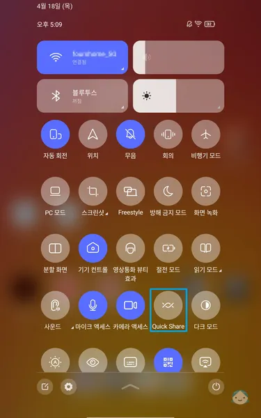

# 기본 설정 및 다양한 기능

> [!NOTE]버전 정보
> * 해당 포스팅은 **글로벌 롬 15.0.139** 버전을 기준으로 작성되었습니다.

## 업데이트 비활성화
### 설정 업데이트 비활성화
**설정** > **태블릿 정보** > **시스템 업데이트**을 찾아 차례대로 선택합니다.\
우측 상단의 `...`을 클릭하여 **업데이트 설정** 항목을 선택합니다.
|{:class='image'}|
|:--:|
| *레노버 리전 Y700 2세대 설정 업데이트 비활성화*{:class='caption'} |

**자동 업데이트** 및 **야간에 다시 시작 및 업그레이드** 항목을 비활성화 합니다.
|{:class='image'}|
|:--:|
| *레노버 리전 Y700 2세대 설정 업데이트 비활성화*{:class='caption'} |

 

### 개발자 옵션 업데이트 비활성화
**설정** > **태블릿 정보**를 찾아 차례대로 선택합니다.\
**소프트웨어 버전** 항목을 7번 클릭하여 **개발자 옵션**을 활성화 합니다.
|{:class='image'}|
|:--:|
| *레노버 리전 Y700 2세대 개발자 옵션 업데이트 비활성화*{:class='caption'} |

다시 이전 화면으로 돌아가 **설정 > 일반 설정** > **개발자 옵션**을 찾아 차례대로 선택합니다.\
상단의 **개발자 옵션 사용** 항목을 활성화 하고 **자동 시스템 업데이트** 항목을 찾아 비활성화 합니다.
|{:class='image'}|
|:--:|
| *레노버 리전 Y700 2세대 개발자 옵션 업데이트 비활성화*{:class='caption'} |

> [!INFO] ADB를 이용한 OTA 삭제 또는 비활성
> * 이 포스팅에서는 **ADB**(Android Debug Bridge)를 이용한 **OTA**(Over The Air) 삭제 또는 비활성화 방법은 다루지 않습니다.

## Entertainment Space 기능 비활성화
홈 화면 좌측에 안드로이드 11버전에 추가된 **Entertainment Space** 앱 버튼이 보입니다.
|{:class='image'}|
|:--:|
| *레노버 리전 Y700 2세대 Entertainment Space 기능 비활성화*{:class='caption'} |

다른 화면이나 앱에서는 나타나지 않지만 비활성화하길 원하는 경우 아래 설정 방법으로 비활성화할 수 있습니다.

홈 화면의 빈 곳을 누르고 있으면 홈 화면 수정 기능이 활성화 됩니다.\
홈 화면 수정 상태에서 우측 하단의 **홈 설정**을 선택합니다.
|{:class='image'}|
|:--:|
| *레노버 리전 Y700 2세대 Entertainment Space 기능 비활성화*{:class='caption'} |

**밀어서 Entertainment Space에 액세스** 항목을 찾아 비활성화 합니다.
|{:class='image'}|
|:--:|
| *레노버 리전 Y700 2세대 Entertainment Space 기능 비활성화*{:class='caption'} |

## 화면 전송

> [!NOTE]화면 전송이란?
> * 동일 네트워크에 연결된 다른 장치에 현재 태블릿의 화면 및 사운드를 표시하는 기능입니다. (갤럭시 DeX와 유사한 기능)

**설정** > **더 많은 연결** > **전송**을 찾아 차례대로 선택합니다.\
**무선 디스플레이 사용** 항목을 찾아 활성화 합니다.\
<u>화면을 표시할 수 있는 주변 장치</u>에 같은 네트워크 상에 연결된 기기 리스트가 표시됩니다.
|{:class='image'}|
|:--:|
| *레노버 리전 Y700 2세대 무선 디스플레이 화면 표시*{:class='caption'} |

연결할 기기를 선택하면\
`녹화 또는 전송을 시작하시겠습니까?` 에서 **시작하기**를 누르면 연결됩니다.
|{:class='image'}|
|:--:|
| *레노버 리전 Y700 2세대 무선 디스플레이 화면 표시*{:class='caption'} |

## Quick Share

> [!NOTE]Quick Share란?
> * Quick Share는 갤럭시 기기에 저장된 콘텐츠를 블루투스와 Wi-Fi를 통해 주변에 갤럭시 기기를 사용하는 상대방에게 빠르게 전송할 수 있는 기기 간 파일 공유 기능입니다.
> * 아울러 Quick Share는 갤럭시 기기뿐 아니라 타사 안드로이드 폰으로도 간편하게 파일을 전달할 수 있습니다.
> * 갤럭시 S24 부터 Quick Share와 Nearby Share 기능이 통합되었습니다.

> [!CAUTION]Quick Share 제한
> * **블루투스 기능이 있는 기기에서만** 사용이 가능합니다.
> * 기기 간 직접 전송 시 용량 제한은 없으나 TV나 냉장고와 같은 삼성 SmartThings 기기로 파일을 전송하는 경우에는 SmartThings 서버를 이용여 전송이 이루어지게 되며, 최신 SmartThings 버전에서는 **한번에 3기가** **하루 5기가**를 전송할 수 있습니다.

### 태블릿 사용 준비

**설정** > **더 많은 연결** > **Quick Share**을 찾아 차례대로 선택합니다.
|{:class='image'}|
|:--:|
| *레노버 리전 Y700 2세대 Quick Share*{:class='caption'} |

**나와 공유할 수 있는 사람** 항목을 선택하면,
|{:class='image'}|
|:--:|
| *레노버 리전 Y700 2세대 Quick Share*{:class='caption'} |

**주변 기기에 표시** 항목을 활성화 합니다.\
<u>나와 공유할 수 있는 사람</u>을 선택합니다.

|{:class='image'}|
|:--:|
| *레노버 리전 Y700 2세대 Quick Share*{:class='caption'} |

> [!NOTE] 공유 대상
> * 내 기기 : 현재 사용 중인 계정에 로그인되어 있는 기기만
> * 주소록 : Google 계정이 있는 연락처만 표시합니다.
> * 모든 사용자 : 주변에 모든 사용자

 

태블릿에 상태바(상단에서 쓸어내리기)를 펼쳐(아래로 드래그),
|{:class='image'}|
|:--:|
| *레노버 리전 Y700 2세대 Quick Share*{:class='caption'} |

**Quick Share**를 활성화 합니다.
|{:class='image'}|
|:--:|
| *레노버 리전 Y700 2세대 Quick Share*{:class='caption'} |

Quick Share 설정 화면이 표시됩니다. **계속**을 선택합니다.
|{:class='image'}|
|:--:|
| *레노버 리전 Y700 2세대 Quick Share*{:class='caption'} |

블루투스를 사용 설정하지 않은 경우 **사용 설정**이 필요합니다.
|{:class='image'}|
|:--:|
| *레노버 리전 Y700 2세대 Quick Share*{:class='caption'} |

태블릿 Quick Share 사용 준비가 완료되었습니다.

 

### PC 사용 준비

아래 링크에서 Windows 용 Quick Share 설치 파일을 다운로드합니다.
* [Windows용 Quick Share](https://www.android.com/intl/ko_kr/better-together/quick-share-app/)

다운로드한 설치 파일을 클릭하여 설치를 진행합니다.
|{:class='image'}|
|:--:|
| *레노버 리전 Y700 2세대 Quick Share*{:class='caption'} |

설치가 완료되면 태블릿에 사용 중인 계정으로 로그인합니다.
|{:class='image'}|
|:--:|
| *레노버 리전 Y700 2세대 Quick Share*{:class='caption'} |

로그인이 완료되면 Quick Share 설정 화면에서\
수신(나와 공유할 수 있는 사용자) 대상을 선택할 수 있습니다.
|{:class='image'}|
|:--:|
| *레노버 리전 Y700 2세대 Quick Share*{:class='caption'} |

수신 대상을 내 기기(Windows Quick Share 로그인에 사용된 계정과 같은 계정을 사용하는 모든 기기)로 선택합니다.\
수신 대상 설정이 끝나면 이전 화면으로 돌아와 **완료**를 선택하세요.
|{:class='image'}|
|:--:|
| *레노버 리전 Y700 2세대 Quick Share*{:class='caption'} |

Quick Share 사용 준비가 완료되었습니다.\
**파일** 또는 **폴더**를 직접 선택하거나 **드래그 앤 드랍**을 이용해 송/수신이 가능합니다.\
PC에 있는 이미지를 태블릿으로 보내보도록 하겠습니다.
|{:class='image'}|
|:--:|
| *레노버 리전 Y700 2세대 Quick Share*{:class='caption'} |

전송할 이미지를 선택하면 **근처에 있는 Quick Share 전송이 가능한 기기**가 표시됩니다.\
해당 기기를 선택하면 파일 전송이 완료됩니다.
|{:class='image'}|
|:--:|
| *레노버 리전 Y700 2세대 Quick Share*{:class='caption'} |

태블릿에 Quick Share 통한 파일 **수신 완료** 알림이 표시됩니다.
|{:class='image'}|
|:--:|
| *레노버 리전 Y700 2세대 Quick Share*{:class='caption'} |