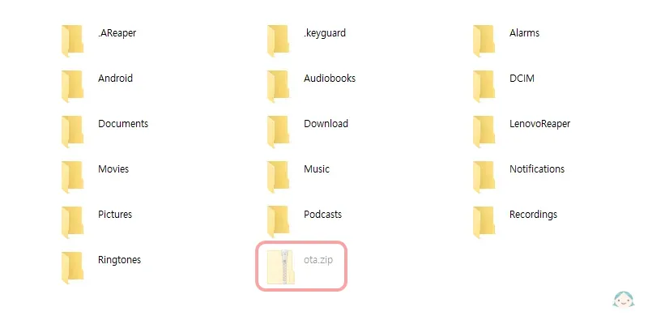

# 레노버 리전 Y700 2세대 글로벌 롬 ota 수동 업데이트

레노버 리전 Y700 2세대 글로벌 롬 소프트웨어 버전을 15.0.240(ota)로 수동 업데이트 하는 방법 안내입니다.

::: info 준비물

- USB 케이블 (C to C 또는 C to A 모두 상관 없음)
- 윈도우 10이 설치된 장치(데스크톱, 노트북, 기타 윈도우 10이 설치 가능한 장치)
  :::

::: danger 경고

- 이 포스트는 **중국 롬**, **일본 롬**에서 **글로벌 롬**으로 업데이트 하는 방법이 아닌 <u>**이미 글로벌 롬이 설치된 사용자**</u>를 위한 ota 수동 업데이트 안내입니다.
- 글로벌 롬 15.0.240 미만(15.0.139...등) 버전에서만 업데이트가 가능합니다.
  :::

## 업데이트 패키지 다운로드

[15.0.358 ota 패키지 파일 링크](https://ota-cdn.lenovo.com/firmware/2024791602392-2884.zip)

[ZUI 16.0.324 ota 패키지 파일 링크](https://ota-cdn.lenovo.com/firmware/202471914561387-3993.zip)

[ZUI 16.0.324 -> 16.0.475 ota 패키지 파일 링크](https://ota-cdn.lenovo.com/firmware/2024112215483352-2627.zip)

::: info 버전 요약

- **15.0.358 ota 패키지 파일** : 글로벌 롬 ZUI 15의 358 버전
- **ZUI 16.0.324 ota 패키지 파일** : 글로벌 롬 ZUI 16의 324 버전
- **ZUI 16.0.324 -> 16.0.475 ota 패키지 파일** : 글로벌 롬 ZUI 16의 324 버전 -> 475 버전

ZUI 16은 최근 출시한 OS로 안드로이드 버전이 기존 **13** 기반에서 **14**로 업그레이드 됩니다.\
새 OS 설치를 원하지 않는 경우 <u>15.0.358 ota 패키지</u>로 업데이트 하시면 됩니다.
:::

::: danger 경고

- ZUI 16 설치 시 **기존 디스플레이 크기를 변경해서 사용하는 경우 기본으로 설정 후 설치하셔야 합니다.** (설치 완료 후 무한 재부팅 발생 보고됨)
- ZUI 16 설치 시 기존에 **정상적으로 가능하던 앱에 문제가 발생**할 수 있습니다. (문제 보고됨)
- **ZUI 16.0.475** 설치 시 기존에 발생하던 **디스플레이 크기 변경 문제**가 일부 수정되었다고 합니다. (문제 보고됨)
- ZUI 16 설치 시 잠금 화면이 무한 반복되는 문제가 발생할 수 있습니다. (문제 보고됨)
  :::

태블릿에서 패키지 파일을 읽을 수 있도록 미리 파일명을 `ota.zip`로 변경해둡니다.

태블릿에서 직접 다운로드하여 파일을 직접 최상위 경로로 이동시킨 경우 다음 단계([업데이트 패키지 태블릿 전송](#%E1%84%8B%E1%85%A5%E1%86%B8%E1%84%83%E1%85%A6%E1%84%8B%E1%85%B5%E1%84%90%E1%85%B3-%E1%84%91%E1%85%A2%E1%84%8F%E1%85%B5%E1%84%8C%E1%85%B5-%E1%84%90%E1%85%A2%E1%84%87%E1%85%B3%E1%86%AF%E1%84%85%E1%85%B5%E1%86%BA-%E1%84%8C%E1%85%A5%E1%86%AB%E1%84%89%E1%85%A9%E1%86%BC))를 건너띄어도 됩니다.

## 업데이트 패키지 태블릿 전송

태블릿을 USB 케이블을 이용해 패키지 파일을 준비한 기기에 연결합니다.

기존에 태블릿에 파일 전송 이력이 없는 경우 USB 연결 옵션에 대한 알림이 표시됩니다.\
**파일 전송**을 선택합니다.
|{:class='image'}|
|:--:|
| _레노버 리전 Y700 2세대 업데이트 패키지 전송_{:class='caption'} |

패키지 파일을 준비한 기기에 태블릿 저장소가 연결됩니다.\
**내부 공유 저장용량**이라고 표시된 내부 저장소를 선택합니다.
|{:class='image'}|
|:--:|
| _레노버 리전 Y700 2세대 업데이트 패키지 전송_{:class='caption'} |

내부 저장소 최상위(root) 경로에 `ota.zip` 파일을 복사합니다.
|{:class='image'}|
|:--:|
| _레노버 리전 Y700 2세대 업데이트 패키지 전송_{:class='caption'} |

## 업데이트 패키지 설치

::: warning 확인
안전하게 패키지 업데이트가 진행될 수 있도록 태블릿의 **배터리 잔량이 40% 이상**인 경우에만 업데이트를 진행하실 것을 권장합니다.
:::
**설정** > **태블릿 정보** > **시스템 업데이트**를 찾아 차례대로 선택합니다.\
**소프트웨어 버전** 부분을 6번 이상 터치하여 **수동 업데이트**를 활성화합니다.
|{:class='image'}|
|:--:|
| _레노버 리전 Y700 2세대 수동 업데이트 활성화_{:class='caption'} |

우측 상단에 `...`을 선택하면 팝업 메뉴가 표시되고 **install update package**가 활성화된 것을 확인할 수 있습니다.
|{:class='image'}|
|:--:|
| _레노버 리전 Y700 2세대 수동 업데이트 활성화_{:class='caption'} |

**install update package**를 선택하면 소프트웨어 업데이트가 시작됩니다.
|{:class='image'}|
|:--:|
| _레노버 리전 Y700 2세대 install update package_{:class='caption'} |

몇 분 동안 업데이트가 진행되고, 업데이트가 완료되면\
`업데이트를 완료하기 위해 시스템이 다시 시작됩니다.`\
팝업 알림이 표시됩니다. **지금 다시 시작**을 선택해 태블릿을 재시작 합니다.
|{:class='image'}|
|:--:|
| _레노버 리전 Y700 2세대 시스템 다시 시작_{:class='caption'} |

태블릿이 재시작 되면,\
**설정** > **태블릿 정보** > **시스템 업데이트**를 찾아 차례대로 선택합니다.\
정상적으로 글로벌 롬 업데이트가 완료되었습니다.
|{:class='image'}|
|:--:|
| _레노버 리전 Y700 2세대 소프트웨어 업데이트 완료_{:class='caption'} |

이제 태블릿 최상위 경로에 복사했던 `ota.zip` 파일을 삭제해도 됩니다.
|{:class='image'}|
|:--:|
| _레노버 리전 Y700 2세대 업데이트 패키지 파일 삭제_{:class='caption'} |
