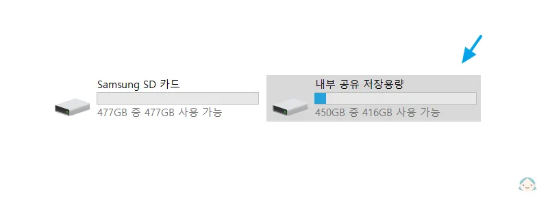

# 레노버 리전 Y700 2세대 글로벌 롬 ota 수동 업데이트
레노버 리전 Y700 2세대 글로벌 롬을 **15.0.240**(ota) 버전으로 수동 업데이트 하는 방법 안내입니다.

> [!NOTE]준비물
> * USB 케이블 (C to C 또는 C to A 모두 상관 없음)
> * 윈도우 10이 설치된 장치(데스크톱, 노트북, 기타 윈도우 10이 설치 가능한 장치)

::: danger 경고
* 이 포스팅은 **중국 롬**, **일본 롬**에서 **글로벌 롬**으로 업데이트 하는 방법이 아닌 <u>**이미 글로벌 롬이 설치된 사용자**</u>를 위한 ota 수동 업데이트 안내입니다.
* 글로벌 롬 15.0.240 미만(15.0.139...등) 버전에서만 업데이트가 가능합니다.
:::

## 업데이트 패키지 다운로드
[15.0.240 ota 패키지 파일 링크](https://www.mediafire.com/file/1og9uv89n170455/2024413153423282-4402.zip/file)

위 페이지에 접속하여 파란색의 <b>DOWNLOAD (120.83MB)</b>를 클릭해\
`2024413153423282-4402.zip` 파일을 다운로드합니다.
|{:class='image'}|
|:--:|
| *레노버 리전 Y700 2세대 업데이트 패키지 다운로드*{:class='caption'} |

기기에서 패키지 파일을 읽을 수 있도록 미리 파일명을 `ota.zip`로 변경해둡니다.

## 업데이트 패키지 태블릿 전송
태블릿을 USB 케이블을 이용해 패키지 파일을 준비한 기기에 연결합니다.

기존에 태블릿에 파일 전송 이력이 없는 경우 USB 연결 옵션에 대한 알림이 표시됩니다.\
**파일 전송**을 선택합니다.
|{:class='image'}|
|:--:|
| *레노버 리전 Y700 2세대 업데이트 패키지 전송*{:class='caption'} |

패키지 파일을 준비한 기기에 태블릿 저장소가 연결됩니다.\
**내부 공유 저장용량**이라고 표시된 내부 저장소를 선택합니다. 
|{:class='image'}|
|:--:|
| *레노버 리전 Y700 2세대 업데이트 패키지 전송*{:class='caption'} |

내부 저장소 최상위(root) 경로에 `ota.zip` 파일을 복사합니다.
|{:class='image'}|
|:--:|
| *레노버 리전 Y700 2세대 업데이트 패키지 전송*{:class='caption'} |

## 업데이트 패키지 설치
::: warning 확인
안전하게 패키지 업데이트가 진행될 수 있도록 태블릿의 **배터리 잔량이 40% 이상**인 경우에만 업데이트를 진행하실 것을 권장합니다.
:::
**설정** > **태블릿 정보** > **시스템 업데이트**를 찾아 차례대로 선택합니다.\
**소프트웨어 버전** 부분을 6번 이상 터치하여 **수동 업데이트**를 활성화합니다.
|{:class='image'}|
|:--:|
| *레노버 리전 Y700 2세대 수동 업데이트 활성화*{:class='caption'} |

우측 상단에 `...`을 선택하면 팝업 메뉴가 표시되고 **install update package**가 활성화된 것을 확인할 수 있습니다.
|{:class='image'}|
|:--:|
| *레노버 리전 Y700 2세대 수동 업데이트 활성화*{:class='caption'} |

**install update package**를 선택하면 소프트웨어 업데이트가 시작됩니다.
|{:class='image'}|
|:--:|
| *레노버 리전 Y700 2세대 install update package*{:class='caption'} |

몇 분 동안 업데이트가 진행되고, 업데이트가 완료되면\
`업데이트를 완료하기 위해 시스템이 다시 시작됩니다.`\
팝업 알림이 표시됩니다. **지금 다시 시작**을 선택해 태블릿을 재시작 합니다.
|{:class='image'}|
|:--:|
| *레노버 리전 Y700 2세대 시스템 다시 시작*{:class='caption'} |

태블릿이 재시작 되면,\
**설정** > **태블릿 정보** > **시스템 업데이트**를 찾아 차례대로 선택합니다.\
정상적으로 글로벌 롬 업데이트가 완료되었습니다.
|{:class='image'}|
|:--:|
| *레노버 리전 Y700 2세대 소프트웨어 업데이트 완료*{:class='caption'} |