# 글로벌 롬 설치

> [!NOTE]준비물
> * USB 케이블 (C to C 또는 C to A 모두 상관 없음)
> * 윈도우 10이 설치된 장치(데스크톱, 노트북, 기타 윈도우 10이 설치 가능한 장치)

글로벌 롬 업데이트 시 **범훈테크**님의 유튜브 영상 및 기글 하드웨어의 **Moria** 님의 게시글을 참고했습니다.

* [강력 추천!! 쉽게 따라하는 리전 Y700 2세대 공식 글로벌롬 설치!! y700 한글화 끝판왕! ⚠️ 순정롬(중국롬) 15.0.761은 절대 금지](https://youtu.be/HOQuO4qz-os?si=hW97EwZfT_Yrh_2j)

* [Y702 글로벌롬 업데이트하는 방법](https://gigglehd.com/gg/mobile/15638286)

## 글로벌 롬 설치 불가
> [!CAUTION] 경고
> * 글로벌 롬 업데이트 시 태블릿에 **모든 정보가 초기화**됩니다. 필요한 경우 데이터를 백업하세요.
> * 지역 코드 변경 시에도 **모든 정보가 초기화**됩니다. 필요한 경우 데이터를 백업하세요.
> * **일본 롬(15.0.022)** 사용자는 현재 작성일(2024-04-10) 기준으로 글로벌 롬 설치 전 부트로더 언락이 필요합니다. (설치 후 리락 불가)
> * **중국 롬(15.0.761)** 사용자는 현재 작성일(2024-04-10) 기준으로 글로벌 롬을 설치할 수 없습니다.

## 태블릿 버전 확인

내수용 제품의 생산일을 확인했을 때 15.0.761 미만 버전이 확실하더라도, 안전하게 설치하기 위해 현재 설치된 버전의 확인이 필요합니다.

> [!IMPORTANT] 글로벌 롬 설치 가능 버전 (2024-04-10 기준)
> * 중국 롬 **15.0.654**
> * 중국 롬 **15.0.677**
> * 중국 롬 **15.0.723**
> * 중국 롬 **15.0.737**
> * 일본 롬 **15.0.008**

태블릿의 전원을 켜면 이미지와 같은 ZUI 15 시작 화면을 확인할 수 있습니다.\
가운데 **开始(시작)** 버튼을 눌러 다음으로 진행합니다.
|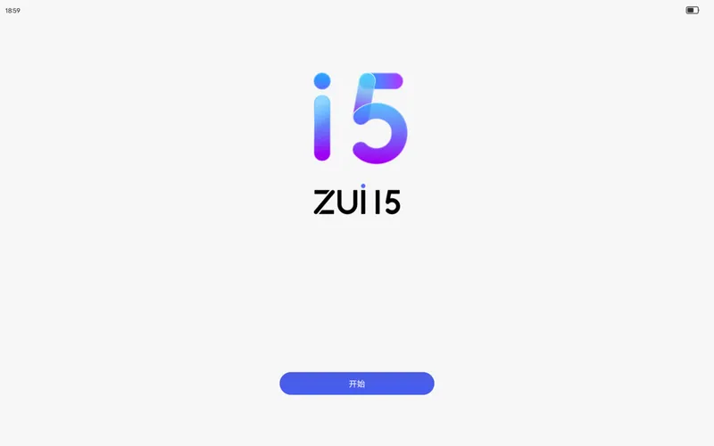{:class='image'}|
|:--:|
| *출처 : 일본 블로그*{:class='caption'} |

 

언어 선택화면 입니다.\
**English**를 선택하고 우측 **继续(계속)** 버튼을 눌러 다음으로 진행합니다.
|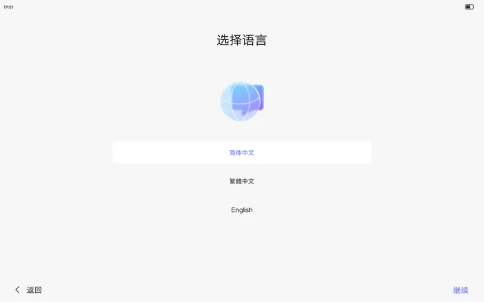{:class='image'}|
|:--:|
| *출처 : 일본 블로그*{:class='caption'} |

언어가 영어로 설정 된 이후 각 항목마다 아래 순서대로 진행하시면 됩니다.

> [!INFO] 태블릿 초기 설정 진행
> 1. **Connect to network** (네트워크 연결)\
> &nbsp;:heavy_check_mark: Skip
>
> 1. **Terms of Use** (이용 약관)\
> &nbsp;:white_check_mark: I Have read and agreed to the terms detailed above.\
> &nbsp;:heavy_check_mark: Next
> 
> 1. **Privacy & Basic Settings** (개인정보 보호 & 기본 설정)\
> &nbsp;⛔ Restrict ad tracking\
> &nbsp;⛔ Join the User Experience Program\
> &nbsp;⛔ Auto update\
> &nbsp;⛔ Restart and upgrade overnight\
> &nbsp;:heavy_check_mark: Next
> 
> 1. **Lenovo Member Benefits** (레노버 회원 혜택)\
> &nbsp;:heavy_check_mark: Skip\
> &nbsp;:heavy_check_mark: keep skipping
> 
> 1. **Restore data** (데이터 복구)\
> &nbsp;:heavy_check_mark: Skip
> 
> 1. **Set device password** (태블릿 비밀번호 설정)\
> &nbsp;:heavy_check_mark: Skip\
> &nbsp;:heavy_check_mark: Skip
> 
> 1. **System navigation** (시스템 탐색)\
> &nbsp;:white_check_mark: Gesture Navigation\
> &nbsp;:heavy_check_mark: Next
>
> 1. **Settings completed** (설정 완료)\
> &nbsp;:heavy_check_mark: Get started

초기화 설정이 끝났습니다. 이제 홈 화면에서 **Settings**(설정)를 선택합니다.\
**About tablet**(태블릿 정보) 항목을 선택해서 **Software version**을 확인하시면 됩니다.

> [!IMPORTANT] Software version
> ZUI **15.0.XXX** Stable version

[글로벌 롬 설치 불가](#글로벌-롬-설치-불가)에 안내한 버전에 표시된 버전이 포함되어 있는지 꼭 확인하시기 바랍니다.

 

> [!INFO] USB 디버깅 필요성
> **개발자 옵션** 사용과 더불어 **USB 디버깅**을 <u>**활성화 할 필요가 없습니다.**</u>

## RSA 설치 (Rescue and Smart Assistant)

> [!TIP] 태블릿 연결 팁
> Rescue and Smart Assistant를 설치하고 프로그램을 실행해서 롬 설치를 진행하기 전까지 **태블릿을 장치(PC)에 미리 연결 할 필요는 없습니다.**

아래 링크로 Rescue and Smart Assistant 설치 파일을 다운로드 받습니다.
* [Rescue and Smart Assistant (RSA) v6.8.4.13](https://download.lenovo.com/consumer/mobiles/rescue_and_smart_assistant_v6.8.4.13_setup.exe)

다운로드 받은 파일을 설치합니다.\
프로그램 설치 부분은 따로 화면 표시 없이 아래 순서대로 진행하시면 됩니다.

> [!INFO] Rescue and Smart Assistant 설치 진행
> 1. **Installer Language** (설치 언어)\
> &nbsp;:white_check_mark: English\
> &nbsp;:heavy_check_mark: OK
> 
> 1. **Rescue and Smart Assistant Setup** 설치 준비\
> &nbsp;:heavy_check_mark: Next >\
> &nbsp;:white_check_mark: I accept the terms of the License Agreement\
> &nbsp;:heavy_check_mark: Next >\
> &nbsp;:heavy_check_mark: Install
> 
> 1. **Rescue and Smart Assistant Setup** 팝업\
> &nbsp;:heavy_check_mark: 확인
> 
> 1. **Spreadtrum Communications (shanghai) Co., Ltd.** (칩셋 소프트웨어)\
> &nbsp;:heavy_check_mark: 설치(I)
>
> 1. **DriverCoding Corporation 포트(COM & LPT)** (포트 드라이버)\
> &nbsp;:heavy_check_mark: 설치(I)
> 
> 1. **Motorola Mobile Drivers Installation 6.4.0** (모토로라 드라이버)\
> &nbsp;:heavy_check_mark: Next >\
> &nbsp;:white_check_mark: I Agree\
> &nbsp;:heavy_check_mark: Next >\
> &nbsp;:heavy_check_mark: Close
> 
> 1. **LenovoUsbDriver 1.1.33 Setup** (레노버 USB 드라이버)\
> &nbsp;:heavy_check_mark: Next >\
> &nbsp;:heavy_check_mark: Next >\
> &nbsp;:white_check_mark: Install\
> &nbsp;:heavy_check_mark: Finish
> 
> 1. **MediaTek SP Driver** (미디어텍 SP 드라이버)\
> &nbsp;❌ Cancel\
> &nbsp;:heavy_check_mark: 예
> 
> 1. **Rescue and Smart Assistant Setup** 설치\
> &nbsp;:heavy_check_mark: Next >\
> &nbsp;:heavy_check_mark:  Finish

RSA 설치가 끝났습니다. 이제 프로그램을 실행해서 롬을 설치해 봅시다.

## RSA로 글로벌 롬 펌웨어 다운로드 및 설치

RSA를 실행하면 레노버 개인정보 이용 동의를 진행합니다.\
:white_check_mark: I agree with Lenovo Privacy Policy\
:heavy_check_mark: Continue
|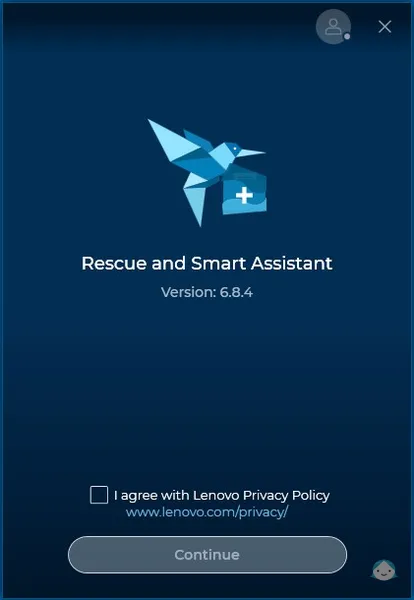{:class='image'}|
|:--:|
| *RSA 개인 정보 이용 동의 화면*{:class='caption'} |

로그인 화면입니다.\
가운데 하단에 있는 언어를 **한국어**로 변경하면 <u>로그인 화면만 한국어로 표시됩니다.</u>\
RSA를 사용하려면 레노버 계정이 필요합니다.\
계정이 없는 경우 간단하게 구글이나 마이크로소프트 계정을 이용해 가입할 수 있습니다.
|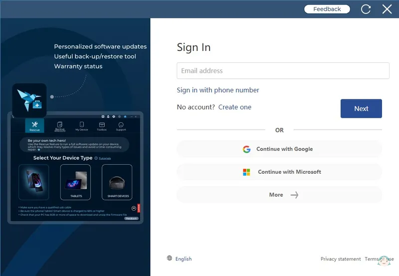{:class='image'}|
|:--:|
| *RSA 로그인 화면*{:class='caption'} |

상단의 RSA 기능 중 **Rescue**를 선택하고, 기기 유형을 **TABLETS**을 선택해 줍니다.
|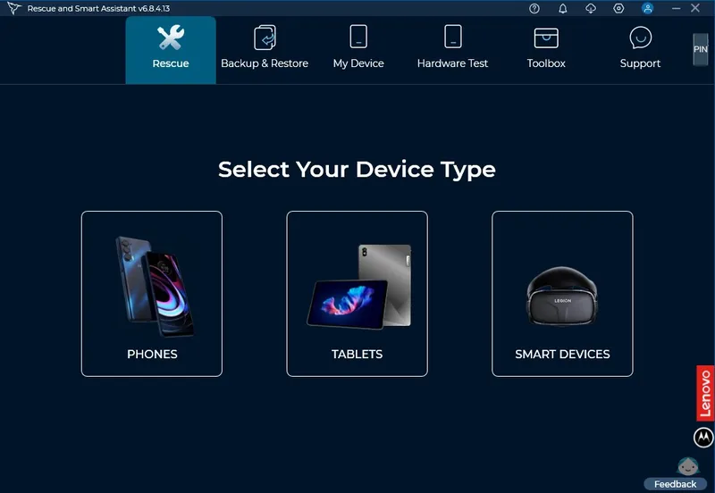{:class='image'}|
|:--:|
| *RSA 처음 화면*{:class='caption'} |

복구를 시작하기 전에 태블릿 시리얼 넘버를 통해 펌웨어를 찾을 수 있도록 시리얼 넘버 입력을 요구합니다.\
임의로 **A1111111** (영대문자1 + 숫자7)을 입력해 줍니다.
|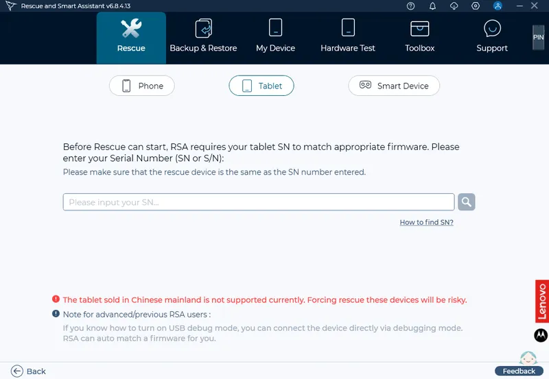{:class='image'}|
|:--:|
| *RSA 태블릿 시리얼 넘버 입력 화면*{:class='caption'} |

해당 시리얼 넘버의 기기를 찾을 수 없기 때문에(당연히) 직접 모델을 선택하라고 나옵니다.\
좌측의 **Select your model from a list**를 선택합니다.
|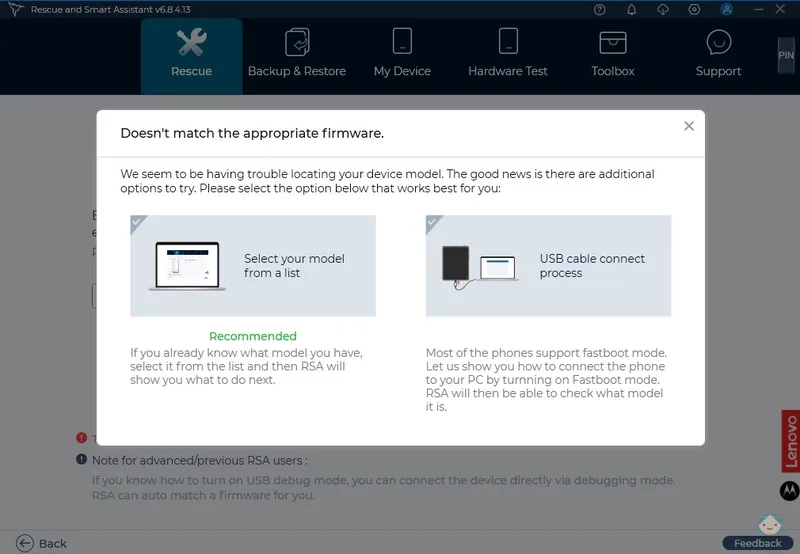{:class='image'}|
|:--:|
| *RSA 태블릿 모델 선택 화면*{:class='caption'} |

이제 직접 제품을 검색합니다.\
첫 번째 **Product name, you can input to search** 선택 상자에서\
**Lenovo Legion Tab**을 선택합니다.\
두 번째 **Please input model name** 선택 상자에서\
**TB320FC**를 선택합니다.\
이제 **Download** 버튼을 눌러 펌웨어를 다운로드 합니다.
|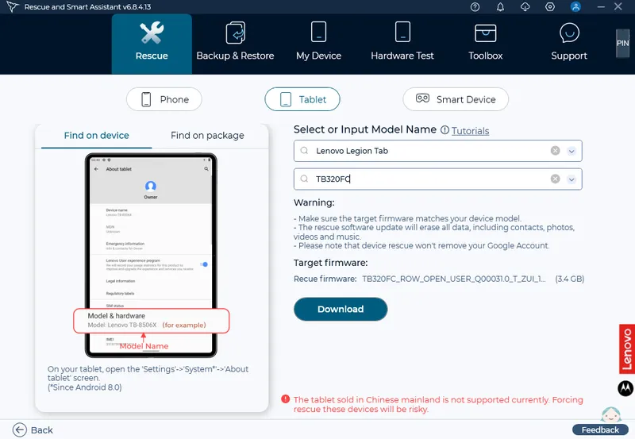{:class='image'}|
|:--:|
| *RSA 태블릿 모델 검색 및 펌웨어 다운로드 화면*{:class='caption'} |

> [!CAUTION] 경고
> * 대상 펌웨어가 기기 모델과 일치하는지 확인하십시오.
> * 복구 소프트웨어 업데이트는 연락처, 사진, 비디오, 음악을 포함한 모든 데이터를 삭제합니다.
> * 기기 복구로 인해 Google 계정이 삭제되지는 않습니다.

 

펌웨어 다운로드가 끝나면 **Download** 버튼이 **Rescue** 버튼으로 변경됩니다.\
**Rescue** 버튼을 눌러 글로벌 롬 업데이트를 진행합니다.
|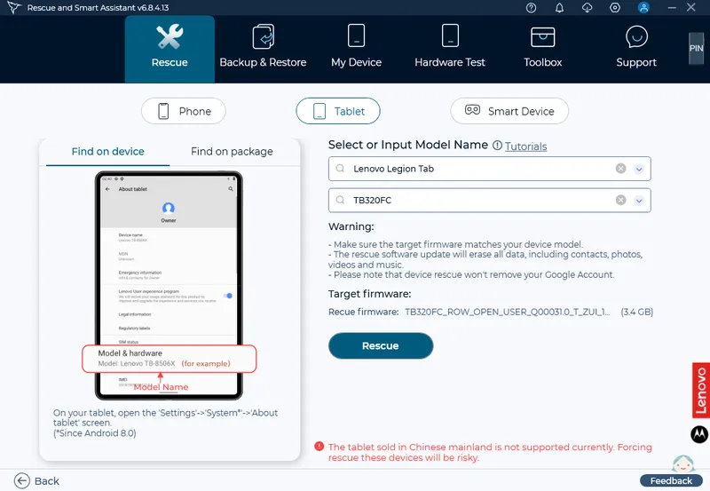{:class='image'}|
|:--:|
| *RSA 태블릿 펌웨어 업데이트 진행*{:class='caption'} |

다음 순서대로 펌웨어 업데이트를 진행해 주세요.

> [!INFO] 태블릿 펌웨어 업데이트 진행
> 1. **Information Collection** (개인정보 수집 알림)\
> &nbsp;:heavy_check_mark: Proceed
> 
> 1. **Kind remind you to backup your data** (데이터 백업 알림)\
> &nbsp;:heavy_check_mark: Continue with the Rescue Software Update
> 
> 1. **Disconnect Instruction** (태블릿 전원 종료 및 연결 해제 확인)\
> &nbsp;:heavy_check_mark: OK

 

RSA의 펌웨어 업데이트 준비가 완료되었습니다.\
이제 태블릿의 펌웨어 업데이트 준비를 진행합니다.
> [!INFO] 태블릿 펌웨어 업데이트 진행
> 1. 정상적인 시스템 상태에서 전원 버튼을 누르고 시스템 안내에 따라 정상적으로 전원을 종료합니다.
> 1. 1번 이외의 비정상적인 상태로 인해 태블릿 종료가 어려울 경우 **볼륨 감소(-) 버튼**과 **전원 버튼**을 동시에 눌러 강제로 전원을 종료합니다. (배터리 30% 이상 권장)

|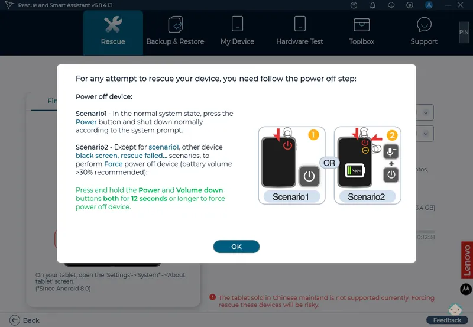{:class='image'}|
|:--:|
| *RSA 태블릿 전원 종료*{:class='caption'} |

다음 순서대로 태블릿과 장치(PC) 연결을 진행해 주세요.
> [!INFO] 태블릿 연결
> 1. **볼륨 증가(+) 버튼**을 누른 상태로
> 1. **태블릿의 긴 측면(옆구리) USB 단자**를 장치(PC)와 연결합니다.

|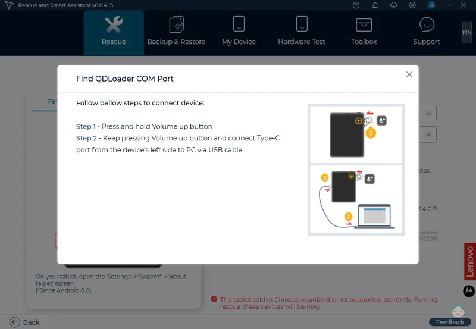{:class='image'}|
|:--:|
| *RSA 태블릿 연결*{:class='caption'} |

태블릿과 장치(PC)가 정상적으로 연결되면 자동으로 펌웨어 업데이트가 진행됩니다.\
태블릿에 진동 알림과 함께 장치(PC)에 펌웨어 업데이트가 진행되는 것이 확인되면,\
**볼륨 증가(+) 버튼**에서 손을 떼도 됩니다.
|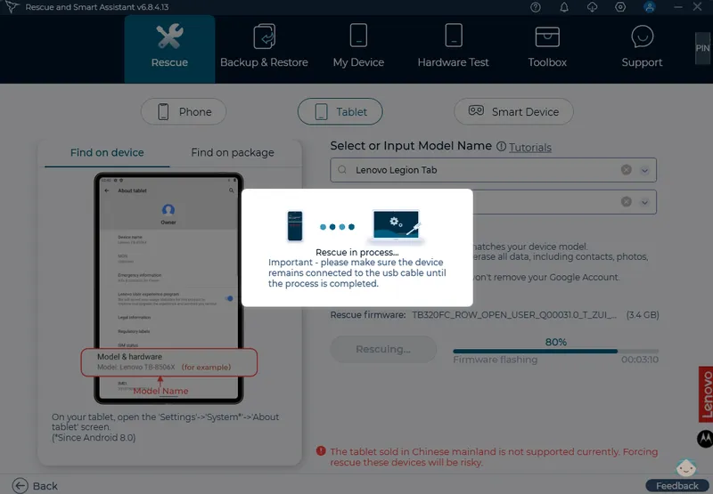{:class='image'}|
|:--:|
| *RSA 태블릿 펌웨어 업데이트 진행*{:class='caption'} |

글로벌 롬 업데이트가 모두 정상적으로 완료되었습니다.\
완료됨과 동시에 태블릿이 자동으로 재부팅 됩니다. 
|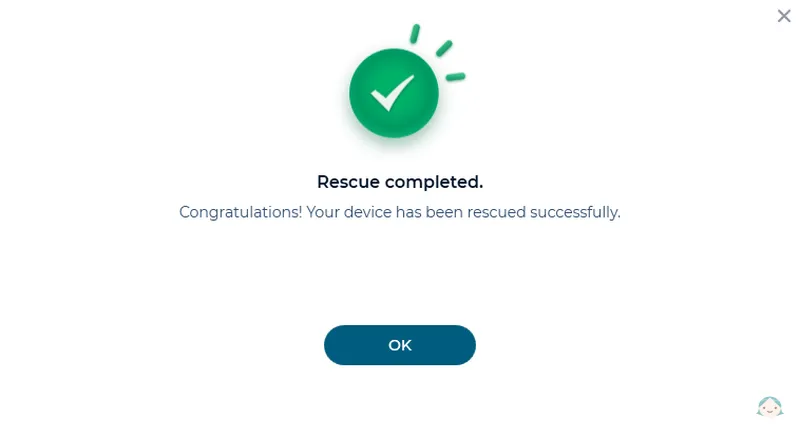{:class='image'}|
|:--:|
| *RSA 태블릿 펌웨어 업데이트 완료*{:class='caption'} |

재부팅이 완료되면 [태블릿 버전 확인](#태블릿-버전-확인)에 나온 초기화 과정을 한 번 더 진행하고 바로 지역 코드를 변경해 줍니다.
> [!WARNING] 지역 코드를 바로 변경하는 이유
> 지역 코드 변경 시 기기의 연락처, 사진, 비디오, 음악을 포함한 모든 데이터가 삭제됩니다.

## 지역 코드 변경하기
태블릿 홈 화면에서 **설정**을 선택합니다.\
최 상단에 있는 **검색 설정** 입력 창에<b style="padding:0 .4em;font-size:1.4em; letter-spacing:4px">####6020#</b>을 입력합니다.
|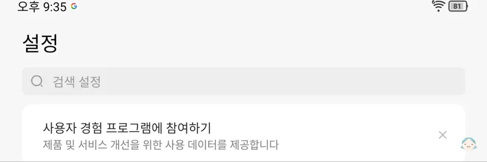{:class='image'}|
|:--:|
| *지역 코드 변경하기*{:class='caption'} |

**KR Korea**를 선택하고 **OK** 버튼을 누르면 태블릿이 초기화되고 자동으로 재부팅 됩니다.
|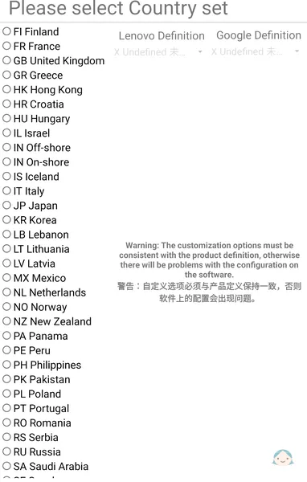{:class='image'}|
|:--:|
| *지역 코드 선택하기*{:class='caption'} |

> [!TIP] 지역 코드 재 변경 팁
> 검색 설정 입력 창에 <b style="padding:0 .2em;font-size:1.2em; letter-spacing:2px">####6030#</b>을 입력하면 재 변경 가능합니다.

 

글로벌 롬 설치와 지역 코드 변경이 모두 완료되면 <u>자동 업데이트로 인해 생기는 문제를 방지</u>하기 위해 **기본 설정** 항목의 [업데이트 비활성화](/it/y700/settings#업데이트-비활성화) 설정을 해주시기 바랍니다.