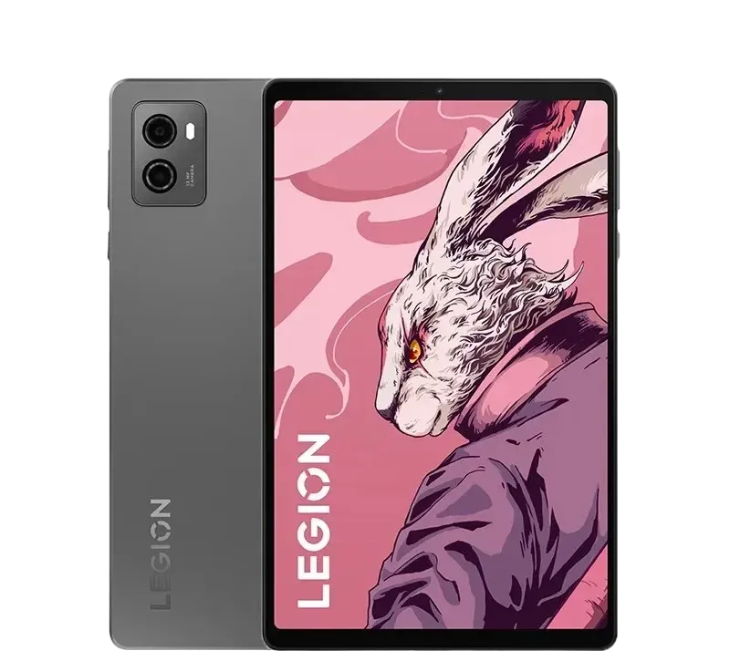

# 레노버 리전 Y700 2세대 소개

| {:class='no-border'} |
| :----------------------------------------------------------------------: |
|             _출처 : 레노버 공식 홈페이지_{:class='caption'}              |

 

::: info 기본 정보
레노버 리전 Y700 2세대는 8.8인치 IPS LCD 스크린을 탑재하여 사진과 동영상에 생동감을 불어넣습니다. 안드로이드 13 OS는 더욱 멋진 사용자 경험을 보장합니다. 스냅드래곤 8+ 1세대 옥타코어 프로세서와 256GB/512GB의 UFS 3.1 스토리지로 구동되며 부드러운 작동과 안정적인 멀티태스킹 환경을 제공합니다.
:::

## 제품 주요 기능

안드로이드 13 OS
레노버 리전 Y700 2세대는 이동 중에도 연결성과 생산성을 유지할 수 있는 새롭고 빠른 플랫폼을 제공하는 안드로이드 13 운영 체제 기반의 ZUI 15에서 실행됩니다.
|{:class='image'}|
|:--:|
| _출처 : 인텍앤컴퍼니 스마트스토어_{:class='caption'} |

## 퀄컴 스냅드래곤 8+ 1세대 칩셋

레노버 리전 Y700 2세대는 스냅드래곤 8+ 1세대 옥타코어 프로세서로 구동됩니다.
|{:class='image'}|
|:--:|
| _출처 : 인텍앤컴퍼니 스마트스토어_{:class='caption'} |

## 강력한 냉각 성능을 가진 램 방열 탑재

레노버 리전 Y700 2세대는 발열 없는 쾌적한 게임 플레이 환경을 위해 광활한 VC 9000mm2 쿨링 성능으로 칩셋을 극한의 성능까지 끌어올립니다.
|{:class='image'}|
|:--:|
| _출처 : 인텍앤컴퍼니 스마트스토어_{:class='caption'} |

## 8.8인치 LCD 화면

레노버 리전 Y700 2세대는 2560*1600 해상도의 8.8인치 2.5K LCD 디스플레이를 갖추고 있으며 144Hz 재생률, 500nit 밝기, DC 디밍, 100% DCI-P3 색 재현율 및 Dolby Vision 등을 지원합니다.
|{:class='image'}|
|:--:|
| *출처 : 레노버 공식 홈페이지\*{:class='caption'} |

## 2개의 리니어 모터

레노버 리전 Y700 2세대는 2개의 리니어 모터로 생동감 있는 게임 환경을 제공합니다. 배틀그라운드에서 적이 근처에 있을 경우 미세 진동을 느낄 수 있습니다.
|{:class='image'}|
|:--:|
| _출처 : 인텍앤컴퍼니 스마트스토어_{:class='caption'} |

## 압도적인 스피커 음질

레노버 리전 Y700 2세대는 2개의 JBL 스피커와 Dolby Atmos를 지원합니다.
|{:class='image'}|
|:--:|
| _출처 : 인텍앤컴퍼니 스마트스토어_{:class='caption'} |

## 6550mAh 장시간 대기 배터리

레노버 리전 Y700 2세대는 45W 고속 충전을 지원하는 6550mAh 배터리를 탑재하고 있습니다. Bypass 기능 지원으로 배터리를 보호하며 초절전 모드를 사용하면 충전 사이에 휴대폰 전원을 더 오래 켤 수 있습니다.
(Bypass란? 충전 시 배터리를 거치지 않고 충전 중인 전력으로만 구동하는 기술)
|{:class='image'}|
|:--:|
| _출처 : 인텍앤컴퍼니 스마트스토어_{:class='caption'} |

## 필기, 계산 기능 용 앱 탑재

레노버 리전 Y700 2세대는 유료 어플(Nebo, MyScript Calculator)이 기본적으로 내장되어 있습니다.
|{:class='image'}|
|:--:|
| _출처 : 인텍앤컴퍼니 스마트스토어_{:class='caption'} |

## 게임 어시스턴트 기능

레노버 리전 Y700 2세대는 게임 어시스턴트 기능으로 빠른 리소스 관리를 도와줍니다.

- 성능 모드 - 태블릿 최고 성능 모드 플레이
- 밸런스 모드 - 원활한 게이밍을 위한 최적의 환경 세팅
- 에너지 절약 모드 - 최대 7시간까지 연속으로 게임 플레이가 가능한 저전력 모드

| {:class='image'} |
| :--------------------------------------------------------------------------------------: |
|                   _출처 : 인텍앤컴퍼니 스마트스토어_{:class='caption'}                   |

## 더 가볍고, 더 얇은 태블릿

레노버 리전 Y700 2세대는 한손에 들기 부담없는 8.8인치 사이즈에 7.6mm로 전작(7.9mm)보다 더 얇고 기존 375g보다 더 가벼워진 350g의 무게로 게이밍 최적의 환경을 제공합니다.
|{:class='image'}|
|:--:|
| _출처 : 인텍앤컴퍼니 스마트스토어_{:class='caption'} |

## E-Book 독서 모드 탑재

레노버 리전 Y700 2세대의 E-Book 리더기 모드 지원으로 E-book 리더기로 사용 가능한 읽기 모드를 지원합니다.
|{:class='image'}|
|:--:|
| _출처 : 인텍앤컴퍼니 스마트스토어_{:class='caption'} |

## Google Kids Space 탑재

레노버 리전 Y700 2세대는 어린이 교육을 위한 Google Kids Space를 탑재하여 교육시장에서 크롬북으로 인정받은 구글에서 선보인 최신의 태블릿 전용 어린이 교육 플랫폼을 제공합니다. 책, 영상, 전용 앱 등을 통해 연령대 별로 다양한 교육 자료와 게임을 제공합니다.
|{:class='image'}|
|:--:|
| _출처 : 인텍앤컴퍼니 스마트스토어_{:class='caption'} |

## 레노버 프리스타일 앱

레노버 리전 Y700 2세대는 프리스타일 앱을 통해 컴퓨터 확장 화면 및 데이터 전송, 자체 화면 분할 기능을 제공합니다.
|{:class='image'}|
|:--:|
| _출처 : 인텍앤컴퍼니 스마트스토어_{:class='caption'} |

## 사진 및 화상 채팅을 위한 듀얼 카메라, 안면인식

레노버 리전 Y700 2세대에는 1300만 화소 후면 카메라와 안면인식을 지원하는 800만 화소 전면 카메라 등 두 개의 카메라가 탑재되어 있습니다.
|{:class='image'}|
|:--:|
| _출처 : 인텍앤컴퍼니 스마트스토어_{:class='caption'} |

## 다국어 지원

영어, 중국어 등 다국어를 제공합니다.

## 12GB/16GB LPDDR5 메모리 및 256GB/512GB 저장소

레노버 리전 Y700 2세대는 12GB/16GB의 LPDDR5 메모리와 256GB/512GB의 UFS 3.1 저장소가 장착되어 있으며, 저장소 확장을 위한 MicroSD 카드 슬롯이 있습니다.

## 호환 장치와 동기화되는 블루투스 5.3 인터페이스

컴퓨터와의 블루투스 지원 휴대폰 또는 MP3 플레이어 간에 사진, 음악 및 기타 미디어를 무선으로 전송하거나 블루투스 무선 액세서리를 연결할 수 있습니다.

## 듀얼 밴드, Wi-Fi Direct

802.11 a/b/g/n/ac/ax 무선 인터넷으로 사용 가능한 무선 네트워크 범위 내에서 웹에 연결할 수 있습니다.

## 기타 기능

레노버 리전 Y700 2세대에는 듀얼 JBL 스피커, Dolby Atmos, 듀얼 밴드 Wi-Fi 및 블루투스 5.3이 탑재되어 있습니다. 충전 및 연결을 위한 두 개의 포트(USB-C 3.2 2세대, USB-C 2.0)가 있습니다.

## 상세 스펙

|                 |                                                                       |
| :-------------: | --------------------------------------------------------------------- |
|    **모델**     | 레노버 리전 Y700 2세대                                                |
|    **색상**     | 크리스탈 그레이, 그레이셔 블루                                        |
|  **운영 체제**  | 안드로이드 13 기반 ZUI 15                                             |
|  **네트워크**   | 무선 Wi-Fi 6 (802.11 a/b/g/n/ac/ax), 블루투스 5.3                     |
|    **밴드**     | 없음                                                                  |
|   **캐리어**    | 해제됨                                                                |
|    **언어**     | 다국어                                                                |
| **구글 플레이** | 지원                                                                  |
|    **화면**     | 8.8 인치 LCD 화면, 144Hz 주사율, 500nit 밝기, DC 디밍 및 Dolby Vision |
|  **프로세서**   | 퀄컴 스냅드래곤 8+ 1세대 옥타코어 프로세서                            |
|   **메모리**    | 12GB/16GB LPDDR5                                                      |
|  **저장장치**   | 256GB/512GB, 1TB MicroSD 카드 슬롯                                    |
| **후면 카메라** | 1300만 화소                                                           |
| **전면 카메라** | 800만 화소                                                            |
|   **배터리**    | 6550mAh (바이패스 충전지원, 최대 충전속도 45W)                        |
|    **슬롯**     | 1TB 마이크로 SD 카드 지원                                             |
|    **크기**     | 208.54 x 129.46 x 7.6mm                                               |
|    **무게**     | 350g                                                                  |
|   **구성품**    | 본체, 충전기, USB-C 케이블                                            |
