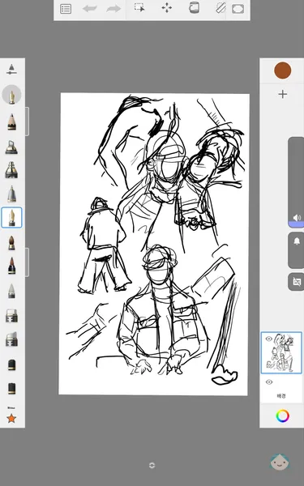

# 레노버 리전 Y700 2세대 전용 펜(AP500U) 리뷰

::: info 전용 펜
레노버 AP500U  제품
:::

## 전용 펜
Y700 2세대를 정식으로 지원하는 AP500U 제품입니다.\
태블릿 보다 늦게 주문했지만 배송은 2주 정도로 좀 더 일찍 도착했습니다.
|{:class='image'}|
|:--:|
| *제품 패키지 정면*{:class='caption'} |

## 구성품
내용물은 펜슬, 교체용 팁 펜촉, 메뉴얼 및 보증서로 구성되어 있습니다.
|{:class='image'}|
|:--:|
| *제품 구성*{:class='caption'} |

## 레노버 펜슬
레노버 펜슬 중에서는 그나마 저렴한 편(할인 시 2만 원 대)이기도 하고 다른 패드의 펜슬을 사용해 본 경험이 없어서 궁금증에 구매하게 되었습니다.
|{:class='image'}|
|:--:|
| *출처 : 티몬*{:class='caption'} |

## 펜슬 촉 부분
펜슬 촉 교체는 간단하게 돌려서 빼고 낄수 있도록 되어있습니다.
|{:class='image'}|
|:--:|
| *펜슬 촉 부분*{:class='caption'} |

## 펜슬 가운데 부분
펜슬 가운데 부분이 자성을 띄며 쇠로 된 곳에 부착이 가능합니다.\
(Y700 2세대 기기에 기본적으로 마그네틱이 지원 되었으면 좋았을 듯...:()

## 펜슬 꼬리 부분
### 충전 단자
펜슬 끝 부분에는 USB-C 타입의 충전 단자와
|{:class='image'}|
|:--:|
| *펜슬 꼬리 부분 1*{:class='caption'} |

### 충전 LED
충전 상태를 알려주는 LED가 있습니다.\
충전 중일 때는 황색 LED가 켜지고 충전이 완료되면 흰색으로 변경됩니다.
|{:class='image'}|
|:--:|
| *펜슬 꼬리 부분 2*{:class='caption'} |

## 펜슬 페어링
블루투스에서 펜슬을 페어링 하고 나면 펜슬이 연결될 때마다 남은 배터리 량과 함께 연결 정보가 표시됩니다.
|{:class='image'}|
|:--:|
| *펜슬 페어링 1*{:class='caption'} |

**펜의 버튼을 8초 동안 길게 누르면 다시 페어링이 가능합니다.**
|{:class='image'}|
|:--:|
| *펜슬 페어링 2*{:class='caption'} |

## 펜슬 스타일러스 버튼
기본적으로 펜슬의 버튼을 누르면 스타일러스 메뉴가 표시됩니다.
|{:class='image'}|
|:--:|
| *펜슬 스타일러스*{:class='caption'} |

스타일러스 메뉴가 나타나지 않도록 하려면\
**설정 > 펜 및 키보드 > 펜 > 스타일러스 버튼을 누릅니다 > 아무것도 안 함**\
으로 설정하면 됩니다.
|{:class='image'}|
|:--:|
| *펜슬 스타일러스 해제*{:class='caption'} |

## 그리기
전문가가 아닌 관계로 간단하게 스케치북 앱을 이용해 보았습니다.\
아이패드나 갤럭시 탭을 사용해 그리기를 해본적은 없지만 생각보다 잘(:)) 그려집니다.
|{:class='image'}|
|:--:|
| *펜슬로 그리기*{:class='caption'} |

## 글쓰기
레노버 리전 Y700 2세대가 기본적으로 제공하는 필기 앱(Nebo)을 이용해 보았습니다.\
Nebo에는 기본적으로 3가지 문서 모드를 지원합니다.
1. 새 메모
1. 새 문서
1. PDF로 가져오기

|{:class='image'}|
|:--:|
| *펜슬로 글쓰기*{:class='caption'} |

    <video width="800" playbackRate="2" muted autoplay loop playsinline>
    <source src="./images/pen/nebo_video.mp4" type="video/mp4" >
    </video>

Nebo 앱을 이용해 간단히 글쓰기를 해보았습니다.

 
 

    <video width="800" playbackRate="2" muted autoplay loop playsinline>
    <source src="./images/pen/nebo_video2.mp4" type="video/mp4" >
    </video>

문서 모드 사용 시 필기한 내용을 변환해서 보여주며 실제로 ***텍스트*** 로 변환도 가능합니다.

## 짤막 리뷰
* 장점
    1. 다른 패드 전용 펜슬보다 저렴한 가격
    1. 생각보다 무난한 필기 감
    1. 팜 리젝션 지원

* 단점
    1. 간단한 메모 용도로 적합하며 필기 용으로는 뭔가 2% 부족한 느낌

## 총평
* 간단한 메모나 그리기 입문자용으로 충분히 구매 가치 있습니다!