# 레노버 리전 Y700 2세대 기본 설정

::: info 버전 정보
* 해당 포스트는 **글로벌 롬 15.0.139** 버전을 기준으로 작성되었습니다.
:::

## 업데이트 비활성화
### 설정 업데이트 비활성화
**설정** > **태블릿 정보** > **시스템 업데이트**를 찾아 차례대로 선택합니다.\
우측 상단의 `...`을 클릭하여 **업데이트 설정** 항목을 선택합니다.
|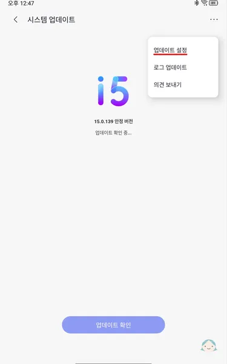{:class='image'}|
|:--:|
| *레노버 리전 Y700 2세대 설정 업데이트 비활성화*{:class='caption'} |

**자동 업데이트** 및 **야간에 다시 시작 및 업그레이드** 항목을 비활성화 합니다.
|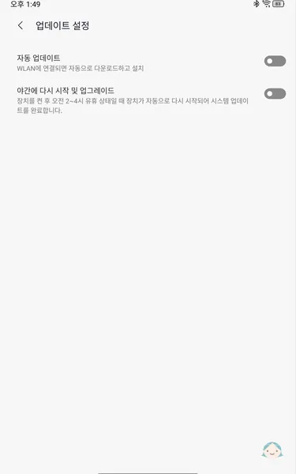{:class='image'}|
|:--:|
| *레노버 리전 Y700 2세대 설정 업데이트 비활성화*{:class='caption'} |

 

### 개발자 옵션 업데이트 비활성화
**설정** > **태블릿 정보**를 찾아 차례대로 선택합니다.\
**소프트웨어 버전** 항목을 7번 클릭하여 **개발자 옵션**을 활성화 합니다.
|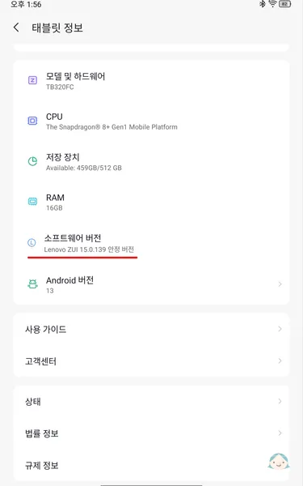{:class='image'}|
|:--:|
| *레노버 리전 Y700 2세대 개발자 옵션 업데이트 비활성화*{:class='caption'} |

다시 이전 화면으로 돌아가 **설정 > 일반 설정** > **개발자 옵션**을 찾아 차례대로 선택합니다.\
상단의 **개발자 옵션 사용** 항목을 활성화 하고 **자동 시스템 업데이트** 항목을 찾아 비활성화 합니다.
|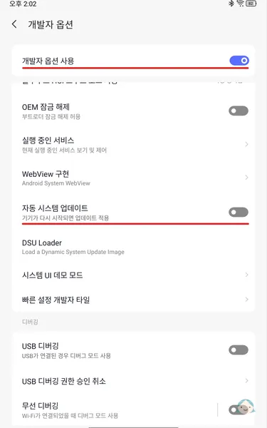{:class='image'}|
|:--:|
| *레노버 리전 Y700 2세대 개발자 옵션 업데이트 비활성화*{:class='caption'} |

> [!INFO] ADB를 이용한 OTA 삭제 또는 비활성
> * 이 포스트에서는 **ADB**(Android Debug Bridge)를 이용한 **OTA**(Over The Air) 삭제 또는 비활성화 방법은 다루지 않습니다.

## Entertainment Space 기능 비활성화
홈 화면 좌측에 안드로이드 11버전에 추가된 **Entertainment Space** 앱 버튼이 보입니다.
|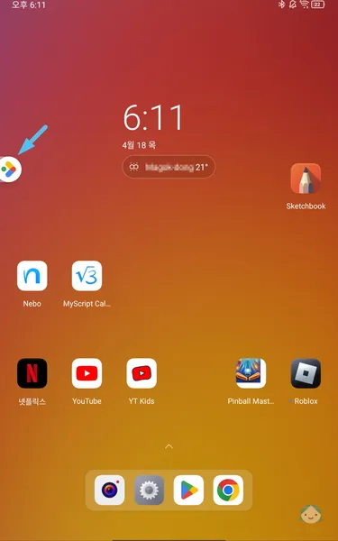{:class='image'}|
|:--:|
| *레노버 리전 Y700 2세대 Entertainment Space 기능 비활성화*{:class='caption'} |

다른 화면이나 앱에서는 나타나지 않지만 비활성화하길 원하는 경우 아래 설정 방법으로 비활성화할 수 있습니다.

홈 화면의 빈 곳을 누르고 있으면 홈 화면 수정 기능이 활성화 됩니다.\
홈 화면 수정 상태에서 우측 하단의 **홈 설정**을 선택합니다.
|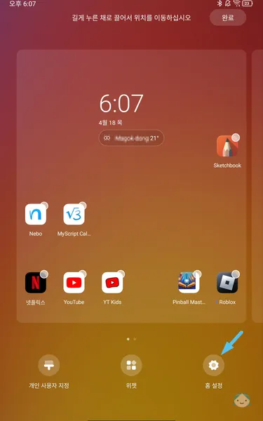{:class='image'}|
|:--:|
| *레노버 리전 Y700 2세대 Entertainment Space 기능 비활성화*{:class='caption'} |

**밀어서 Entertainment Space에 액세스** 항목을 찾아 비활성화 합니다.
|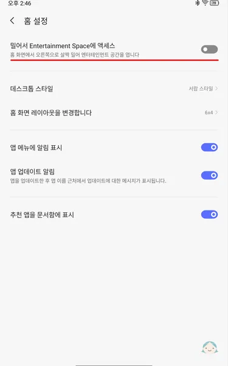{:class='image'}|
|:--:|
| *레노버 리전 Y700 2세대 Entertainment Space 기능 비활성화*{:class='caption'} |

## 화면 색상 모드
**설정** > **디스플레이** > **화면 색상 모드**를 찾아 차례대로 선택합니다.\
채도(표준, 선명)와 색상(표준, 난색, 한색)을 본인의 취향에 맞게 설정합니다.
|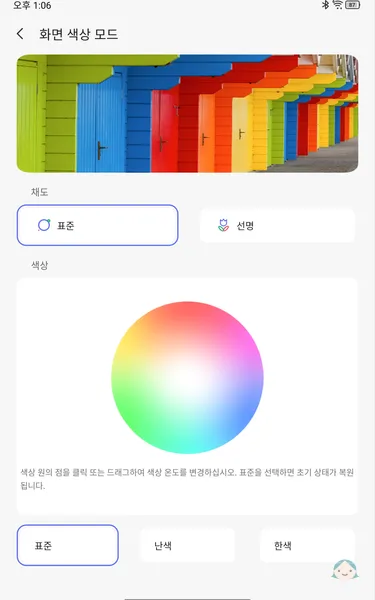{:class='image'}|
|:--:|
| *레노버 리전 Y700 2세대 화면 색상 모드*{:class='caption'} |

## 화면 새로 고침 빈도
**설정** > **디스플레이** > **화면 새로 고침 빈도**를 찾아 차례대로 선택합니다.\
기본값은 **자동 주사율**입니다.\
120Hz(추천) 이상으로 설정하면 슬라이드와 같은 화면 전환이 부드럽게 처리되는 것을 체감할 수 있습니다.\
<u>주사율이 높을수록 소비되는 전력이 높으며, 그만큼 배터리가 빨리 소진됩니다.</u>
|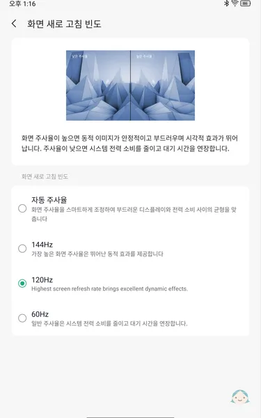{:class='image'}|
|:--:|
| *레노버 리전 Y700 2세대 화면 새로 고침 빈도*{:class='caption'} |

## 기기를 들어 대기 모드 해제 비활성화
**설정** > **디스플레이** > **추가 디스플레이 설정**을 찾아 차례대로 선택합니다.\
**기기를 들어 대기 모드 해제** 항목을 찾아 비활성화 합니다.
|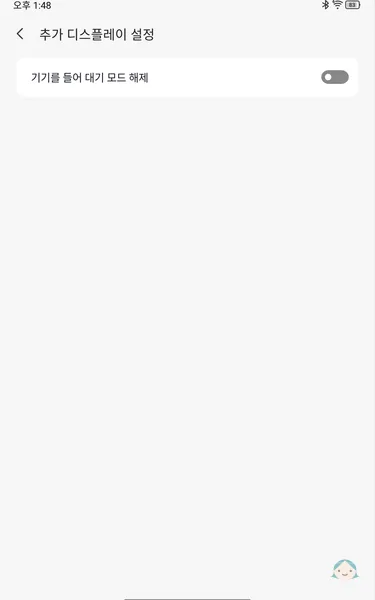{:class='image'}|
|:--:|
| *레노버 리전 Y700 2세대 기기를 들어 대기 모드 해제 비활성화*{:class='caption'} |

## 화면을 켜려면 두 번 탭합니다 활성화
**설정** > **일반 설정** > **빠른 제스처**를 찾아 차례대로 선택합니다.\
**화면을 켜려면 두 번 탭합니다** 항목을 찾아 활성화 합니다.
|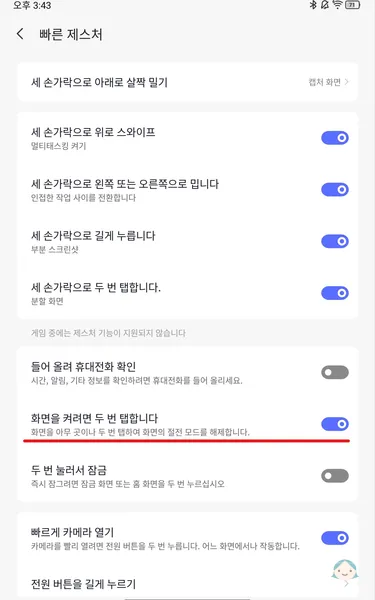{:class='image'}|
|:--:|
| *레노버 리전 Y700 2세대 화면을 켜려면 두 번 탭합니다 활성화*{:class='caption'} |

## 여러 사용자 허용 비활성화
**설정** > **일반 설정** > **여러 사용자**를 찾아 차례대로 선택합니다.\
**여러 사용자 허용** 항목을 찾아 비활성화 합니다.
|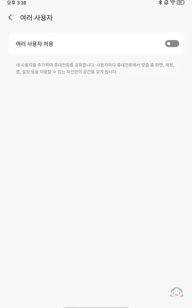{:class='image'}|
|:--:|
| *레노버 리전 Y700 2세대 여러 사용자 허용 비활성화*{:class='caption'} |