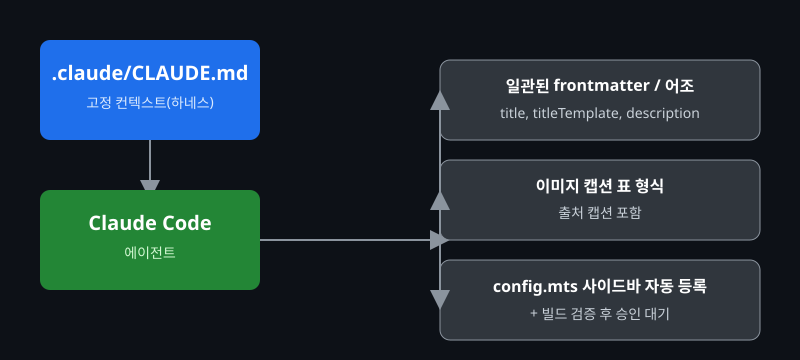

# Claude Code 하네스 도입기

::: info 들어가며
블로그 글 작성과 관리에 Claude Code 같은 AI 에이전트를 활용하다 보면, 대화를 새로 시작할 때마다 프로젝트 구조와 글쓰기 규칙을 처음부터 다시 설명해야 하는 번거로움이 생깁니다. 이 포스트에서는 `.claude/CLAUDE.md` 파일로 고정된 컨텍스트(하네스)를 만들어, 에이전트가 항상 같은 규칙을 따르도록 만든 과정을 공유합니다.
:::

## 문제 발견: 매번 달라지는 톤앤매너

이 블로그는 VitePress로 운영되고 있고, 글마다 어느 정도 일관된 형식이 있습니다. 소개·리뷰형 글은 상단에 스펙표를 두고 기능별로 이미지와 출처 캡션을 반복하는 구조이고, 트러블슈팅형 글은 문제 발견부터 원인 추적, 해결까지 narrative로 풀어내는 구조입니다.

AI 에이전트에게 새 글 작성을 맡겨보니 처음 몇 번은 꽤 만족스러운 결과가 나왔습니다. 그런데 대화를 새로 시작해서 같은 작업을 부탁하면 결과물이 매번 조금씩 달랐습니다.

- frontmatter에 `titleTemplate`이 빠지거나
- 이미지 캡션이 표 형식이 아니라 일반 문단으로 들어가거나
- 새 글을 추가했는데 사이드바 등록을 까먹거나

제 기억 속에 분명 지난번에는 이렇게 작업하지 않았는데, 왜 자꾸 결과물이 달라지는지 한동안 의아했습니다.

## 원인 추적: 고정된 컨텍스트가 없었다

고민을 한창 하던 중에, 문제의 원인이 에이전트 쪽이 아니라 제 쪽에 있다는 것을 깨달았습니다. 대화를 새로 시작할 때마다 에이전트는 이 프로젝트에 대한 기억이 전혀 없는 상태로 시작합니다. 즉, 제가 그때그때 구두로 설명해 준 규칙은 그 대화가 끝나면 사라지는 것이었습니다.

- 카테고리 구조(`/programming/`, `/it/`)
- 글 스타일 가이드(어조, frontmatter, 이미지 캡션 문법)
- 콘텐츠 템플릿(소개·리뷰형 vs 트러블슈팅형)
- 사이드바 등록 위치(`docs/.vitepress/config.mts`)

이런 정보들을 매번 새로 알려주다 보니 설명을 깜빡 빠뜨리는 경우가 생기고, 그 결과가 그대로 글에 반영되었던 것입니다.

## 해결 방법: `.claude/CLAUDE.md` 도입

해결책은 단순했습니다. 프로젝트 루트에 `.claude/CLAUDE.md` 파일을 만들어, 에이전트가 매 대화마다 자동으로 읽어들이는 고정 규칙(하네스)으로 등록하는 것이었습니다.

```md{1,3,9,15,21}
# CLAUDE.md

## 2. 카테고리 및 구조

게시물 생성 시 반드시 `docs/.vitepress/config.mts`를 읽고,
해당 카테고리의 `items` 배열에 다음 형태로 사이드바를 수동 등록할 것:

{ text: '제목', link: '/경로/' }

## 3. 게시물 스타일 가이드

- 어조: 정중한 구어체 종결어미(~합니다, ~습니다, ~해 봅시다)
- Frontmatter: title, titleTemplate, description 필수 포함
- 요약 레이아웃: 본문 시작 전 ::: info 또는 > [!info] 컨테이너 사용

## 5. 배포 규칙

- main 브랜치 푸시 시 GitHub Actions로 자동 배포됨
- git 커밋 및 푸시는 반드시 사용자 승인을 거칠 것
```

| {:class='image'} |
| :-------------------------------------------------------------------------------: |
|              _출처 : Claude Code 하네스 아키텍처_{:class='caption'}               |

이렇게 작성된 `CLAUDE.md`는 에이전트가 작업을 시작할 때 가장 먼저 읽는 문서가 되고, 글쓰기 스타일부터 사이드바 등록, 배포 전 승인 절차까지 모든 작업의 기준점이 됩니다.

## 결과 및 검증

`CLAUDE.md`를 도입한 이후로는 새 대화를 시작해도 에이전트가 다음과 같은 작업을 일관되게 수행합니다.

- frontmatter에 `title`, `titleTemplate`, `description`을 빠짐없이 포함
- 본문 시작 전 `::: info` 요약 컨테이너 배치
- 이미지·캡션을 표 형식 문법으로 작성
- 글의 성격에 맞는 템플릿(소개·리뷰형 / 트러블슈팅형) 적용
- 새 글 작성 후 `docs/.vitepress/config.mts` 사이드바에 자동 등록
- `npm run docs:build`로 빌드 검증까지 마친 뒤, 커밋·푸시는 제 승인을 받아 진행

## 다음 단계

작업 규칙을 하네스로 고정해두고 나니, 이제 Claude Code 자체를 설치하고 첫 대화를 시작하는 과정도 정리해 둘 차례라는 생각이 들었습니다.

- **Claude Code 설치 및 인증** — Node.js 환경 준비부터 계정 로그인까지
- **MCP(Model Context Protocol) 서버 연동** — GitHub, Slack, DB 등 외부 서비스 연결
- **멀티 에이전트 워크플로우** — 복잡한 작업을 여러 Claude 인스턴스로 병렬 처리

설치부터 인증, 첫 대화까지의 과정은 [Claude Code 시작하기](./getting-started)에서 정리해 두었습니다.

## 마치며

별도의 도구를 설치하거나 외부 시스템을 연동할 필요 없이, 텍스트 파일 하나로 워크플로우의 일관성과 안전성을 동시에 확보할 수 있었던 점이 가장 만족스러웠습니다. 매 대화를 새로 시작해도 같은 기준으로 글이 정리된다는 확신이 생기니, 이제는 글쓰기 형식보다 주제 선정에 더 집중할 수 있게 되었습니다.

> [!note]
> `CLAUDE.md`는 한 번 작성하고 끝나는 문서가 아닙니다. 새로운 컨벤션이 생기거나 결과물이 기준과 어긋날 때마다 규칙을 조금씩 보완해 나가는 것을 추천합니다.
