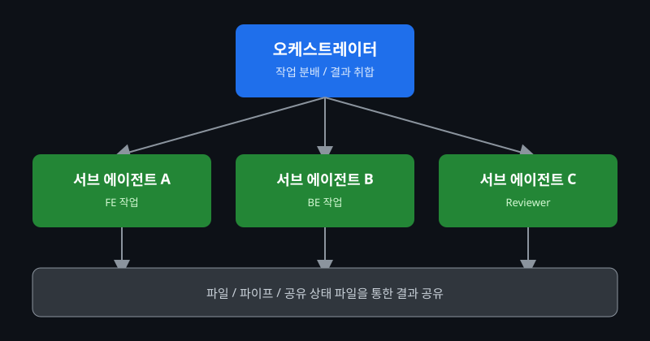

# Claude Code 멀티 에이전트 구성 및 실전 활용법

::: info 들어가며
하나의 Claude Code 세션으로 큰 작업을 맡기다 보면 어느 순간 컨텍스트가 가득 차서 응답 품질이 떨어지는 경험을 하게 됩니다. 이 글에서는 Claude Code를 여러 인스턴스로 나눠 **오케스트레이터(Orchestrator)**와 **서브 에이전트(Sub-agent)** 구조로 동작시키는 방법을 정리합니다. `claude --print`를 활용한 병렬 실행부터, 프롬프트 기반 동적 오케스트레이션, 서브디렉터리별 `CLAUDE.md`로 역할을 고정하는 방법까지, 그리고 에이전트 간 통신 패턴과 비용 관리 팁까지 한 번에 다룹니다.
:::

## 단일 에이전트의 한계

단일 에이전트만으로 대규모 리팩토링을 돌리다 한계에 부딪혔던 제 기억 속에, 처음에는 "왜 이렇게 자꾸 같은 파일을 다시 읽어들이지?" 하는 의문이 들었습니다. 작업 범위가 넓어질수록 Claude는 이전에 읽었던 파일 내용, 탐색 경로, 수정 이력을 계속 컨텍스트에 들고 있어야 했고, 결국 컨텍스트가 포화되면서 응답이 느려지고 가끔은 앞서 합의했던 내용을 놓치는 경우도 생겼습니다.

- 컨텍스트 윈도우가 가득 차면 오래된 정보가 요약·압축되면서 세부 사항이 흐려짐
- 한 세션 안에서 "코드 작성"과 "코드 리뷰"를 동시에 수행하면 객관적인 검증이 어려움
- 여러 영역(FE/BE, 여러 모듈)을 순차적으로 처리하면 전체 작업 시간이 선형적으로 늘어남

## 오케스트레이터와 서브 에이전트

어떻게 하면 이 녀석들을 팀처럼 움직이게 할까 고민을 한창 하던 중에, 결국 답은 "역할 분리"였습니다. 한 명의 만능 에이전트 대신, 작업을 지휘하는 **오케스트레이터**와 좁은 범위를 집중적으로 처리하는 **서브 에이전트**로 나누는 것입니다.

| 역할               | 책임                                                          | 특징                                     |
| ------------------ | ------------------------------------------------------------- | ---------------------------------------- |
| **오케스트레이터** | 작업을 작은 단위로 분배하고, 서브 에이전트의 결과를 취합·검증 | 전체 그림을 유지, 컨텍스트를 가볍게 유지 |
| **서브 에이전트**  | 할당받은 좁은 범위의 작업만 집중적으로 수행                   | 독립된 컨텍스트, 병렬 실행 가능          |

|   {:class='image'}   |
| :----------------------------------------------------------------------------------: |
| _출처 : 오케스트레이터와 서브 에이전트의 협업 아키텍처 파이프라인_{:class='caption'} |

## 구현 방법 3가지

멀티 에이전트라고 해서 거창한 프레임워크가 필요한 것은 아니었습니다. 실제로 써보니 난이도 순으로 크게 세 가지 방식이 있었습니다.

### 1. `claude --print` + Shell 병렬 실행

가장 간단하고 직관적인 방식입니다. `claude --print`(또는 `claude -p`)로 단일 쿼리를 stdout으로 받아오고, PowerShell의 `Start-Job`과 `Wait-Job`을 조합해 여러 인스턴스를 동시에 띄웁니다.

```powershell{2,3,4,6}
# 세 개의 모듈을 동시에 리뷰
Start-Job { claude --print "src/auth 모듈의 보안 취약점을 검토해줘" | Out-File review-auth.md }
Start-Job { claude --print "src/payment 모듈의 보안 취약점을 검토해줘" | Out-File review-payment.md }
Start-Job { claude --print "src/user 모듈의 보안 취약점을 검토해줘" | Out-File review-user.md }

Get-Job | Wait-Job
Write-Output "모든 리뷰 완료"
```

각 작업(Job)은 완전히 독립된 컨텍스트를 가지므로 서로 간섭하지 않고, `Wait-Job`이 끝나면 결과 파일 3개가 동시에 준비됩니다. 별도의 설정 없이 바로 시도해볼 수 있다는 점이 가장 큰 장점이었습니다.

### 2. `-p` (Prompt) 플래그를 활용한 동적 오케스트레이터

두 번째 방식은 오케스트레이터 역할의 Claude가 직접 작업을 쪼개고, 그 결과를 다시 `-p` 플래그로 서브 에이전트에게 넘기는 방식입니다. 즉, 오케스트레이터의 출력이 서브 에이전트의 입력 프롬프트가 됩니다.

```powershell{2,5,6,7,9}
# 1단계: 오케스트레이터가 작업 목록을 줄 단위로 분해
$tasks = claude --print "다음 디렉터리 목록 중 리팩토링이 필요한 파일을 찾아 파일별 작업 지시를 한 줄씩 출력해줘: src/components/"

# 2단계: 분해된 작업을 한 줄씩 서브 에이전트에게 전달
foreach ($task in ($tasks -split "`n" | Where-Object { $_.Trim() })) {
  Start-Job -ArgumentList $task {
    param($t) claude --print $t | Out-File -Append refactor-results.md
  }
}
Get-Job | Wait-Job
```

이 방식은 작업 목록을 사람이 미리 정의하지 않아도, 오케스트레이터가 그 시점의 코드 상태를 보고 동적으로 작업을 나눠준다는 점이 매력적이었습니다. 다만 오케스트레이터의 출력 형식이 흔들리면 후속 파이프라인이 깨질 수 있어서, "파일별로 정확히 한 줄씩, 다른 설명은 출력하지 말 것"처럼 출력 형식을 엄격하게 지시하는 것이 중요했습니다.

### 3. 서브디렉터리별 `CLAUDE.md` 분리 (고도화)

세 번째는 가장 고도화된 방법으로, 서브 에이전트가 작업할 디렉터리마다 별도의 `CLAUDE.md`를 두어 **페르소나와 역할을 고정**하는 방식입니다. Claude Code는 현재 작업 디렉터리를 기준으로 가장 가까운 `CLAUDE.md`를 읽기 때문에, 디렉터리 구조 자체로 역할을 분리할 수 있습니다.

```text{2,3,4,5,6,7}
project/
├── CLAUDE.md                # 오케스트레이터용: 전체 작업 분배 규칙
├── frontend/
│   └── CLAUDE.md             # FE 에이전트 페르소나: Vue 컨벤션, 컴포넌트 구조
├── backend/
│   └── CLAUDE.md             # BE 에이전트 페르소나: API 응답 형식, 에러 처리 규칙
└── reviewer/
    └── CLAUDE.md             # 리뷰어 에이전트 페르소나: 보안/성능 체크리스트
```

```powershell{2,3,4}
# 각 서브 에이전트를 해당 디렉터리에서 실행 → 그 디렉터리의 CLAUDE.md를 자동으로 적용
Start-Job { Set-Location "$using:PWD/frontend"; claude --print "로그인 폼 컴포넌트를 작성해줘" | Out-File "$using:PWD/fe-result.md" }
Start-Job { Set-Location "$using:PWD/backend"; claude --print "로그인 API 엔드포인트를 작성해줘" | Out-File "$using:PWD/be-result.md" }
Get-Job | Wait-Job
```

이렇게 하면 매번 프롬프트에 "너는 프론트엔드 담당이고 Vue 컨벤션을 따라야 해"처럼 역할을 설명할 필요가 없어집니다. 디렉터리 자체가 곧 역할이 되는 구조라서, 팀 규모가 커져도 일관성을 유지하기 좋았습니다.

## 실전 활용 시나리오

### 시나리오 1: 대규모 소스코드 보안 리뷰 병렬화

수십 개의 모듈을 가진 프로젝트에서 보안 리뷰를 한 세션으로 진행하면 컨텍스트가 금방 가득 찹니다. 모듈별로 서브 에이전트를 띄워 동시에 리뷰하고, 오케스트레이터가 결과를 취합하는 방식이 훨씬 효율적이었습니다.

```powershell{2,3,4,5,6,9,12}
# 1단계: 모듈 목록을 가져와 모듈별 서브 에이전트 실행
Get-ChildItem src/modules -Directory | ForEach-Object {
  $name = $_.Name
  Start-Job -ArgumentList $_.FullName, $name {
    param($dir, $name)
    claude --print "$dir 디렉터리의 코드를 OWASP Top 10 기준으로 검토하고, 발견된 취약점을 마크다운 표로 출력해줘" | Out-File "review-$name.md"
  }
}
Get-Job | Wait-Job

# 2단계: 오케스트레이터가 개별 리뷰 결과를 종합
Get-Content review-*.md | claude --print "다음 리뷰 결과들을 취합해서 심각도별로 정리한 종합 보안 리포트를 작성해줘" | Out-File security-report.md
```

### 시나리오 2: FE/BE 동시 개발 후 통합 검증 자동화

프론트엔드와 백엔드를 같은 기능 단위로 동시에 개발하고, 마지막에 오케스트레이터가 두 결과물의 인터페이스(API 스펙)가 맞는지 검증하는 흐름입니다.

```powershell{2,3,4,7}
# 1단계: FE/BE 서브 에이전트를 각자 디렉터리에서 동시 실행
Start-Job { Set-Location "$using:PWD/frontend"; claude --print "사용자 프로필 수정 화면을 구현해줘" | Out-File "$using:PWD/fe-done.md" }
Start-Job { Set-Location "$using:PWD/backend"; claude --print "사용자 프로필 수정 API를 구현해줘" | Out-File "$using:PWD/be-done.md" }
Get-Job | Wait-Job

# 2단계: 오케스트레이터가 두 작업물의 API 계약 일치 여부 검증
claude --print "frontend/src/api/profile.ts와 backend/src/routes/profile.ts를 비교해서 요청/응답 형식이 일치하는지 검증하고, 불일치하면 수정해줘"
```

### 시나리오 3: 작성자(Writer) - 검토자(Reviewer) 교차 검증 패턴

같은 에이전트가 코드를 작성하고 스스로 검토하면 자신의 실수를 잘 못 잡아내는 경향이 있었습니다. 그래서 작성자 역할과 검토자 역할을 완전히 분리된 세션으로 나누고, 서로의 결과물을 주고받게 했습니다.

```powershell{2,5,9}
# 1단계: 작성자 에이전트가 기능을 구현
claude --print "장바구니에 수량 변경 기능을 추가해줘. 변경한 파일 목록과 변경 이유를 마지막에 요약해줘" | Out-File writer-output.md

# 2단계: 검토자 에이전트가 작성자의 결과물을 비판적으로 검토
claude --print "$(Get-Content writer-output.md -Raw)
위 작업 내용을 바탕으로 변경된 파일을 직접 열어 코드 리뷰를 진행하고, 문제가 있다면 구체적으로 지적해줘" | Out-File reviewer-output.md

# 3단계: 작성자 에이전트가 검토 의견을 반영해 재작업
claude --print "$(Get-Content reviewer-output.md -Raw)
위 리뷰 의견을 반영해서 코드를 수정해줘"
```

작성자와 검토자를 분리하니, 검토자 입장에서는 "이 코드가 왜 이렇게 작성됐는지"에 대한 선입견 없이 결과물만 보고 판단하게 되어 리뷰 품질이 눈에 띄게 좋아졌습니다.

## 에이전트 간 통신 패턴

여러 에이전트를 굴리다 보면 결국 "에이전트 A의 결과를 에이전트 B에게 어떻게 전달할 것인가"라는 문제에 부딪힙니다. 실제로 써본 세 가지 패턴을 비교해 보겠습니다.

### 파일(File) 기반

가장 단순하고 디버깅하기 쉬운 방식입니다. 각 에이전트가 결과를 파일로 남기고, 다음 에이전트가 그 파일을 읽습니다.

```powershell{2,5}
# 서브 에이전트 A: 결과를 파일로 저장
claude --print "API 명세를 분석해서 변경 사항을 정리해줘" | Out-File changes.md

# 서브 에이전트 B: 파일을 읽어 후속 작업 수행
claude --print "changes.md 파일 내용을 참고해서 프론트엔드 타입 정의를 업데이트해줘"
```

결과가 파일로 남기 때문에 중간 산출물을 사람이 직접 검토하거나, 문제가 생겼을 때 어느 단계에서 잘못됐는지 추적하기 쉽습니다. 다만 파일 I/O가 늘어나고, 동시에 여러 에이전트가 같은 파일을 쓰면 충돌이 발생할 수 있습니다.

### 파이프(Pipe) 기반

중간 산출물을 파일로 남기지 않고, 한 에이전트의 출력을 곧바로 다음 에이전트의 입력으로 흘려보내는 방식입니다.

```powershell{1,2}
claude --print "이번 주 변경된 커밋 목록을 분석해서 릴리즈 노트 초안을 작성해줘" |
  claude --print "다음 내용을 더 친근한 어조로 다시 작성해줘:"
```

중간 파일이 남지 않아 깔끔하지만, 중간 단계의 결과를 검토하기 어렵고, 두 번째 에이전트가 첫 번째 에이전트의 출력 형식에 그대로 의존하게 되어 형식이 흔들리면 전체 파이프라인이 깨지기 쉬웠습니다. 짧고 단순한 변환 작업에는 적합했지만, 중요한 의사결정이 끼는 작업에는 파일 기반을 더 선호하게 되었습니다.

### 공유 상태 파일(State File) 기반

여러 에이전트가 동시에 작업하면서 "현재 전체 작업이 어디까지 진행됐는지"를 공유해야 할 때 사용했습니다. JSON이나 마크다운 체크리스트 형태의 상태 파일을 두고, 각 에이전트가 자신이 맡은 항목만 갱신합니다.

```powershell{2,3,4,5,6,7,8,9,10,11,15}
# state.json
# {
#   "tasks": [
#     { "id": 1, "name": "FE 컴포넌트 작성", "owner": "frontend", "status": "todo" },
#     { "id": 2, "name": "BE API 작성", "owner": "backend", "status": "todo" },
#     { "id": 3, "name": "통합 테스트", "owner": "orchestrator", "status": "todo" }
#   ]
# }

# 서브 에이전트는 자신이 맡은 task만 처리하고 상태를 갱신
claude --print "state.json에서 owner가 frontend이고 status가 todo인 task를 처리한 뒤, 해당 항목의 status를 done으로 갱신해줘"

# 오케스트레이터는 주기적으로 state.json을 확인해 모든 task가
# done이 되면 다음 단계(통합 테스트)를 트리거
claude --print "state.json의 모든 task status를 확인하고, 전부 done이면 통합 테스트를 진행해줘"
```

이 패턴은 진행 상황을 한눈에 파악할 수 있다는 장점이 있지만, 상태 파일에 대한 동시 쓰기를 막아야 한다는 점을 항상 염두에 둬야 했습니다.

## 주의사항 및 비용 관리

### 파일 동시 수정 충돌 방지

여러 서브 에이전트를 병렬로 돌리다가 같은 파일을 동시에 수정해서 충돌이 났던 경험이 있습니다. 이후로는 다음 원칙을 지키고 있습니다.

- 서브 에이전트별로 **작업 디렉터리(또는 파일 범위)를 명확히 분리**해서 겹치지 않게 할 것
- 공유 상태 파일은 **오케스트레이터만 쓰기**, 서브 에이전트는 자신의 항목만 갱신하도록 프롬프트에 명시할 것
- 병렬 작업이 끝난 뒤에는 `git status`로 변경된 파일 목록을 확인하고, 의도하지 않은 중복 수정이 없는지 검토할 것

### 컨텍스트의 명시적 전달

서브 에이전트는 오케스트레이터의 대화 맥락을 전혀 알지 못하는 상태로 시작합니다. "이전에 합의한 내용대로 해줘"처럼 암묵적인 전제를 깔면 전혀 다른 결과가 나옵니다. 항상 프롬프트 자체에 필요한 배경, 파일 경로, 출력 형식을 구체적으로 적어서 넘겨야 합니다.

### 비용 관리: 계정 인증 기준 크레딧 최적화

Claude.ai 계정으로 로그인해서 사용하는 경우, 멀티 에이전트로 여러 인스턴스를 동시에 띄우면 구독 플랜의 사용량 한도에 그만큼 빠르게 도달합니다. Anthropic Console(API 키) 방식으로 전환해 사용량 기반 과금으로 운영하는 경우라면, 다음과 같은 점을 챙기는 것이 비용 관리에 도움이 되었습니다.

- 병렬로 띄우는 서브 에이전트 수를 작업 단위(모듈, 디렉터리)에 맞춰 **필요한 만큼만** 제한하기
- 동일한 파일을 여러 에이전트가 반복해서 읽지 않도록, 공통 컨텍스트는 요약된 형태로 한 번만 전달하기
- 단순 변환·포맷팅처럼 가벼운 작업은 더 가벼운 모델로 처리하고, 복잡한 설계·리뷰 작업에만 상위 모델을 사용하기
- 대규모 작업 전에는 작은 샘플(예: 모듈 1~2개)로 먼저 돌려보고 결과 품질과 소요 시간을 확인한 뒤 전체로 확장하기

## 다음 단계

멀티 에이전트 구성에 익숙해졌다면, 다음 주제로 이어가 볼 차례입니다.

- **MCP 서버를 공유하는 멀티 에이전트** — GitHub, Slack, DB MCP를 여러 에이전트가 함께 활용하는 구조
- **CI/CD 파이프라인 내 멀티 에이전트** — GitHub Actions에서 리뷰어 에이전트와 빌드 에이전트를 분리해 실행하기
- **상태 파일 기반 작업 큐 자동화** — 오케스트레이터가 작업 큐를 주기적으로 폴링하며 서브 에이전트를 스케줄링하는 구조

특히 첫 번째 주제는 [Claude Code MCP 연동하기](./mcp-integration)에서 다룬 MCP 서버 설정을 기반으로 확장하게 될 것 같습니다.

## 마치며

처음에는 "에이전트를 여러 개 띄운다"는 개념이 막연하게 느껴졌는데, 막상 해보니 셸 스크립트 수준의 병렬 실행만으로도 꽤 큰 효과를 볼 수 있었습니다. 다만 에이전트가 늘어날수록 "누가 무엇을 책임지고, 결과를 어떻게 주고받는가"를 명확히 설계하는 것이 가장 중요하다는 것을 느꼈습니다. 처음에는 파일 기반의 단순한 작성자-검토자 구조부터 시작해서, 점차 디렉터리별 `CLAUDE.md`로 역할을 고정하는 방식으로 확장해 나가는 것을 추천합니다.

> [!note]
> 멀티 에이전트 구성은 모델 사용량이 빠르게 늘어날 수 있습니다. 처음에는 적은 수의 서브 에이전트로 시작해서 결과 품질과 비용을 함께 확인해 보세요.
