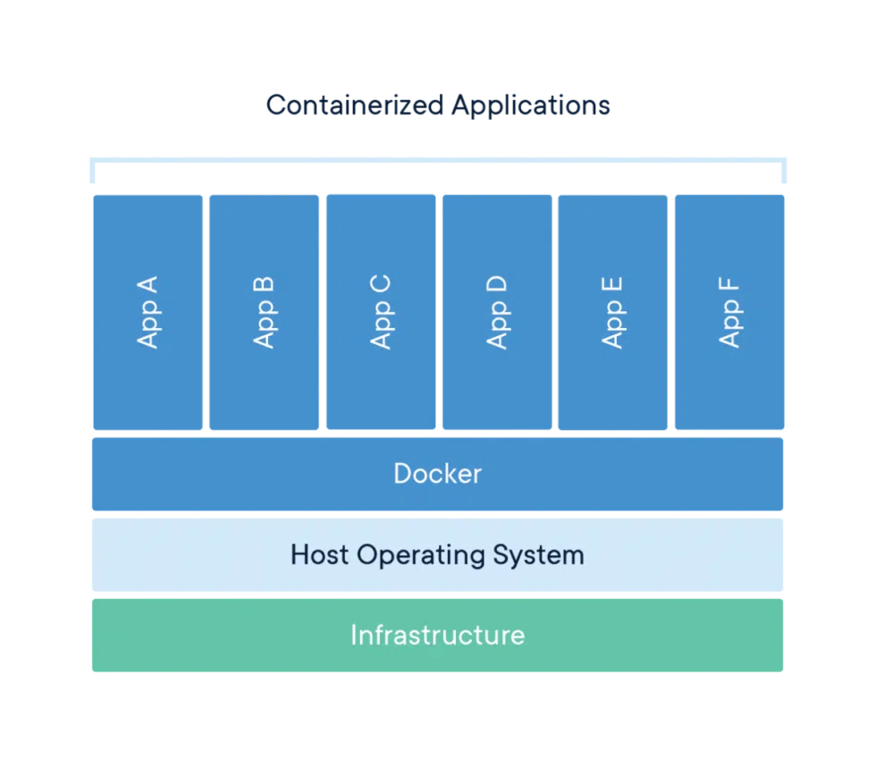

# Docker란 무엇인가?
 
<svg class="docker_logo " id="Layer_1" data-name="Layer 1" xmlns="http://www.w3.org/2000/svg" viewBox="0 0 2334.44 537.22"><path d="M664.01 223.35c-16.55-11.14-60.03-15.89-91.64-7.38-1.7-31.49-17.94-58.03-47.65-81.17l-10.99-7.38-7.33 11.07c-14.4 21.86-20.47 51-18.33 77.49 1.7 16.32 7.37 34.66 18.33 47.97-41.15 23.87-79.07 18.45-247.03 18.45H.06C-.7 320.33 5.4 393.28 51.79 452.67c5.12 6.56 10.74 12.91 16.84 19.02 37.72 37.77 94.71 65.47 179.93 65.54 130 .12 241.39-70.16 309.15-240.07 22.3.37 81.15 3.99 109.95-51.66.7-.94 7.33-14.76 7.33-14.76l-10.98-7.38zm-494.72-39.14H96.37v72.92h72.92v-72.92zm94.21 0h-72.92v72.92h72.92v-72.92zm94.21 0h-72.92v72.92h72.92v-72.92zm94.21 0H379v72.92h72.92v-72.92zm-376.82 0H2.16v72.92h72.92v-72.92zm94.21-92.11H96.39v72.92h72.92V92.1zm94.21 0H190.6v72.92h72.92V92.1zm94.21 0h-72.92v72.92h72.92V92.1zM357.7 0h-72.92v72.92h72.92V0zm1972.23 424.7c0 18.94-14.87 33.81-34.21 33.81s-34.42-14.87-34.42-33.81 15.27-33.4 34.42-33.4 34.21 14.87 34.21 33.4zm-60.08 0c0 14.87 11 26.68 26.07 26.68s25.46-11.81 25.46-26.47-10.8-26.89-25.65-26.89-25.87 12.02-25.87 26.68zm20.58 17.52h-7.74v-33.4c3.04-.61 7.33-1.02 12.82-1.02 6.32 0 9.16 1.02 11.61 2.45 1.84 1.42 3.26 4.07 3.26 7.33 0 3.67-2.85 6.52-6.91 7.74v.41c3.24 1.21 5.08 3.66 6.1 8.14 1.01 5.09 1.62 7.13 2.45 8.35h-8.35c-1.02-1.22-1.64-4.27-2.65-8.15-.61-3.66-2.65-5.29-6.93-5.29h-3.66v13.45zm.2-18.94h3.66c4.28 0 7.74-1.42 7.74-4.88 0-3.06-2.23-5.11-7.13-5.11-2.03 0-3.46.21-4.27.43v9.56zM1017.65 86.68c-4.79-4.68-10.54-7.06-17.43-7.06S987.41 82 982.8 86.68c-4.62 4.68-6.88 10.68-6.88 17.83v119.4c-23.7-19.59-51.05-29.47-82.16-29.47-36.16 0-67.08 13.06-92.7 39.27-25.62 26.12-38.34 57.72-38.34 94.78s12.81 68.57 38.34 94.78c25.62 26.12 56.46 39.27 92.7 39.27s66.74-13.06 92.7-39.27c25.62-25.86 38.34-57.45 38.34-94.78V104.5c0-7.15-2.35-13.15-7.15-17.83zm-48.18 274.11v.18c-4.27 10.15-10.11 19.06-17.51 26.65-7.4 7.68-16.12 13.68-26.05 18.18-10.02 4.5-20.65 6.71-32.06 6.71s-22.3-2.21-32.32-6.71-18.65-10.5-25.96-18.09c-7.32-7.59-13.15-16.5-17.42-26.65-4.27-10.24-6.45-21.09-6.45-32.57s2.18-22.33 6.45-32.57c4.27-10.24 10.11-19.06 17.42-26.65 7.32-7.59 16.03-13.59 25.96-18.09 10.02-4.5 20.74-6.71 32.32-6.71s22.04 2.21 32.06 6.71c10.02 4.5 18.65 10.5 26.05 18.18 7.4 7.68 13.24 16.59 17.51 26.65 4.27 10.15 6.45 20.92 6.45 32.39s-2.18 22.33-6.45 32.39zm1130.79-83.75c-6.36-15.89-16.05-30.27-28.76-43.16l-.17-.09c-25.88-26.12-56.82-39.27-92.7-39.27s-67.09 13.06-92.71 39.27c-25.62 26.12-38.33 57.72-38.33 94.78s12.81 68.57 38.33 94.78c25.62 26.12 56.47 39.27 92.71 39.27 32.92 0 61.41-10.85 85.64-32.56 4.69-4.94 7.06-10.94 7.06-17.92s-2.26-13.15-6.89-17.83c-4.61-4.68-10.45-7.06-17.42-7.06-6.09.18-11.5 2.21-16.11 6.27-7.32 6.35-15.25 11.21-23.87 14.39-8.63 3.18-18.04 4.77-28.31 4.77-9.07 0-17.78-1.41-26.05-4.32-8.29-2.91-16.03-6.89-22.92-12.09-6.98-5.21-12.98-11.38-18.12-18.71-5.14-7.24-9.06-15.27-11.67-24.09h185.32c6.87 0 12.62-2.38 17.42-7.06 4.8-4.68 7.15-10.68 7.15-17.83 0-18.53-3.24-35.74-9.58-51.54zm-200.48 26.65c2.53-8.74 6.36-16.77 11.5-24.09 5.15-7.24 11.24-13.5 18.21-18.71 7.06-5.21 14.72-9.18 23.17-12.09 8.44-2.91 17.06-4.32 25.97-4.32s17.51 1.41 25.86 4.32c8.37 2.91 16.05 6.88 22.92 12.09 6.98 5.21 13.07 11.38 18.21 18.71 5.22 7.24 9.16 15.27 11.86 24.09h-157.71zm428.21-92.4c-4.36-4.32-9.85-7.68-16.47-10.15-6.62-2.47-13.85-4.15-21.78-5.12-7.84-.97-15.25-1.41-22.12-1.41-15.61 0-30.24 2.56-44 7.68-13.77 5.12-26.49 12.44-38.17 21.97v-4.76c0-6.88-2.35-12.71-7.15-17.56-4.78-4.85-10.45-7.32-17.15-7.32s-12.64 2.47-17.42 7.32c-4.8 4.85-7.15 10.77-7.15 17.56v218.25c0 6.88 2.35 12.71 7.15 17.56 4.78 4.85 10.53 7.32 17.42 7.32s12.45-2.47 17.15-7.32c4.8-4.85 7.15-10.77 7.15-17.56V328.58c0-11.65 2.18-22.59 6.45-32.83 4.27-10.24 10.11-19.06 17.51-26.65 7.42-7.59 16.13-13.59 26.05-17.92 10.02-4.41 20.66-6.62 32.08-6.62s22.2 2.03 32.06 6c3.91 1.77 7.32 2.65 10.28 2.65 3.4 0 6.62-.62 9.58-1.94 2.96-1.32 5.58-3.09 7.76-5.38 2.18-2.29 3.91-4.94 5.22-8.03 1.31-3 2.01-6.27 2.01-9.8 0-6.88-2.18-12.44-6.53-16.77h.08zm-1023.01 65.83c-6.36-15.8-15.86-30.27-28.66-43.33-25.87-26.12-56.8-39.27-92.7-39.27s-67.08 13.06-92.7 39.27c-25.62 26.12-38.33 57.72-38.33 94.78s12.81 68.57 38.33 94.78c25.62 26.12 56.46 39.27 92.7 39.27s66.74-13.06 92.7-39.27c25.62-25.86 38.34-57.45 38.34-94.78-.18-18.53-3.4-35.65-9.67-51.45zm-45.65 83.66v.18c-4.27 10.15-10.11 19.06-17.51 26.65-7.4 7.68-16.12 13.68-26.05 18.18s-20.65 6.71-32.06 6.71-22.3-2.21-32.32-6.71-18.65-10.5-25.96-18.09c-7.32-7.59-13.15-16.5-17.42-26.65-4.27-10.24-6.45-21.09-6.45-32.57s2.18-22.33 6.45-32.57c4.27-10.24 10.11-19.06 17.42-26.65 7.32-7.59 16.03-13.59 25.96-18.09 10.02-4.5 20.74-6.71 32.32-6.71s22.04 2.21 32.06 6.71c10.02 4.5 18.65 10.5 26.05 18.18 7.4 7.68 13.24 16.59 17.51 26.65 4.27 10.15 6.45 20.92 6.45 32.39s-2.18 22.33-6.45 32.39zm569.78-141.37c0-3.35-.7-6.53-2-9.53-1.31-3-3.05-5.73-5.23-8.03-2.18-2.29-4.79-4.15-7.75-5.38-2.96-1.23-6.18-1.94-9.58-1.94-4.88 0-9.24 1.24-13.07 3.8l-139.92 93.11V104.68c0-7.06-2.35-12.97-7.14-17.83-4.79-4.85-10.45-7.32-17.16-7.32s-12.63 2.47-17.43 7.32c-4.79 4.85-7.14 10.77-7.14 17.83v332.71c0 6.88 2.35 12.8 7.14 17.74 4.79 4.94 10.54 7.41 17.43 7.41s12.46-2.47 17.16-7.41c4.79-4.94 7.14-10.86 7.14-17.74v-86.4l28.58-19.15 108.12 124.17c4.36 4.32 9.85 6.44 16.38 6.44 3.4 0 6.62-.62 9.58-1.94 2.96-1.24 5.58-3.09 7.75-5.38 2.18-2.29 3.92-4.94 5.23-8.03 1.31-3 2-6.27 2-9.53 0-6.53-2.26-12.36-6.8-17.47l-100.63-115.87 98.01-65.13c6.27-4.32 9.32-10.94 9.32-19.86v.18zm-414.26 49.68c7.49-7.59 16.21-13.59 26.23-17.92 10.02-4.41 20.65-6.62 32.06-6.62 10.28 0 19.78 1.77 28.58 5.29 8.71 3.53 17.08 8.74 25 15.53 4.7 3.79 10.02 5.73 15.94 5.73 7.06 0 12.81-2.38 17.43-7.15 4.62-4.77 6.88-10.77 6.88-17.92s-2.79-13.77-8.45-18.88c-24.05-21.71-52.53-32.57-85.38-32.57-36.16 0-67.08 13.06-92.7 39.27-25.62 26.12-38.33 57.72-38.33 94.78s12.81 68.57 38.33 94.78c25.62 26.12 56.46 39.27 92.7 39.27 32.76 0 61.25-10.85 85.38-32.57 5.14-5.29 7.76-11.38 7.76-18.44s-2.27-13.15-6.88-17.83c-4.62-4.68-10.45-7.06-17.42-7.06-5.92.18-11.07 1.94-15.42 5.29-7.84 6.88-16.03 12-24.83 15.44-8.71 3.44-18.21 5.12-28.58 5.12-11.41 0-22.04-2.21-32.06-6.62-10.02-4.41-18.73-10.41-26.23-17.91-7.49-7.5-13.42-16.5-17.69-26.65-4.27-10.24-6.45-21.18-6.45-32.83s2.18-22.59 6.45-32.83c4.27-10.24 10.19-19.06 17.69-26.65v-.09z" fill="#1d63ed" stroke-width="0"></path></svg>
 

::: info 들어가며
오랫동안 개발자로 일하면서 Docker가 무엇인지 모르는 사람들이 많습니다. 게다가 최근 회사 채용 정보들을 보면 자격요건이나 우대사항에 Git과 Docker 항목이 심심치 않게 등장하는 것을 볼 수 있습니다. 이 포스팅에서는 Docker가 무엇인지 간략하게 알아보는 시간을 갖도록 하겠습니다.
:::

## Docker란?
[Docker 공식 사이트](https://docker.com)에 접속하면 메인 화면에 아래와 같은 문구가 있습니다.
>#### Docker는 개발자가 지루한 환경 구성이나 관리 없이 어디서나 애플리케이션을 구축, 공유, 실행 및 확인할 수 있도록 도와줍니다
>>
>Docker는 애플리케이션을 개발, 제공 및 실행하기 위한 개방형 플랫폼입니다. Docker를 사용하면 애플리케이션을 인프라에서 분리하여 소프트웨어를 신속하게 제공할 수 있습니다. Docker를 사용하면 애플리케이션을 관리하는 것과 동일한 방식으로 인프라를 관리할 수 있습니다. 코드 전송, 테스트 및 배포에 대한 Docker의 방법론을 활용하면 코드 작성과 프로덕션 환경 실행 사이의 지연 시간을 크게 줄일 수 있습니다.

회사나 개인 프로젝트를 진행하다 보면 실제 서비스 제공을 위해 배포를 해야 하는 할 일이 생기곤 합니다. 개발자로 일하면서 누구나 한 번쯤은 배포를 하거나 들어본 경험이 있을 텐데요. 제 기억 속에 배포는 정말 지루하고 귀찮은 업무 중 하나였습니다.
* 빌드하고
* 압축하고
* 서버에 붙어 파일을 옮기고
* 기존 서비스를 중지하고
* 백업을 하고...

거기다 서버를 이전해야 하는 일이 생기면... 추가로 서버 설치부터 설정까지 모두 다시 해야 하는 것과 더불어 기존 서버와 똑같이 정상적으로 실행된다는 보장을 할 수 없습니다.\
Docker는 이런 일련의 복잡한 작업들을 매번 반복하지 않도록 도와주는 역할을 합니다. 그럼 우선 왜 Docker를 사용해야 하는지 알아봅시다.

## 왜 Docker를 사용해야 할까요?
도대체 Docker가 무엇이기에 개발 환경에서 자주 언급되는지 무척 궁금했습니다. 그렇게 찾아 헤매다 좋은 글을 발견했습니다. 꼭 한번 읽어보세요.

* [44BITS - 왜 굳이 도커(컨테이너)를 써야 하나요? - raccoony](https://www.44bits.io/ko/post/why-should-i-use-docker-container)

Docker를 사용하면 위에서 언급한 서버 설치, 설정부터 배포, 배포 이후 일련의 작업들까지 모두 코드로 구성하고 이미지화하는 것이 가능합니다. 우리는 서버에 Docker를 설치하고 만들어둔 이미지로부터 컨테이너들을 구동시키기만 하면 됩니다.

## Docker 이미지
>Docker 이미지는 Docker 컨테이너를 생성하기 위한 지침이 포함된 읽기 전용 템플릿입니다. 어떤 이미지는 사용자가 추가 정의한 부분이 포함된 또 다른 이미지를 기반으로 합니다. 예를 들어, 우분투 이미지를 기반으로 Apache 웹 서버와 애플리케이션을 추가로 설치하고 애플리케이션을 실행하는 데 필요한 세부 구성 정보를 포함하는 이미지를 빌드할 수 있습니다.

좀 더 쉽게 설명하자면, **순정 윈도우 설치 CD**를 이용해 **자주 애용하는 브라우저나 백신과 같은 프로그램이 포함된 윈도우 설치 CD**를 새롭게 만들 수 있다는 얘기와 비슷합니다.

## Docker 컨테이너
>컨테이너는 애플리케이션이 한 컴퓨팅 환경에서 다른 컴퓨팅 환경으로 빠르고 안정적으로 실행될 수 있도록 코드와 모든 종속성을 패키지화하는 소프트웨어의 표준 단위입니다. Docker 컨테이너 이미지는 코드, 런타임, 시스템
도구, 시스템 라이브러리 및 설정 등 애플리케이션을 실행하는 데 필요한 모든 것을 포함하는 가벼운 독립 실행 가능 소프트웨어 패키지입니다.
>>
>컨테이너 이미지는 런타임 시 컨테이너가 되며, Docker 컨테이너의 경우 이미지가 Docker 엔진 에서 실행될 때 컨테이너가 됩니다. Linux 및 Windows 기반 애플리케이션 모두에서 사용할 수 있는 컨테이너화된 소프트웨어는 인프라에 관계없이 항상 동일하게 실행됩니다. 컨테이너는 소프트웨어를 해당 환경에서 격리하고 개발과 스테이징 간의 차이에도 불구하고 소프트웨어가 균일하게 작동하도록 보장합니다.

|{:class='image'}|
|:--:|
| *출처 : Docker 공식 사이트*{:class='caption'} |

컨테이너란 한마디로, 미리 만들어 둔 이미지(그것이 OS나 App 등 무엇이 되었든지)로부터 단독으로 만들어져 구동되는 가상의 머신이라고 생각하면 될 것 같습니다.\
물론 실제 컨테이너는 <u>가상 머신이 아닙니다.</u>