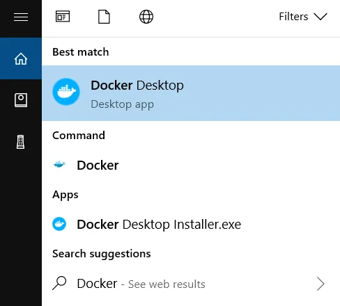

# Docker 시작하기
::: info Docker를 시작하기 앞서
윈도우 환경에서 Docker Desktop을 설치하고 윈도우 터미널을 이용해 Docker를 다룰 예정입니다.
Docker Desktop은 아래와 같은 환경에서 설치가 가능합니다.
* Mac
* Windows
* Linux (Ubuntu, Devian, Pedora, Arch)
:::
::: warning 목표
저는 현재 개인 프로젝트로 서비스 중인 [디아블로® IV | 트레이더스](https://d4.tradurs.com/) 사이트를 Github와 Jenkins를 이용해 Docker 컨테이너로 자동 배포하는 것을 목표로 하여 진행할 예정입니다.
:::

## WSL 2 설치
Windows 환경에서 Docker를 사용하려면 선행적으로 `WSL`을 설치해야 합니다.
::: info WSL이란?
* Linux 배포를 설치할 때 기본 배포판 유형입니다. 
* Windows에서 직접 Linux 애플리케이션, 유틸리티 및 Bash 명령줄 도구를 사용할 수 있도록 도와줍니다.
:::

**관리자** 모드에서 PowerShell 또는 Windows 명령 프롬프트를 마우스 오른쪽 단추로 클릭하고 "관리자 권한으로 실행"을 선택하여 열고 `wsl --install` 명령을 입력한 다음 컴퓨터를 다시 시작합니다.
```Shell
wsl --install
```

::: tip 설치 팁
설치 중 사용자명과 비밀번호를 설정해야 합니다.
:::

PowerShell 또는 Windows 명령 프롬프트에서 `wsl -l -v` 명령을 입력하여 설치된 Linux 배포판을 나열하고 각각 설정된 WSL 버전을 확인할 수 있습니다.
```Shell
wsl -l -v
```

WSL 설치에 대한 자세한 정보는 [WSL을 사용하여 Windows에 Linux를 설치하는 방법](https://learn.microsoft.com/ko-kr/windows/wsl/install)을 참조하세요.

## Docker Desktop for Windows
### Docker Desktop for Windows 시스템 요구사항
::: info 시스템 요구사항
* WSL 1.1.3.0 이나 이후 버전
* Windows 11 64비트 : Home 또는 Pro 21H2 버전 이상, Enterprise 또는 Education 21H2 버전 이상
* Windows 10 64비트 : Home 또는 Pro 22H2(빌드 19045) 버전 이상, Enterprise 또는 Education 22H2(빌드 19045) 버전 이상
    * 최소 요구사항은 Home 또는 Pro 21H2(빌드 19044) 버전 이상, Enterprise 또는 Education 21H2(빌드 19044) 버전 이상
* Windows에서 WSL 2 기능을 켭니다. 자세한 지침은 [Microsoft 설명서](https://docs.microsoft.com/en-us/windows/wsl/install-win10)를 참조하세요.
* Windows 10 또는 Windows 11에서 WSL 2를 성공적으로 실헹하려면 다음 하드웨어 필수 구성 요소가 필요합니다.
    * [SLAT(Second Level Adress Translation)](https://en.wikipedia.org/wiki/Second_Level_Address_Translation) 기능을 갖춘 64비트 프로세서
    * 4GB 시스템 RAM
    * BIOS에서 하드웨어 가상화를 활성화합니다. 자세한 내용은 [가상화](https://docs.docker.com/desktop/troubleshoot/topics/#virtualization)를 참조하세요.
:::

Docker Desktop을 사용하여 WSL 2를 설정하는 방법에 대한 내용은 [WSL](https://docs.docker.com/desktop/wsl/)을 참조하세요.

::: warning 중요
Windows 컨테이너를 실행하려면 Windows 10, Windows 11 Professional 또는 Enterprise 버전이 필요합니다. Windows Home 또는 Education 버전에서는 Linux 컨테이너만 실행할 수 있습니다.
:::
\
Docker Desktop의 자세한 정보는 Docker.docs의 [Docker desktop](https://docs.docker.com/desktop/) 카테고리를 참조하세요.

### Docker Desktop for Windows 설치
::: warning 중요
기본적으로 Docker Desktop은 **Hyper-V** 또는 **WSL 2** 백엔드 환경에서 구동됩니다. 저는 **WSL 2** 백엔드로 진행할 예정입니다.
:::
[Release Notes](https://docs.docker.com/desktop/release-notes/)에서 설치 프로그램을 다운로드합니다.

1. `Docker Desktop Installer.exe`를 더블 클릭하여 설치를 시작합니다. 
1. 기본적으로 Docker Desktop은 `C:\Program Files\Docker\Docker`에 설치됩니다.
1. 메시지가 표시되면 선택한 백엔드에 따라 구성 페이지에서 **Hyper-V 대신 WSL 2 사용** 옵션이 선택되었는지 확인하세요. 시스템이 두 가지 옵션 중 하나만 지원하는 경우에는 사용할 백엔드를 선택할 수 없습니다.
1. 설치 마법사의 안내에 따라 설치 마법사에 권한을 부여하고 설치를 진행합니다.
1. 설치가 완료되면 닫기를 선택하여 설치 프로세스를 완료합니다.

관리자 계정이 사용자 계정과 다른 경우 해당 사용자를 docker-users 그룹에 추가해야 합니다:
1. **관리자**로 **컴퓨터 관리**를 실행합니다.
1. **로컬 사용자 및 그룹** > **그룹** > **docker-users**로 이동합니다.
1. 마우스 오른쪽 버튼을 클릭하여 그룹에 추가를 선택합니다.
1. 구성원에 사용자를 추가합니다.
1. 변경 사항을 적용하려면 로그아웃했다가 다시 로그인합니다.

### Docker Desktop for Windows 시작하기

Docker Desktop은 설치 후 자동으로 시작되지 않습니다. Docker Desktop을 시작하려면:
1. 윈도우 검색창에 **Docker**를 검색하고 검색 결과에서 Docker Desktop을 선택합니다.

|{:class='image'}|
|:--:|
| *출처 : Docker 공식 사이트*{:class='caption'} |

2.Docker 메뉴에는 Docker 구독 서비스 계약이 표시됩니다.

주요 내용을 요약하면 다음과 같습니다.

* Docker Desktop은 소규모 기업(직원 수 250명 미만, 연간 수익 1,000만 달러 미만), 개인 용도, 교육 및 비상업적 오픈 소스 프로젝트에 무료로 제공됩니다.
* 그렇지 않은 경우 전문적으로 사용하려면 유료 구독이 필요합니다.
* 정부 기관에도 유료 구독이 필요합니다.
* Docker Pro, Team 및 Business 구독에는 Docker Desktop의 상업적 사용이 포함됩니다.

3. 계속하려면 **Accept**를 선택하세요. Docker Desktop은 약관에 동의한 후에 시작됩니다.

약관에 동의하지 않으면 Docker Desktop이 실행되지 않습니다. Docker Desktop을 열어 나중에 약관에 동의하도록 선택할 수 있습니다.

자세한 내용은 [Docker Desktop Subscription Service Agreement](https://www.docker.com/legal/docker-subscription-service-agreement/)을 참조하세요. [FAQ](https://www.docker.com/pricing/faq/)도 읽어 보시기 바랍니다 