# Github와 Jenkins 연동하기

::: info 들어가기 앞서
이 포스트는 사용자가 **Github 계정**과 실제 외부에서 접속 가능한 **Jenkins Web**이 준비되어 있다는 가정하에 진행됩니다.
:::

## Node.js 앱 만들기

**jenkins**라는 Node.js 프로젝트를 하나 만들겠습니다.

```sh
$ npm init
```

index.js 파일을 생성하고 간단한 웹서버 코드를 작성합니다.

```js
import http from 'http'

const server = http.createServer((req, res) => {
  res.end('Hello Jenkins')
})

server.listen(80, 'localhost', () => {
  console.log('Start Jenkins App...')
})
```

작성한 앱이 정상적으로 실행되는지 브라우저로 테스트 해봅시다.

```sh
$ node index.js
```

| 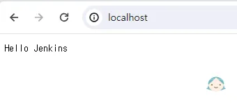{:class='image'} |
| :--------------------------------------------------------------------: |
|                  _Jenkins App 실행_{:class='caption'}                  |

## Github 저장소 만들기

Github에 프로젝트 저장소를 만들고 소스를 올려보도록 하겠습니다.

Github Dashboard 화면의 `Create repository`를 클릭하여 저장소를 생성합니다.

| 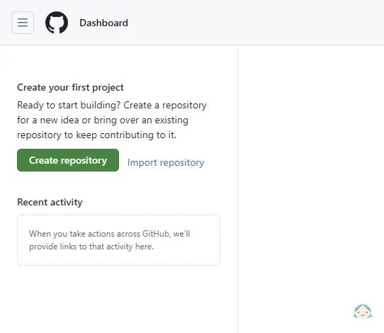{:class='image'} |
| :----------------------------------------------------------------------------: |
|                    _Github 저장소 만들기_{:class='caption'}                    |

만들어진 저장소로 소스를 올립니다.

```sh
$ git init
$ git add .
$ git commit -m "first commit"
$ git branch -M main
$ git remote add origin https://github.com/[Git username]/[Git URL]
$ git push -u origin main
```

| 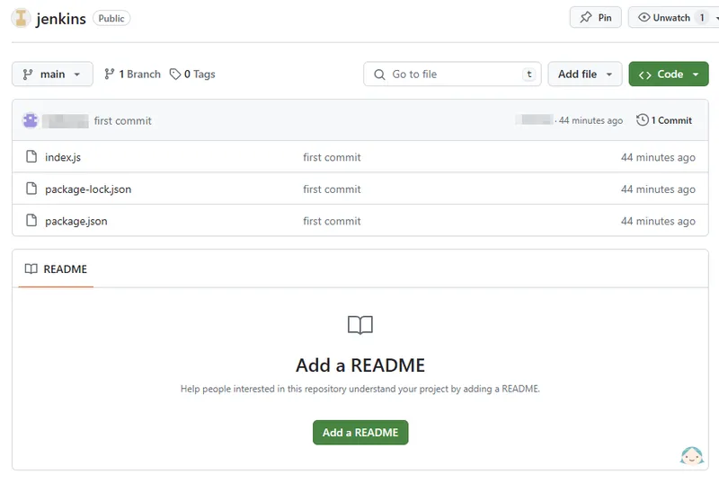{:class='image'} |
| :-----------------------------------------------------------------------------------: |
|                    _Github 저장소에 소스 올리기_{:class='caption'}                    |

## ssh 인증키 쌍 생성하기

Github와 Jenkins 연동을 위해 **ssh 인증키**를 생성이 필요합니다.
PowerShell을 관리자 권한으로 열거나 Shell 명령창을 열어 **ssh-keygen**을 실행합니다.

```sh
$ ssh-keygen
```

```sh
Generating public/private rsa key pair.
Enter file in which to save the key ([기본 생성 위치]):
Enter passphrase (empty for no passphrase):
Enter same passphrase again:
Your identification has been saved in [실제 생성 위치]\Jenkins.
Your public key has been saved in [실제 생성 위치]\Jenkins.pub.
The key fingerprint is:
SHA256:3YdXDLiM8Hq4bhfCohZrM86HCNSZhP6EVOtSjD8IWKw user@DESKTOP-ABCDEFG
The key's randomart image is:
+---[RSA 3072]----+
| .+.         ..  |
|.++..   .   .  o |
|=o++o    o o .  o|
|E+==     .o.o. . |
|.oo+   .So. o o  |
|. ..o . = o  o   |
| . . = . + .     |
|  ..O . o .      |
|   +o+ o..       |
+----[SHA256]-----+
```

키가 생성될 위치와 키 이름(`ex: c:\ssh\Jenkins`)을 지정하고 다음 설정부터 엔터키를 눌러 Skip 합니다.

| 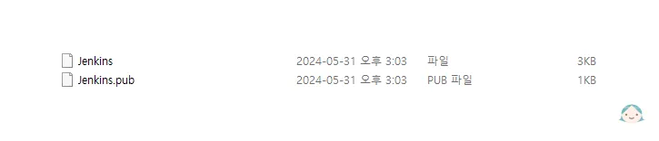{:class='image'} |
| :--------------------------------------------------------------------------: |
|                    _SSH 인증키 쌍 생성_{:class='caption'}                    |

`Jenkins`라는 이름으로 개인키와 공개키 한 쌍이 생성되었습니다.

## Github Deploy Key 등록

생성된 **공개키**를 Github의 Deploy Keys에 등록해 보도록 하겠습니다.

Github Jenkins 저장소 우측 상단의 `Settings` > `Deploy Keys`로 이동합니다.
|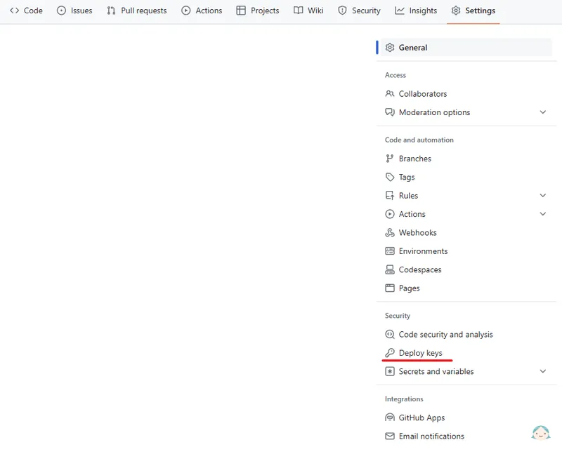{:class='image'}|
|:--:|
| _Github Deploy Key 등록_{:class='caption'} |

우측 상단의 `Add deploy key`를 선택해서

1. **Title** 항목에 원하는 deploy key 이름을,
2. **Key** 항목에 위에서 생성한 `Jenkins.pub` 공개키의 내용을 입력하고

`Add key`를 선택하여 deploy key를 등록해 줍니다.
|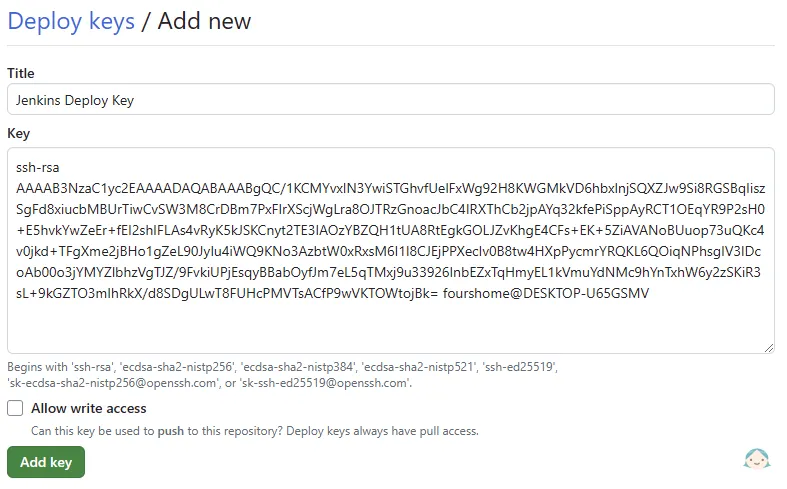{:class='image'}|
|:--:|
| _Github Deploy Key 등록_{:class='caption'} |

Github Deploy Key가 정상적으로 등록되었습니다.
|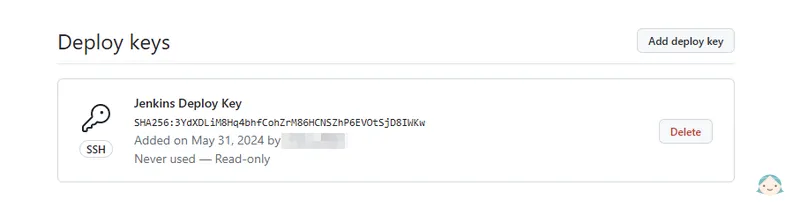{:class='image'}|
|:--:|
| _Github Deploy Key 등록 완료_{:class='caption'} |

## Jenkins Credential 등록

생성된 **개인키**를 Jenkins Credential에 등록해 보도록 하겠습니다.

**Jenkins Dashboard** > **Jenkins 관리** > **Credentials** 로 차례대로 이동합니다.

System credential 행 Domains 컬럼의 **(global)** 부분에 마우스를 오버, 드롭 다운하여 `Add credentials`를 선택합니다.
|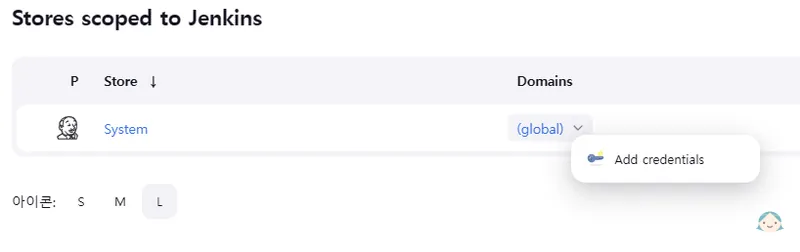{:class='image'}|
|:--:|
| _Jenkins Credential 등록_{:class='caption'} |

1. **Kind** 항목에 `SSH Username with private key`를 선택합니다.
1. **Username** 항목에 원하는 credential 이름을,
1. **Enter directly**를 선택하고 **Key** 항목 우측에 `Add`를 클릭하여 위에서 생성한 `Jenkins` 개인키의 내용을 입력하고

`Create`를 선택하여 credential을 등록해 줍니다.
|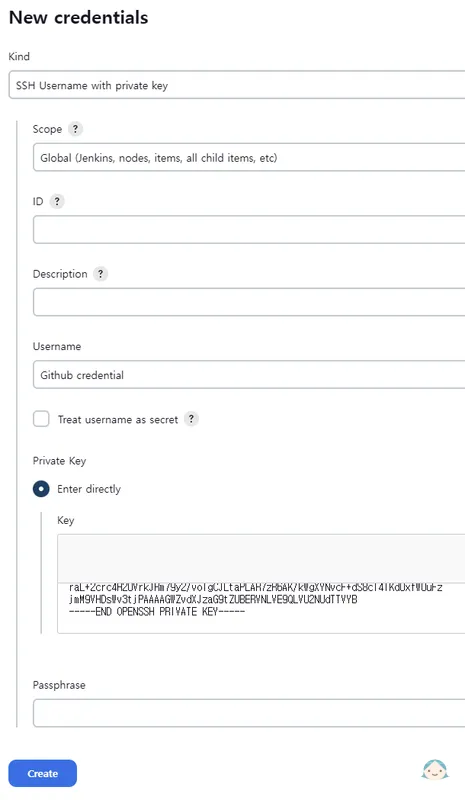{:class='image'}|
|:--:|
| _Jenkins Credential 등록_{:class='caption'} |

Jenkins Credential이 정상적으로 등록되었습니다.
|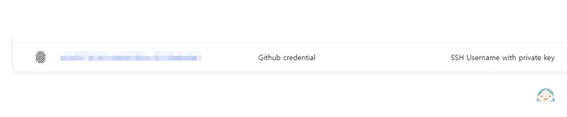{:class='image'}|
|:--:|
| _Jenkins Credential 등록완료_{:class='caption'} |

## Jenkins 프로젝트 추가 및 Github 연동

이제 Jenkins 프로젝트를 추가해 Github 주소를 연결하고 위에서 설정한 Github Deploy Key와 Jenkins Credential을 이용해 연동을 진행해 보도록 하겠습니다.

Jekins Dashboard 화면에서 `+ 새로운 Item`을 선택합니다.
|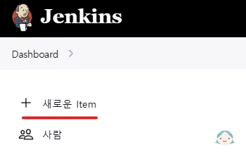{:class='image'}|
|:--:|
| _Jenkins 프로젝트 추가_{:class='caption'} |

1. **Enter an item name** 항목에 Jenkins에 추가할 프로젝트 명을 입력하고,
1. **Freestyle project**를 선택한 후,

`OK` 버튼을 클릭합니다.

| 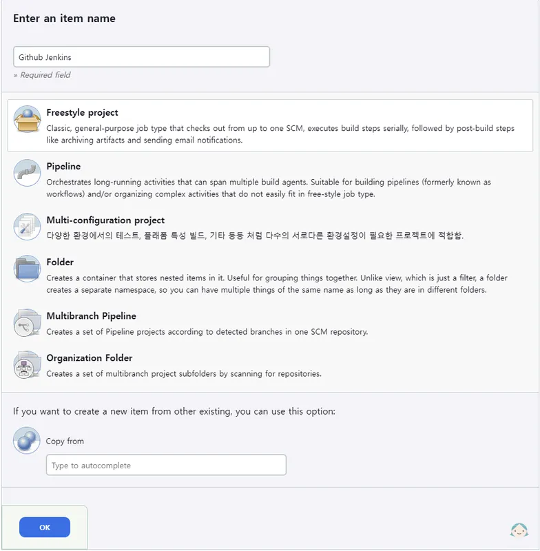{:class='image'} |
| :---------------------------------------------------------------------------------: |
|                      _Jenkins 프로젝트 추가_{:class='caption'}                      |

Jenkins Item이 생성되면 구성 설정화면으로 이동됩니다.\
**소스 코드 관리** 항목에 **Git**을 선택합니다.\
이제 차례대로

1. **Repository URL** 항목에 **Github SSH 저장소 주소**를 입력합니다.
1. **Credentials** 항목에 위에 만들어둔 **Jenkins Credential을 선택**합니다.
1. **Branches to build** 항목에 브랜치 명을 **\*\/main** 으로 입력합니다.

| 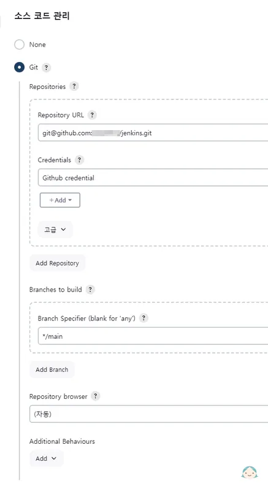{:class='image'} |
| :---------------------------------------------------------------------------------: |
|                      _Jenkins 프로젝트 추가_{:class='caption'}                      |

> [!INFO] Branched to build
> <u>Branched to build 항목에 지정한 브랜치가 push 됐을 경우</u>에만 Jenkins 배포가 동작합니다.

<br />

4. **빌드 유발** 항목에 **Github hook trigger for GITScm polling**을 선택합니다.
1. Push 이후 추가로 처리할 작업이 있는 경우 **Build Steps**에 스크립트를 작성하면 됩니다.

| 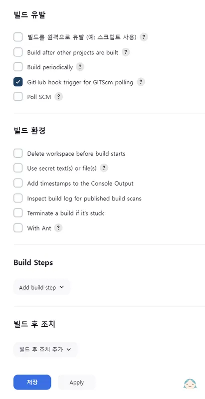{:class='image'} |
| :---------------------------------------------------------------------------------: |
|                      _Jenkins 프로젝트 추가_{:class='caption'}                      |

> [!INFO] Build Steps
> Build Steps > **Execute shell**을 이용해 Push 이후 후처리 작업(Docker 이미지를 생성하고 이미지를 컨테이너로 구동하는 등의)을 정의할 수 있습니다.

<br />

6. `저장`을 선택하여 Jenkin 프로젝트를 저장합니다.

| 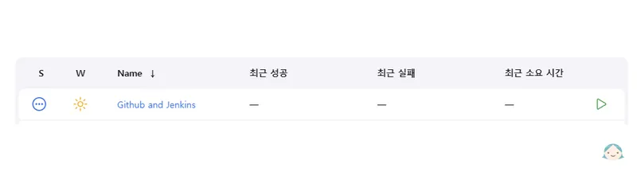{:class='image'} |
| :--------------------------------------------------------------------------------------: |
|                      _Jenkins 프로젝트 추가 완료_{:class='caption'}                      |

Jenkins 프로젝트 추가 및 Github 연동 작업이 완료되었습니다.

## Github Webhook 등록

Github Jenkins 저장소 우측 상단의 `Settings` > `Webhooks`로 이동합니다.
|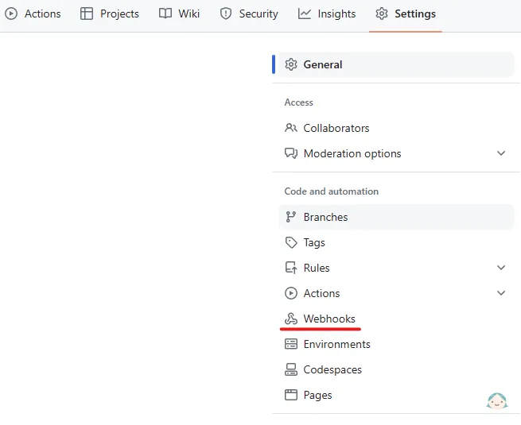{:class='image'}|
|:--:|
| _Github Webhook 등록_{:class='caption'} |

우측 상단의 `Add webhook`을 선택해서

1. **Payload URL** 항목에 `https://[Jenkins 외부 주소]/github-webhook/`을 입력,
1. **Content type** 항목을 `application/json`으로 선택하고

`Add webhook`을 선택하여 webhook을 등록해 줍니다.
|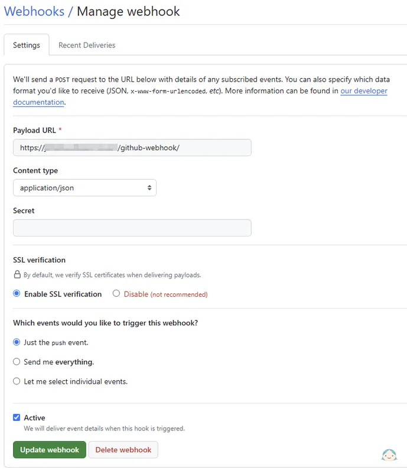{:class='image'}|
|:--:|
| _Github Webhook 등록_{:class='caption'} |

Github webhook이 정상적으로 등록되었습니다.
|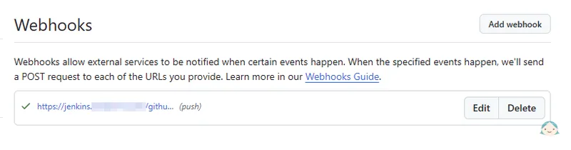{:class='image'}|
|:--:|
| _Github Webhook 등록 완료_{:class='caption'} |

## Node.js 앱 배포 테스트

모든 연동 작업이 완료되었습니다.

Node.js 앱의 main 브랜치를 push 해서 정상적으로 Jenkins와 연동되는지 확인해 봅시다.

```sh
$ git push origin main
```

<br />

Jenkins Dashboard 페이지의 **빌드 대기 목록**에 프로젝트가 추가되고 빌드가 작업이 시작되면 **빌드 실행 상태**로 옮겨집니다.
|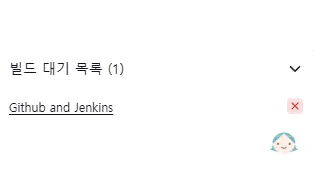{:class='image'}|
|:--:|
| _Node.js 앱 배포 테스트_{:class='caption'} |

빌드가 정상적으로 완료되면 Jenkins의 해당 프로젝트 상태가 업데이트됩니다.
|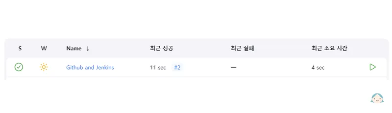{:class='image'}|
|:--:|
| _Node.js 앱 배포 테스트_{:class='caption'} |
