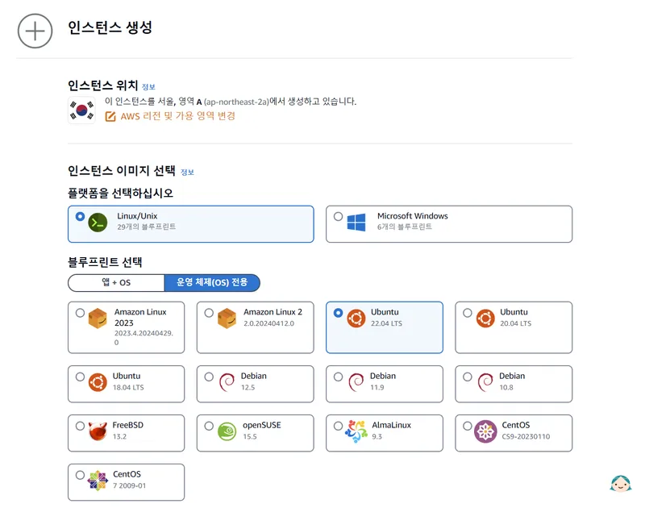
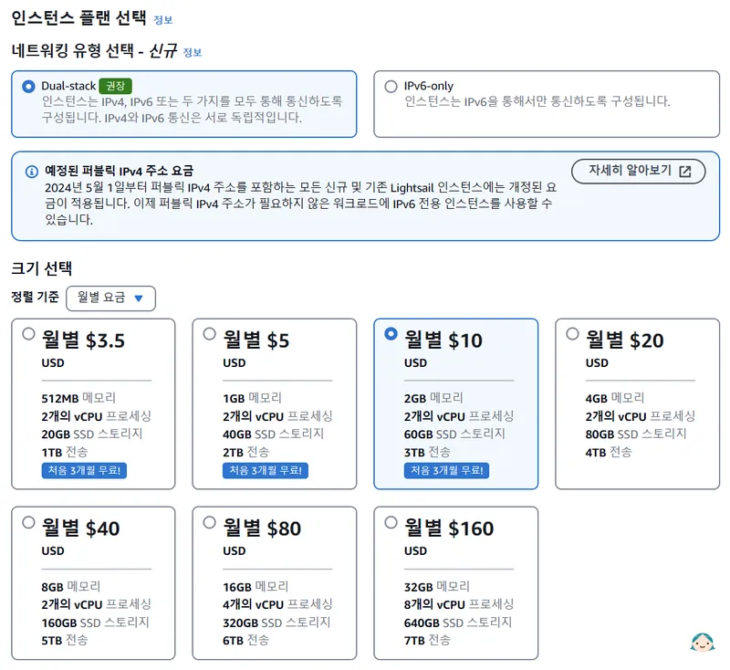
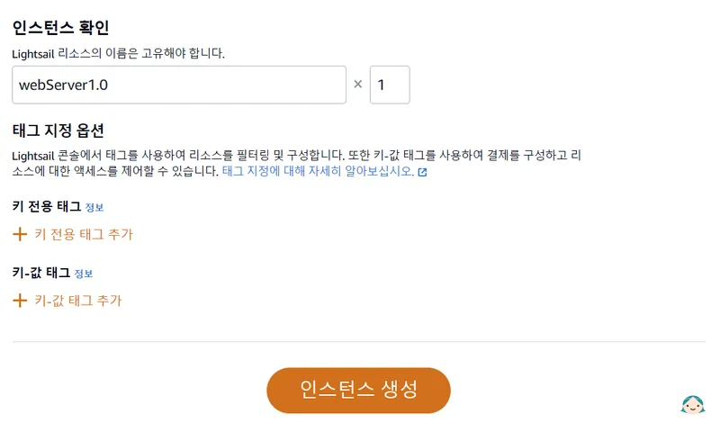
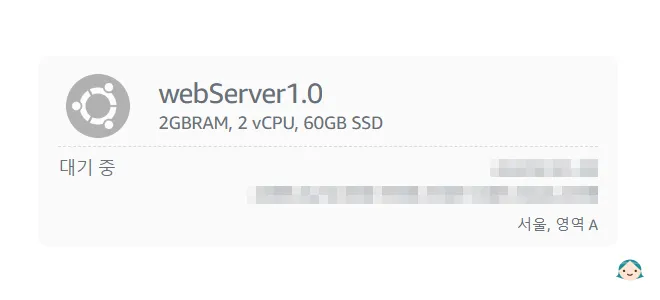
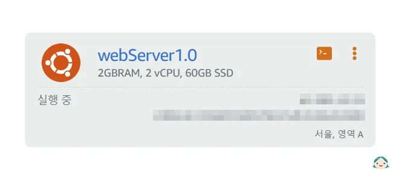
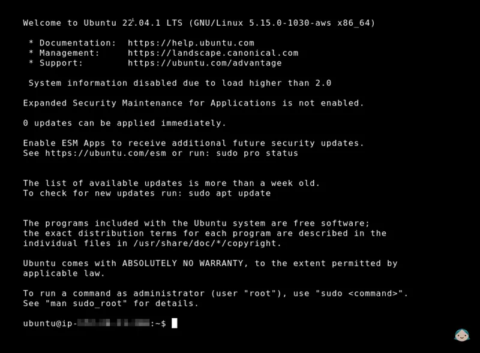
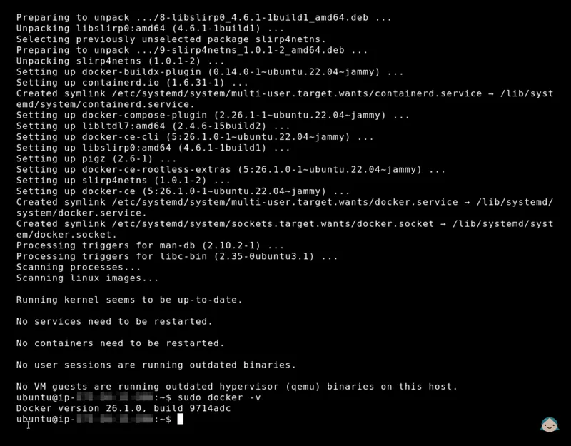

# Docker 호스트 준비
::: info Docker 호스트 준비에 앞서
어떤 환경(Linux, Unix, Windows 등)에서 Docker를 사용할지는 온전히 사용자의 몫입니다. 결국 호스트에 Docker를 설치하고 내부에 운영되는 컨테이너는 어떤 환경이 되었던지 똑같이 구성해서 사용할수 있습니다.

저는 좀 더 대중적이고 저렴한 Linux/Unix 플랫폼의 **Ubuntu**를 호스트로 사용할 예정이고 이 포스트는 Ubuntu를 기준으로 작성되었습니다.
:::

## Lightsail 인스턴스 생성

[Amazon Lightsail 인스턴스](https://lightsail.aws.amazon.com/ls/webapp/home/instances)에 접속하여 `인스턴스 생성` 버튼을 클릭합니다.

1. 인스턴스 위치\
    <b>서울, 영역 A(ap-northeast-2a)</b>로 지정합니다.

1. 인스턴스 이미지 선택\
    **Linux/Unix**를 선택합니다. 

1. 블루프린트 선택\
    **Ubuntu 22.04 LTS**를 체크합니다.

|{:class='image'}|
|:--:|
| *Amazon Lightsail 인스턴스 생성 화면*{:class='caption'} |

4. 인스턴스 플랜 선택\
    **Dual-stack**을 선택합니다.
    > 2024년 2월부터 **Amazon**에서 **IPV4 이용에 대한 요금을 책정**하기 시작했습니다.(기존 무료)

4. 크기 선택\
     저는 **2GB 메모리, 2개의 vCPU 프로세싱, 60GB SSD 스토리지**를 선택했습니다.

|{:class='image'}|
|:--:|
| *Amazon Lightsail 인스턴스 생성 화면*{:class='caption'} |

::: tip 크기 선택 팁
단순히 테스트 목적으로 인스턴스를 사용하려면 **가장 낮은 단계부터 시작**하시는 것을 권장합니다.

더 많은 자원이 필요한 경우 사양 업그레이드는 쉽게 가능합니다.
:::

<br />

6. 인스턴스 확인\
    인스턴스 명(고유)을 입력하고 하단에 `인스턴스 생성` 버튼을 눌러줍니다.

|{:class='image'}|
|:--:|
| *Amazon Lightsail 인스턴스 생성 화면*{:class='caption'} |

7. 인스턴스가 생성 중인 화면입니다.

|{:class='image'}|
|:--:|
| *Amazon Lightsail 인스턴스 생성 화면*{:class='caption'} |

8. 인스턴스가 정상적으로 생성되었습니다.\
우측 상단에 **브라우저 기반 SSH 클라인언트 연결 버튼** 및 **다양한 기능 옵션 버튼**이 표시됩니다.

|{:class='image'}|
|:--:|
| *Amazon Lightsail 인스턴스 생성 화면*{:class='caption'} |

## Docker 설치
> [!important] Docker 설치 방법
> Docker 설치 방법은 운영체제마다 다르기 때문에 되도록이면 [공식 사이트 문서](https://docs.docker.com/desktop/)를 참고하시는 것을 추천드립니다.
>
> 이 포스트는 Ubuntu 22.04 LTS 환경에서 Docker를 설치하는 방법만 소개합니다.
1. 먼저 생성된 인스턴스에 연결합니다.

|{:class='image'}|
|:--:|
| *Amazon Lightsail 인스턴스 SSH 클라인언트 화면*{:class='caption'} |

2. 패키지 업데이트를 실행합니다.
```Shell
$ sudo apt update
```
3. 필요 패키지를 설치합니다.
```Shell
$ sudo apt install -y apt-transport-https ca-certificates curl software-properties-common
```
4. Docker GPG 키를 추가합니다.
```Shell
$ curl -fsSL https://download.docker.com/linux/ubuntu/gpg | sudo gpg --dearmor -o /usr/share/keyrings/docker-archive-keyring.gpg
```
5. Docker 저장소를 추가합니다.
```Shell
$ echo "deb [signed-by=/usr/share/keyrings/docker-archive-keyring.gpg] https://download.docker.com/linux/ubuntu $(lsb_release -cs) stable" | sudo tee /etc/apt/sources.list.d/docker.list > /dev/null
```
6. 다시 패키지를 업데이트합니다.
```Shell
$ sudo apt update
```
7. 이제 Docker를 설치합니다.
```Shell
$ sudo apt install docker-ce docker-ce-cli containerd.io
```
8. 설치가 완료되면 Docker 버전을 확인해봅시다.
```Shell
$ sudo docker -v

Docker version 26.1.0. build 9714adc
```

|{:class='image'}|
|:--:|
| *Docker 버전 확인*{:class='caption'} |

Docker 설치를 끝으로 **Docker로 웹서버를 구축하기 위한 기본적인 호스트 준비**가 모두 끝났습니다. 