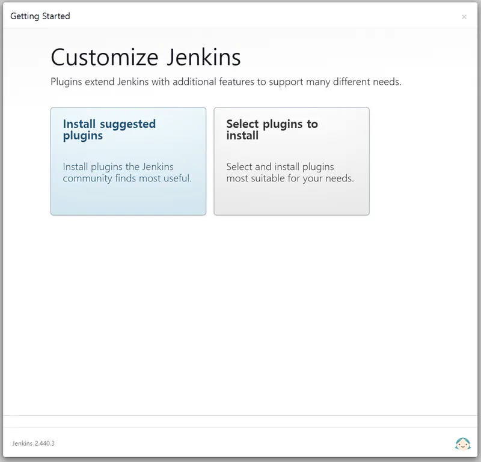

# Jenkins 컨테이너

::: info Jenkins 컨테이너화하기 앞서
[dockerhub](https://hub.docker.com/)에 접속해 보면 수많은 Docker 이미지들이 있습니다.
이 포스트에서는 [jenkins/jenkins:lts-jdk17](https://hub.docker.com/r/jenkins/jenkins) 이미지를 이용해 컨테이너화하여 초기 설정하는 방법까지 소개합니다.
:::

## Jenkins 컨테이너화하기

1. 지난 [Docker 호스트 준비](/programming/docker/webserver/host)에서 준비한 <b>인스턴스(호스트)</b>에 접속합니다.

2. 다음 명령을 실행해 `jenkins/jenkins:lts-jdk17` 이미지를 가져옵니다.

```shell
$ sudo docker image pull jenkins/jenkins:lts-jdk17
```

3. Jenkins와 연동할 호스트 볼륨의 경로를 미리 생성하고 소유자를 변경합니다.

```shell
$ sudo mkdir /var/jenkins_home
$ sudo chown 1000 /var/jenkins_home
```

> [!WARNING] 경고
> 호스트와 공유할 경로의 소유자를 변경하지 않는 경우 Jenkins 구동 시 **Permission denied**가 발생할 수 있으니 꼭 소유자 변경을 해주세요.

4. 이제 Jenkins를 컨테이너화(실행)합니다.

```shell
$ sudo docker container run --detach --restart always --cpuset-cpus="1" --cpu-shares="1024" --memory="1g" --memory-swap="1.5g" --publish 8080:8080 --volume /var/jenkins_home:/var/jenkins_home --volume /var/run/docker.sock:/var/run/docker.sock --env TZ=Asiz/Seoul --env JAVA_OPTS="-Xms512m -Xmx1024m" --name jenkins jenkins/jenkins:lts-jdk17
```

| 옵션               | 설명                                                            |
| :----------------- | :-------------------------------------------------------------- |
| `--detach`         | 백그라운드에서 컨테이너를 실행하고 컨테이너 ID를 출력           |
| `--restart`        | 컨테이너가 종료됐을 때 재시작 관련 정책 (always : 항상 재시작)  |
| `--cpuset-cpus`    | 실행을 허용할 CPU(0-3, 0, 1)                                    |
| `-c, --cpu-shares` | CPU 점유율(상대적 가중치)                                       |
| `-m, --memory`     | 메모리 한도                                                     |
| `--memory-swap`    | 스왑 한도는 메모리에 스왑을 더한 값과 같습니다.(-1 무제한 스왑) |
| `-p, --publish`    | 호스트에 컨테이너 포트 게시                                     |
| `-v, --volume`     | 볼륨 바인드 마운트                                              |
| `-e, --env`        | 환경 변수 설정                                                  |
| `--name`           | 컨테이너에 이름 지정                                            |

> [!TIP] docker.sock
>
> - Jenkins 컨테이너 내부에 설치한 Docker 데몬과 호스트에 설치된 Docker 데몬을 연결해줍니다.
> - 이를 통해 호스트 docker.sock 데몬은 Jenkins 컨테이너의 이벤트를 수신하여 **호스트에서 직접 Docker 명령을 사용하는 것처럼 동작하게 됩니다.**

5. Jenkins 컨테이너가 정상적으로 구동되고 있는지 확인해봅시다.

```shell
$ sudo docker ps

CONTAINER ID    IMAGE   COMMAND     CREATED     STATUS  PORTS   NAMES
[Jenkins 컨테이너 아이디]   jenkins/jenkins:lts-jdk17   "/usr/bin/tini -- /u..."    10 seconds ago  up 15 seconds   0.0.0.0:8080->8080/tcp, :::8080->8080/tcp, 50000/tcp    jenkins
```

## Jenkins 컨테이너에 Docker 설치하기

1. 구동 중인 Jenkins 컨테이너 Shell에 접속합니다.

```shell
$ sudo docker exec -itu 0 [Jenkins 컨테이너 아이디] /bin/bash
```

| 옵션                | 설명                                                       |
| :------------------ | :--------------------------------------------------------- |
| `-i, --interactive` | 컨테이너와 연결(attach)되어 있지 않더라도 표준 입력을 유지 |
| `-t, --tty`         | 가상으로 터미널과 유사한 환경을 제공                       |
| `-u, --user`        | Username 또는 UID (형식: `\<name\|uid\>\[:group\|gid\]`)   |

> [!TIP] -u 0
>
> - Jenkins 컨테이너 Shell에 접속할 때 root 권한으로 접속할 수 있도록 해주는 옵션

2. github의 **webhook**을 이용한 자동 배포는 Jenkins <u>컨테이너에서 git 인증</u>이 필요합니다.

3. Jenkins에 Docker를 설치합니다.\
   Jenkins 이미지는 **Debian 환경**으로 만들어졌기 때문에 Debian 환경에 맞는 Docker를 설치해야 합니다.

```shell
$ apt-get update
$ apt-get install ca-certificates curl
$ install -m 0755 -d /etc/apt/keyrings
$ curl -fsSL https://download.docker.com/linux/debian/gpg -o /etc/apt/keyrings/docker.asc
$ chmod a+r /etc/apt/keyrings/docker.asc
$ echo "deb [arch=$(dpkg --print-architecture) signed-by=/etc/apt/keyrings/docker.asc] https://download.docker.com/linux/debian  $(. /etc/os-release && echo "$VERSION_CODENAME") stable" | tee /etc/apt/sources.list.d/docker.list > /dev/null
$ apt-get update
$ apt-get install docker-ce docker-ce-cli containerd.io docker-buildx-plugin docker-compose-plugin
```

4. `docker` 그룹을 추가하고 Jenkins 사용자에게 `docker` 그룹의 권한을 줍니다.\
   위에서 설명한 `/var/run/docker.sock` 소유자도 변경해줘야 합니다.

```shell
$ groupadd -f docker
$ usermod -aG docker jenkins
$ chown root:docker /var/run/docker.sock
```

5. Jenkins 컨테이너 접속을 종료하고 호스트 환경으로 돌아와 Jenkins를 재시작 합니다.

```shell
$ sudo docker restart [Jenkins 컨테이너 아이디]
```

> [!CAUTION] Jenkins 빌드 중 docker 실행 권한 오류
>
> - 특별한 사유로 <u>호스트를 재시작 했을 경우</u> Jenkins 컨테이너 내부로 접속하여 **docker.sock** 소유자 변경 작업을 다시 해줘야 합니다. **그렇지 않은 경우 Jenkins 빌드 중 docker 명령어 사용 시 권한 오류가 발생합니다.**

## Jenkins 초기 설정

1. 브라우저를 통해 Jenkins 서비스에 접속합니다.\
   기본적으로 Jenkins는 **8080 포트**를 사용합니다.
   - http://**[인스턴스 주소(IPV4)]**:8080\
     or
   - http://[지정한 Jenkins 주소]

| {:class='image'} |
| :-------------------------------------------------------------------: |
|                 _Jenkins 잠금 해제_{:class='caption'}                 |

2. Jenkins 서비스 접속이 처음인 경우 생성된 관리자 계정이 없기 때문에 소유자가 맞는지 확인하는 절차가 필요합니다.\
   Jenkins 컨테이너의 로그 명령을 실행하여 **소유자 확인용 비밀번호**를 확인해 봅시다.

```shell
$ sudo docker logs [Jenkins 컨테이너 아이디]
```

| {:class='image'} |
| :-----------------------------------------------------------------------------: |
|                 _Jenkins 잠금 해제 암호 확인_{:class='caption'}                 |

이미지에 표시된 부분에 임의로 생성된 비밀번호가 출력됩니다. 해당 부분을 복사하여 브라우저 비밀번호 입력란에 붙여 넣고 `Continue` 버튼을 눌러 계속 진행합니다.

<br />

3. `Install suggested plugins`를 선택하여 Jenkins에 필요한 플러그인을 자동으로 설치합니다.

| {:class='image'} |
| :-----------------------------------------------------------------------: |
|                 _Jenkins 플러그인 설치_{:class='caption'}                 |

플러그인 설치가 몇 분정도 진행됩니다.
|{:class='image'}|
|:--:|
| _Jenkins 플러그인 설치 완료_{:class='caption'} |

4. Jenkins 플러그인 설치가 완료되면 **관리자 계정 생성 화면**으로 이동합니다.\
   앞으로 Jenkins 서비스에 접속하려면 이때 생성한 **관리자 계정**이 필요합니다.

| {:class='image'} |
| :-----------------------------------------------------------------------: |
|                 _Jenkins 플러그인 설치_{:class='caption'}                 |

Jenkins 초기 설정을 끝으로 **Docker로 웹서버를 구축하기 위한 기본적인 Jenkins 사용 준비**가 모두 완료되었습니다.
