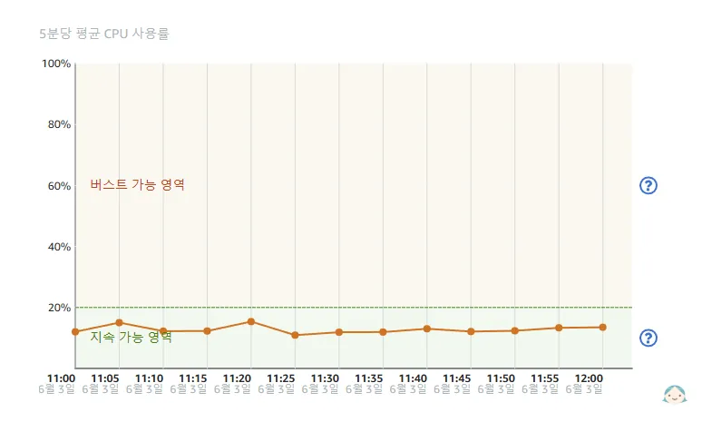

# 서버 장애 그리고 해결 과정

> [!info] 들어가기 앞서
> 서버를 운영하다 보면 알 수 없는 장애로 인해 곤란한 상황을 겪는 경우가 종종 발생합니다.\
> 이 포스트에서는 [디아블로® IV | 트레이더스](https://d4.tradurs.com)를 실제 Docker 웹서버로 구축, 운영하면서 발생한 문제들과 그 해결 과정을 소개하도록 하겠습니다.

## Docker 리소스

Docker를 이용한 웹서버 구축 후 가볍게 자동 배포 및 접속 테스트까지 완료했습니다.

AWS Lightsail 지표도 `지속 가능 영역`에 안정적으로 안착해 있었습니다.

> [!WARNING] 지속 가능 영역과 버스트 가능 영역
> AWS Lightsail은 평소 인스턴스 **자원**을 일정량 모아두었다가 트래픽이 몰려 CPU 사용량이 늘어나 `지속 가능 영역`을 벗어나 `버스트 가능 영역`으로 들어가게 되면 모아두었던 **자원**을 조금씩 소비하게 됩니다.
>
> - 이때 모아둔 자원을 모두 소진하고도 `버스트 가능 영역`을 벗어나지 못하면 **서버에 문제가 발생할 수 있으니 주의해야 합니다**.

| {:class='image'} |
| :--------------------------------------------------------------------: |
|                 _AWS Lightsail 지표_{:class='caption'}                 |

### 인스턴스 접속 불가

실제 웹서버를 운영해 보면 혹시 문제가 있지 않을까 한 번씩 접속해 보곤 합니다.

그래서 운영 중인 사이트 중 아무거나 한곳을 클릭했는데...

| {:class='image'} |
| :-------------------------------------------------------------------: |
|              _만나고 싶지 않은 페이지_{:class='caption'}              |

**올 것이 왔구나...**

서둘러 AWS Lightsail에 접속해 SSH 연결을 시도했습니다.

| {:class='image'} |
| :-----------------------------------------------------------------------: |
|              _AWS Lightsail SSH 접속 시도_{:class='caption'}              |

평소대로라면 Ubuntu Shell 화면이 떠야 정상이지만, **SSH 접속조차 불가한 걸 보니 상황이 꽤 심각하다는 것을 알 수 있었습니다.**
사실 크게 당황하지는 않았습니다. 그도 그럴 것이 초기 Lightsail 최 하위 사양의 인스턴스를 사용하면서 이미 몇 번 겪었던 일이었기 때문이죠.

AWS Lightsail 관리자 페이지에 접속해 해당 **인스턴스를 재부팅 해줍니다**. 재부팅 되는 1~2분 정도를 기다린 후 SSH에 다시 접속했습니다.

`docker ps` 명령을 이용해 혹시 컨테이너들이 중지되진 않았는지 먼저 확인하였고, 다행히 Docker 컨테이너들은 정상적으로 동작 중이었습니다.

```sh
$ sudo docker ps -a
```

재부팅 이후 웹사이트 접속은 가능했지만 장애가 재발할 가능성이 있기 때문에 원인을 찾아보기로 했습니다. **Docker 자원 관리**에 대한 정보를 검색하다 보니 간과하거나 잘못 알고 있던 것들이 생각보다 꽤나 많았습니다.

우선, Docker 컨테이너를 구성하면 **Docker가 각 컨테이너들의 자원을 자동으로 배분해 줄 것이라 착각**했습니다. 그리고 **Docker가 호스트의 자원을 어느 정도 보장해 줄 것이라 생각했는데** 이 두 원인 때문에 인스턴스(호스트)가 중지된 것으로 확신하게 되었고, 컨테이너 별로 자원 제한을 해주기로 했습니다.
