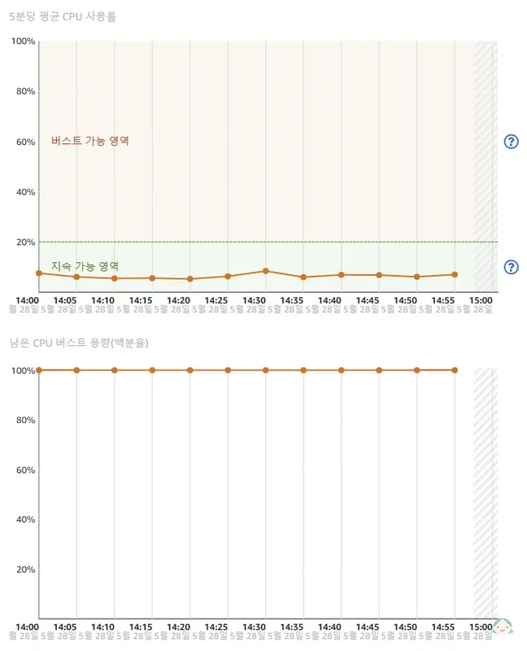
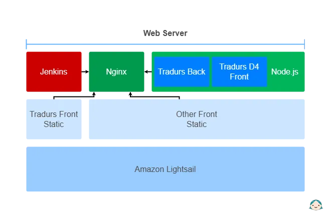
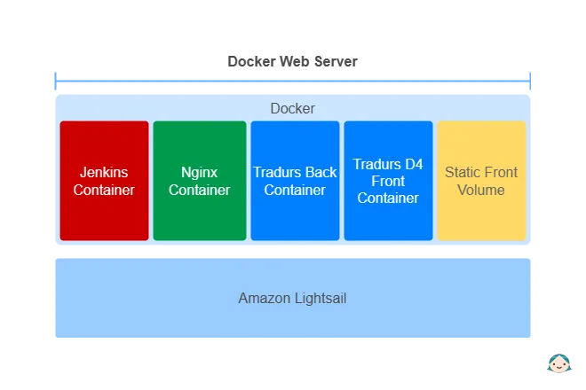

# 왜 Docker 웹서버인가?
::: info 목차
- Amazon Lightsail의 한계
- 서버 이전에 발생하는 문제를 미연에 방지
- Docker에 대한 궁금점
- Docker로 웹서버 구축 계획
:::

## Amazon Lightsail의 한계
가볍게 개인 용도로 사용할 목적으로 **EC2**보다 기능은 적지만 저렴한 **Lightsail** 서비스를 선택했습니다. 

>**월별 $5만 내면 나도 웹사이트를 운영할수 있겠구나!**

가장 낮은 사양을 고른 게 문제였을까요? 시도 때도 없이 서버가 내려가고 SSH로 접속조차 되지 않는 일이 잦아졌습니다.
게다가 유닉스 환경도 익숙지 않던 더라 원인을 찾는 것도 쉽지 않았습니다.
단순히 사양이 낮아 발생하는 문제라 생각하고 처음에는 한 단계 한 단계 씩 사양을 올려도 상황은 나아지지 않았습니다.

|{:class='image'}|
|:--:|
| *출처 : Amazon Lightsail 지표*{:class='caption'} |

- **첫 번째**\
*Amazon Lightsail* 은 <u>선택한 사양을 온전히 사용하는 것이 아닌</u> `지속 가능 영역`을 벗어나면 평소에 모아둔 `버스트 용량`을 가져다 쓰는 구조로 되어있습니다.
서버에 트래픽이 많아져 **지속 가능 영역**을 벗어나 **버스트 가능 영역**에 유지되는 시간이 길어지게 되면 평소에 쌓인 `버스트 용량`을 빠르게 소진하게 되고 더 이상 버스트 용량을 사용 할 수 없게 된 시점에서 서버는 더 버터지 못하고 중지되버리는 문제가 발생하는 것입니다.

- **두 번째**\
제공되는 서버에 `Node.js`, `Jenkins`, `nginx` 등 웹서버 구동에 필요한 것들을 잡다하게 설치하다 보니 **패키지 관리 또한 어려웠습니다**.

- **세 번째**\
한 서버에 여러 가지 프로젝트를 배포할 계획이었으나 **각 프로젝트에서 사용하는 프레임워크마다 요구하는 환경이 달랐**습니다. `node16`부터 `node20`에 이르기까지 모두 설치해야 한다고 생각하니 머리가 아팠습니다.

## 서버 이전에 발생하는 문제를 미연에 방지
*Amazon Lightsail* 은 현재 사용하는 인스턴스의 **스냅샷** 기능을 이용해 사양 업그레이드를 손쉽게 할 수 있는 장점이 있습니다.
반대로 **스냅샷**을 이용한 <u>사양 다운그레이드를 할 수 없는 큰 단점도 가지고 있습니다</u>.

예를 들어 이용자가 급격하게 늘어나면 부득이하게 사양을 업그레이드할 상황이 생기게 되고, 그렇게 업그레이드된 인스턴스는 이후 <u>사용자가 줄어도 고 비용의 고 사양 인스턴스를 계속해서 사용할 수밖에 없는 상황</u>이 돼버리는 것이죠.

다운그레이드 할 상황에 맞닥뜨렸을 때 인스턴스 생성부터 필요한 프로그램들을 모두 설치하고 서비스 등록까지.. 게다가 <u>기존 인스턴스 환경과 완전히 동일하게 만들기도 어려워 배포된 모든 서비스들이 정상적으로 구동된다는 보장도 받기 힘들 것</u>입니다.

## Docker에 대한 궁금점
이전엔 그저 순수 개발만 하는 개발자 입장이라, 서버 관리부터 배포 영역은 관심 밖이었습니다. 하지만 직접 웹사이트를 구축해서 배포까지 해야 하는 상황이 오니 Docker 사용에 관심이 가기 시작했습니다. **도대체 Docker가 뭘 해주길래 대부분의 사람들이 사용할까?** 그 점이 궁금했습니다.

## Docker로 웹서버 구축 계획

기존 웹서버 구성도입니다. 우분투 위에 `Node.js`, `Jenkins`, `Nginx`가 구동되고 **Tradurs Back**와 **Tradurs D4 Front**를 `Node.js` 서비스로 등록했습니다. 그 외 스태틱 사이트들은 따로 경로를 지정해서 Nginx로 연결되어 서비스되는 구조입니다.
모든 서비스들이 각각 여러 곳에 산재되어 있어 문제가 생길 때마다 관련 서비스들을 점검해 봐야 합니다.
|{:class='image'}|
|:--:|
| *기존 웹서버 구성도*{:class='caption'} |

기본적으로 인스턴스(호스트)에는 Docker만 설치되고 `Jenkins`, `nginx`, `Node.js 서비스들`은 컨테이너로 `Static Front`는 볼륨 연동으로 구성했습니다. 신규 웹서버 구성이 기존 구성에 비해 매우 단조로워졌습니다.
|{:class='image'}|
|:--:|
| *신규 웹서버 구성도*{:class='caption'} |

