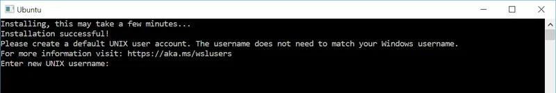

# Docker 시작하기
::: info Docker를 시작하기에 앞서
윈도우 환경에서 Docker Desktop을 설치하고 윈도우 터미널을 이용해 Docker를 다룰 예정입니다.\
Docker Desktop은 아래와 같은 환경에서 설치가 가능합니다.
* Mac
* Windows
* Linux (Ubuntu, Devian, Pedora, Arch)
:::
::: warning 목표
현재 개인 프로젝트로 서비스 중인 [디아블로® IV | 트레이더스](https://d4.tradurs.com/) 사이트를 Github와 Jenkins를 이용해 Docker 컨테이너로 자동 배포하는 것
:::

## WSL (WSL 2) 설치
::: tip WSL 2 수동 설치 단계
아래 **WSL 2**의 단계 별 수동 설치 과정은 마이크로소프트 공식 사이트의 [문제 해결 가이드의 설치 섹션](https://learn.microsoft.com/ko-kr/windows/wsl/troubleshooting#installation-issues)의 내용을 그대로 옮겨놓았습니다. 이점 참고하시기 바랍니다.
:::
간단하게 하려면 일반적으로 `wsl --install`을 사용하여 Linux용 Windows 하위 시스템을 설치하는 것이 좋지만, 이전 빌드의 Windows를 실행하는 경우에는 수동 설치 단계가 지원되지 않을 수 있습니다. 아래에 수동 설치 단계가 설명되어 있습니다. 설치 과정에서 문제가 발생하는 경우 [문제 해결 가이드의 설치 섹션](https://learn.microsoft.com/ko-kr/windows/wsl/troubleshooting#installation-issues)을 참조하세요.

### 1단계 - Linux 용 Windows 하위 시스템 활성화
Windows에서 Linux 배포를 설치하려면 먼저 "Linux용 Windows 하위 시스템" 옵션 기능을 사용하도록 설정합니다.\
PowerShell을 <b>관리자 권한(시작 메뉴 > PowerShell >에서 관리자 권한으로 실행 >을 마우스 오른쪽 단추로 클릭)</b>으로 열고 다음 명령을 입력합니다.
```Shell
> dism.exe /online /enable-feature /featurename:Microsoft-Windows-Subsystem-Linux /all /norestart
```

### 2단계 - WSL 2 실행을 위한 요구 사항 확인
WSL 2로 업데이트하려면 Windows 10을 실행해야 합니다.

* x64 시스템의 경우: **버전 1903** 이상, **빌드 18362.1049** 이상.
* ARM64 시스템의 경우: **버전 2004** 이상, **빌드 19041** 이상
또는 Windows 11.
::: danger 참고
* 18362보다 낮은 빌드는 WSL 2를 지원하지 않습니다. [Windows Update Assistant](https://www.microsoft.com/software-download/windows10)를 사용하여 Windows 버전을 업데이트합니다. Windows 버전 1903 지원은 x64 시스템에만 적용됩니다. Arm64 버전 Windows를 사용하는 경우 WSL 2에 대한 모든 권한을 얻으려면 Windows 10 버전 2004 이상으로 업그레이드해야 합니다. 자세한 내용은 [Windows 10 버전 1903 및 1909에 제공되는 WSL 2 지원](https://devblogs.microsoft.com/commandline/wsl-2-support-is-coming-to-windows-10-versions-1903-and-1909)을 참조하세요.
:::
버전 및 빌드 번호를 확인하려면 **Windows 로고 키 + R**을 선택하고, **winver**를 입력하고, **확인**을 선택합니다. [설정] 메뉴에서 [최신 Windows 버전으로 업데이트](ms-settings:windowsupdate)합니다.
::: danger 참고
* indows 10 버전 1903 또는 1909를 실행하고 있는 경우 Windows 메뉴에서 "설정"을 열고, "업데이트 및 보안"으로 이동한 다음, "업데이트 확인"을 선택합니다. 빌드 번호는 18362.1049 이상 또는 18363.1049 이상이고, 부 빌드 번호는 .1049 이상이어야 합니다. 자세한 정보: [WSL 2 지원이 Windows 10 버전 1903 및 1909에 제공됨](https://devblogs.microsoft.com/commandline/wsl-2-support-is-coming-to-windows-10-versions-1903-and-1909/).
:::

### 3단계 - Virtual Machine 기능 사용
WSL 2를 설치하려면 먼저 Virtual Machine 플랫폼 옵션 기능을 사용하도록 설정해야 합니다. 이 기능을 사용하려면 머신에 [가상화 기능](https://learn.microsoft.com/ko-kr/windows/wsl/troubleshooting#error-0x80370102-the-virtual-machine-could-not-be-started-because-a-required-feature-is-not-installed)이 필요합니다.
PowerShell을 관리자 권한으로 열어 실행합니다.
```Shell
> dism.exe /online /enable-feature /featurename:VirtualMachinePlatform /all /norestart
```
머신을 **다시 시작하여** WSL 설치를 완료하고 WSL 2로 업데이트합니다.

### 4단계 - Linux 커널 업데이트 패키지 다운로드
Linux 커널 업데이트 패키지는 Windows 운영 체제 이미지 내에서 WSL을 실행하기 위해 WSL 2 Linux 커널의 최신 버전을 설치합니다. (더 자주 푸시되는 업데이트와 함께 Microsoft Store에서 WSL을 실행하려면 `wsl.exe --install` 또는 `wsl.exe --update`을(를) 사용합니다.)

1. 최신 패키지를 다운로드합니다.
    * [x64 머신용 최신 WSL2 Linux 커널 업데이트 패키지](https://wslstorestorage.blob.core.windows.net/wslblob/wsl_update_x64.msi)
    ::: danger 참고
    ARM64 머신을 사용하는 경우 [ARM64 패키지](https://wslstorestorage.blob.core.windows.net/wslblob/wsl_update_arm64.msi)를 대신 다운로드하세요. 사용하고 있는 머신의 종류를 잘 모르는 경우 명령 프롬프트 또는 PowerShell을 열고 `systeminfo | find "System Type"`을 입력합니다. **주의**: 비 영어 Windows 버전에서는 "시스템 유형" 문자열을 변환하여 검색 텍스트를 수정해야 할 수 있습니다. find 명령에 대한 따옴표는 이스케이프해야 할 수도 있습니다. 예를 들어 독일어 `systeminfo | find '"Systemtyp"'`입니다.
    :::
1. 이전 단계에서 다운로드한 업데이트 패키지를 실행합니다. (실행하려면 두 번 클릭 - 관리자 권한을 요구하는 메시지가 표시되면 '예'를 선택하여 이 설치를 승인합니다.)

설치가 완료되면 새 Linux 배포를 설치할 때 WSL 2를 기본 버전으로 설정하는 다음 단계로 이동합니다. (새 Linux 설치를 WSL 1로 설정하려면 이 단계를 건너뜁니다.)

::: danger 참고
자세한 내용은 [Windows 명령줄 블로그](https://aka.ms/cliblog)에서 사용할 수 있는 [WSL2 Linux 커널업데이트 변경](https://devblogs.microsoft.com/commandline/wsl2-will-be-generally-available-in-windows-10-version-2004) 문서를 참조하세요.
:::

### 5단계 - WSL 2를 기본 버전으로 설정
PowerShell을 열고 이 명령을 실행하여 새 Linux 배포를 설치할 때 WSL 2를 기본 버전으로 설정합니다.
```Shell
> wsl --set-default-version 2
```

### 6단계 - 선택한 Linux 배포 설치
1. [Microsoft Store](https://aka.ms/wslstore)를 열고 즐겨 찾는 Linux 배포를 선택합니다.

    |{:class='image'}|
    |:--:|
    | *출처 : Microsoft 공식 사이트*{:class='caption'} |

    각 배포에 대한 Microsoft Store 페이지를 여는 링크는 다음과 같습니다.

    * [Ubuntu 18.04 LTS](https://www.microsoft.com/store/apps/9N9TNGVNDL3Q)
    * [Ubuntu 20.04 LTS](https://www.microsoft.com/store/apps/9n6svws3rx71)
    * [Ubuntu 22.04 LTS](https://www.microsoft.com/store/apps/9PN20MSR04DW) :heavy_check_mark: AWS 라이트세일 버전에 맞추기 위해 22.04 버전을 설치했습니다.
    * [openSUSE Leap 15.1](https://www.microsoft.com/store/apps/9NJFZK00FGKV)
    * [SUSE Linux Enterprise Server 12 SP5](https://www.microsoft.com/store/apps/9MZ3D1TRP8T1)
    * [SUSE Linux Enterprise Server 15 SP1](https://www.microsoft.com/store/apps/9PN498VPMF3Z)
    * [Kali Linux](https://www.microsoft.com/store/apps/9PKR34TNCV07)
    * [Debian GNU/Linux](https://www.microsoft.com/store/apps/9MSVKQC78PK6)
    * [Fedora Remix for WSL](https://www.microsoft.com/store/apps/9n6gdm4k2hnc)
    * [Pengwin](https://www.microsoft.com/store/apps/9NV1GV1PXZ6P)
    * [Pengwin Enterprise](https://www.microsoft.com/store/apps/9N8LP0X93VCP)
    * [Alpine WSL](https://www.microsoft.com/store/apps/9p804crf0395)
    * [Raft(평가판)](https://www.microsoft.com/store/apps/9msmjqd017x7)
    * [Alma Linux](https://apps.microsoft.com/search?query=alma+linux)

1. 배포 페이지에서 "가져오기"를 선택합니다.

    |{:class='image'}|
    |:--:|
    | *출처 : Microsoft 공식 사이트*{:class='caption'} |

::: tip 배포판 다운로드
Microsoft Store 앱을 사용할 수 없는 경우 다음 링크를 사용하여 Linux 배포판을 다운로드하고 수동으로 설치하면 됩니다.
* [Ubuntu](https://aka.ms/wslubuntu)
* [Ubuntu 22.04 LTS](https://aka.ms/wslubuntu2204)
* [Ubuntu 20.04](https://aka.ms/wslubuntu2004)
* [Ubuntu 20.04 ARM](https://aka.ms/wslubuntu2004arm)
* [Ubuntu 18.04](https://aka.ms/wsl-ubuntu-1804)
* [Ubuntu 18.04 ARM](https://aka.ms/wsl-ubuntu-1804-arm)
* [Ubuntu 16.04](https://aka.ms/wsl-ubuntu-1604)
* [Debian GNU/Linux](https://aka.ms/wsl-debian-gnulinux)
* [Kali Linux](https://aka.ms/wsl-kali-linux-new)
* [SUSE Linux Enterprise Server 12](https://aka.ms/wsl-sles-12)
* [SUSE Linux Enterprise Server 15 SP2](https://aka.ms/wsl-SUSELinuxEnterpriseServer15SP2)
* [SUSE Linux Enterprise Server 15 SP3](https://aka.ms/wsl-SUSELinuxEnterpriseServer15SP3)
* [openSUSE Tumbleweed](https://aka.ms/wsl-opensuse-tumbleweed)
* [openSUSE Leap 15.3](https://aka.ms/wsl-opensuseleap15-3)
* [openSUSE Leap 15.2](https://aka.ms/wsl-opensuseleap15-2)
* [Oracle Linux 8.5](https://aka.ms/wsl-oraclelinux-8-5)
* [Oracle Linux 7.9](https://aka.ms/wsl-oraclelinux-7-9)
* [Fedora Remix for WSL](https://github.com/WhitewaterFoundry/WSLFedoraRemix/releases/)
:::

새로 설치된 Linux 배포를 처음 시작하면 콘솔 창이 열리고 파일이 압축 해제되어 PC에 저장될 때까지 1~2분 정도 기다려야 합니다. 이후의 모든 시작은 1초도 걸리지 않습니다.

[새 Linux 배포를 위한 사용자 계정 및 암호를 만들어야](https://learn.microsoft.com/ko-kr/windows/wsl/setup/environment#set-up-your-linux-username-and-password) 합니다.

|{:class='image'}|
|:--:|
| *출처 : Microsoft 공식 사이트*{:class='caption'} |

**축하합니다! Windows 운영 체제와 완전히 통합된 Linux 배포를 성공적으로 설치하고 설정했습니다.**

## Docker Desktop for Windows 설치
### Docker Desktop for Windows 시스템 요구사항
::: info 시스템 요구사항
* WSL 1.1.3.0 이나 이후 버전
* Windows 11 64비트 : Home 또는 Pro 21H2 버전 이상, Enterprise 또는 Education 21H2 버전 이상
* Windows 10 64비트 : Home 또는 Pro 22H2(빌드 19045) 버전 이상, Enterprise 또는 Education 22H2(빌드 19045) 버전 이상
    * 최소 요구사항은 Home 또는 Pro 21H2(빌드 19044) 버전 이상, Enterprise 또는 Education 21H2(빌드 19044) 버전 이상
* Windows에서 WSL 2 기능을 켭니다. 자세한 지침은 [Microsoft 설명서](https://docs.microsoft.com/en-us/windows/wsl/install-win10)를 참조하세요.
* Windows 10 또는 Windows 11에서 WSL 2를 성공적으로 실헹하려면 다음 하드웨어 필수 구성 요소가 필요합니다.
    * [SLAT(Second Level Adress Translation)](https://en.wikipedia.org/wiki/Second_Level_Address_Translation) 기능을 갖춘 64비트 프로세서
    * 4GB 시스템 RAM
    * BIOS에서 하드웨어 가상화를 활성화합니다. 자세한 내용은 [가상화](https://docs.docker.com/desktop/troubleshoot/topics/#virtualization)를 참조하세요.
:::

Docker Desktop을 사용하여 WSL 2를 설정하는 방법에 대한 내용은 [WSL](https://docs.docker.com/desktop/wsl/)을 참조하세요.

::: warning 중요
Windows 컨테이너를 실행하려면 Windows 10, Windows 11 Professional 또는 Enterprise 버전이 필요합니다. Windows Home 또는 Education 버전에서는 Linux 컨테이너만 실행할 수 있습니다.
:::
\
Docker Desktop의 자세한 정보는 Docker.docs의 [Docker desktop](https://docs.docker.com/desktop/) 카테고리를 참조하세요.

### Docker Desktop for Windows 설치
::: warning 중요
기본적으로 Docker Desktop은 **Hyper-V** 또는 **WSL 2** 백엔드 환경에서 구동됩니다. 저는 **WSL 2** 백엔드로 진행할 예정입니다.
:::
[Release Notes](https://docs.docker.com/desktop/release-notes/)에서 설치 프로그램을 다운로드합니다.

1. `Docker Desktop Installer.exe`를 더블 클릭하여 설치를 시작합니다. 
1. 기본적으로 Docker Desktop은 `C:\Program Files\Docker\Docker`에 설치됩니다.
1. 메시지가 표시되면 선택한 백엔드에 따라 구성 페이지에서 **Hyper-V 대신 WSL 2 사용** 옵션이 선택되었는지 확인하세요. 시스템이 두 가지 옵션 중 하나만 지원하는 경우에는 사용할 백엔드를 선택할 수 없습니다.
1. 설치 마법사의 안내에 따라 설치 마법사에 권한을 부여하고 설치를 진행합니다.
1. 설치가 완료되면 닫기를 선택하여 설치 프로세스를 완료합니다.

관리자 계정이 사용자 계정과 다른 경우 해당 사용자를 docker-users 그룹에 추가해야 합니다:
1. **관리자**로 **컴퓨터 관리**를 실행합니다.
1. **로컬 사용자 및 그룹** > **그룹** > **docker-users**로 이동합니다.
1. 마우스 오른쪽 버튼을 클릭하여 그룹에 추가를 선택합니다.
1. 구성원에 사용자를 추가합니다.
1. 변경 사항을 적용하려면 로그아웃했다가 다시 로그인합니다.

### Docker Desktop for Windows 시작하기

Docker Desktop은 설치 후 자동으로 시작되지 않습니다. Docker Desktop을 시작하려면:
1. 윈도우 검색창에 **Docker**를 검색하고 검색 결과에서 Docker Desktop을 선택합니다.


{ class="no-border center"}

2.Docker 메뉴에는 Docker 구독 서비스 계약이 표시됩니다.

주요 내용을 요약하면 다음과 같습니다.

* Docker Desktop은 소규모 기업(직원 수 250명 미만, 연간 수익 1,000만 달러 미만), 개인 용도, 교육 및 비상업적 오픈 소스 프로젝트에 무료로 제공됩니다.
* 그렇지 않은 경우 전문적으로 사용하려면 유료 구독이 필요합니다.
* 정부 기관에도 유료 구독이 필요합니다.
* Docker Pro, Team 및 Business 구독에는 Docker Desktop의 상업적 사용이 포함됩니다.

3. 계속하려면 **Accept**를 선택하세요. Docker Desktop은 약관에 동의한 후에 시작됩니다.

약관에 동의하지 않으면 Docker Desktop이 실행되지 않습니다. Docker Desktop을 열어 나중에 약관에 동의하도록 선택할 수 있습니다.

자세한 내용은 [Docker Desktop Subscription Service Agreement](https://www.docker.com/legal/docker-subscription-service-agreement/)을 참조하세요. [FAQ](https://www.docker.com/pricing/faq/)도 읽어 보시기 바랍니다.