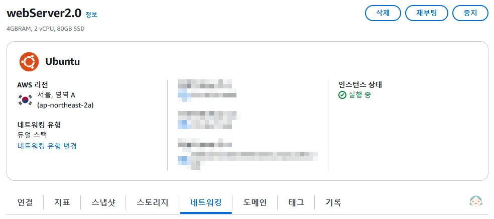
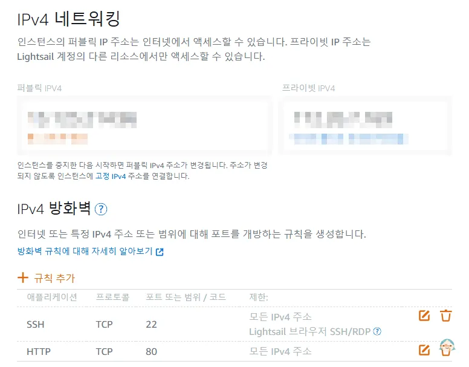
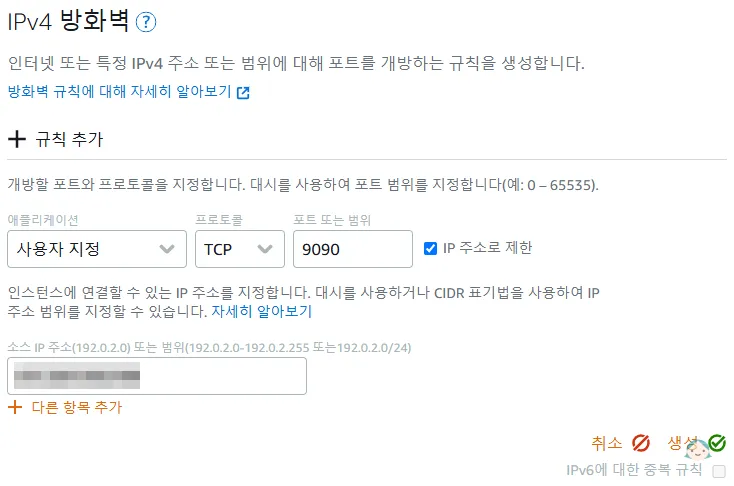
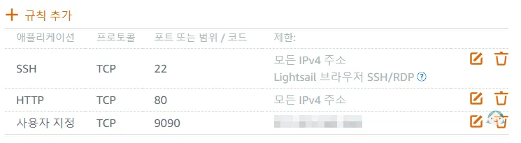
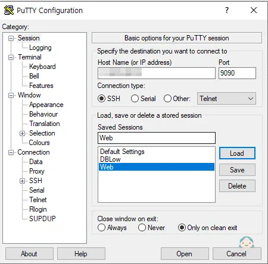
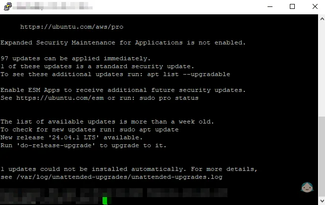

# SSH 기본포트 변경

> [!info]
> 사용 중인 인터넷 업체를 변경한 이후로 기존에 잘 접속되던 Lightsail SSH 연결이 되지 않는 문제가 발생했습니다.\
> 이런 경우 기본 포트(22)를 다른 포트로 변경하여 Lightsail SSH에 접속하는 방법을 알아봅시다.
>
> - **Lightsail Ubuntu 인스턴스 사용자 기준**

## 방화벽에 사용할 포트 추가

인스턴스 정보의 네트워크 탭을 선택합니다.
| {:class='image'} |
| :--------------------------------------------------------------------------: |
| _Lightsail 인스턴스 정보_{:class='caption'} |

IPv4 방화벽에 **+ 규칙 추가**를 선택합니다.
| {:class='image'} |
| :--------------------------------------------------------------------------: |
| _Lightsail 인스턴스 방화벽 규칙_{:class='caption'} |

`22`번 포트를 대신해서 사용할 `9090`번 포트를 추가하였습니다.
| {:class='image'} |
| :--------------------------------------------------------------------------: |
| _Lightsail 인스턴스 방화벽 규칙 추가_{:class='caption'} |

> [!tip] 규칙에 IP 주소로 제한 사용 (선택)
> `IP 주소로 제한`을 체크하고 접속 가능한 IP 주소를 추가하면 해당 IP 주소로만 접속이 가능하기 때문에 한층 더 보안을 강화할 수 있습니다.

<br />

방화벽 포트가 정상적으로 추가되었습니다.
| {:class='image'} |
| :--------------------------------------------------------------------------: |
| _Lightsail 인스턴스 방화벽 규칙_{:class='caption'} |

> [!danger] 기존 22번 포트 유지
> SSH 설정 파일 수정 시 SSH 접속이 필요하므로 <u>**변경된 포트로 연결이 성공하기 전에 22번 포트를 삭제하지 마세요!**</u>

## SSH 설정 파일 수정

이제 AWS에서 제공하는 브라우저 전용 SSH로 접속합니다.

```shell
$> sudo vi /etc/ssh/sshd_config
```

주석 처리되어 있는 포트 번호 부분을 주석 해제 후 방화벽에 추가한 포트 번호로 변경합니다.

```ini
# This is the sshd server system-wide configuration file.  See
# sshd_config(5) for more information.

# This sshd was compiled with PATH=/usr/local/sbin:/usr/local/bin:/usr/sbin:/usr/bin:/sbin
:/bin:/usr/games

# The strategy used for options in the default sshd_config shipped with
# OpenSSH is to specify options with their default value where
# possible, but leave them commented.  Uncommented options override the
# default value.

Include /etc/ssh/sshd_config.d/*.conf

#Port 22 // [!code --]
Port 9090 // [!code ++]
#AddressFamily any
#ListenAddress 0.0.0.0
#ListenAddress ::
...
```

설정 파일을 저장한 후 SSH 서비스를 재시작합니다.

```shell
$> sudo service sshd restart
```

## 연결 테스트

SSH 연결 프로그램(PuTTY 등)을 이용해 변경된 포트로 연결이 되는지 확인합니다.
| {:class='image'} |
| :--------------------------------------------------------------------------: |
| _PuTTY 연결_{:class='caption'} |

변경된 포트로 연결이 성공했습니다.
| {:class='image'} |
| :--------------------------------------------------------------------------: |
| _PuTTY 연결 성공_{:class='caption'} |

> [!tip] 방화벽 기본 SSH 포트 삭제
> 연결이 확인되면 네트워크 방화벽의 기본 포트(22)를 삭제해도 됩니다.
