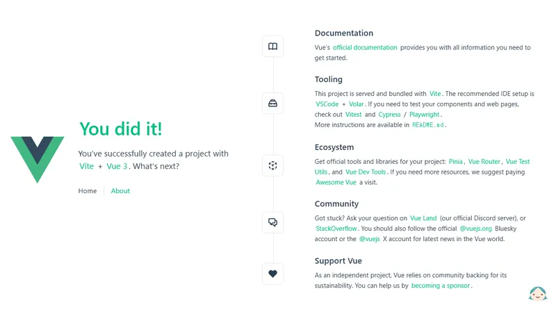
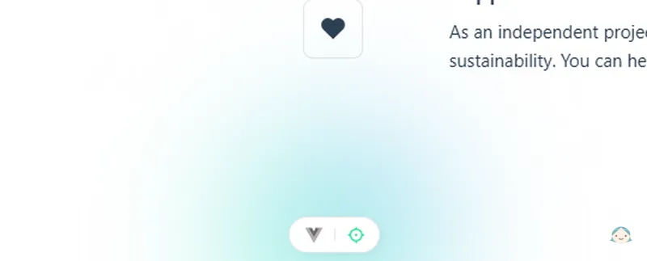
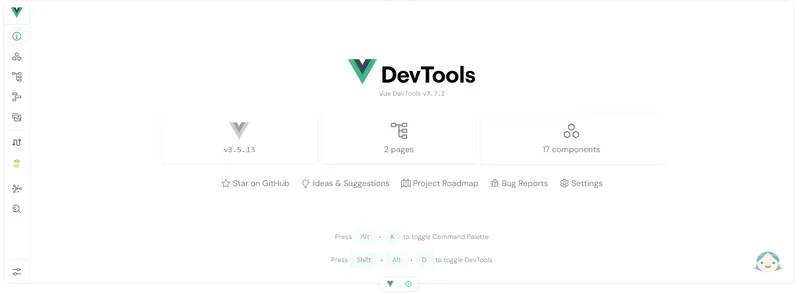
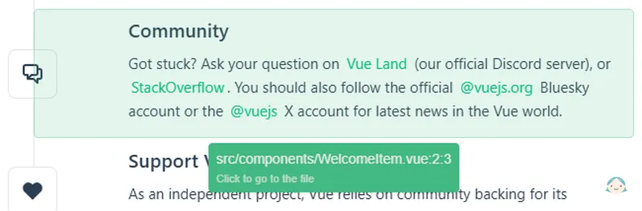
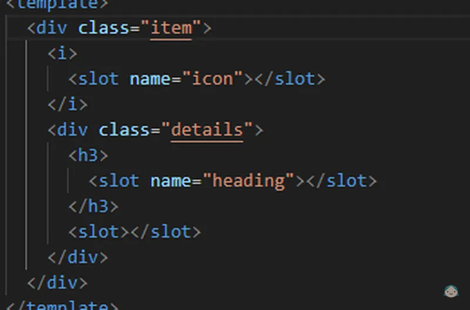

# 빠른 시작

::: info Vue 애플리케이션을 설치하기 앞서

- 최신 버전의 Node.js(버전 18.3 이상)가 설치되어 있어야 합니다.
  :::

## Vue 애플리케이션 만들기

애플리케이션을 만들 상위 경로에서 아래 명령줄을 실행합니다.

```sh
> npm create vue@latest
```

```sh
Need to install the following packages:
create-vue@3.14.2
Ok to proceed? (y) y


> npx
> create-vue


Vue.js - The Progressive JavaScript Framework

√ Project name: ... vue-study
√ Add TypeScript? ... No / Yes
√ Add JSX Support? ... No / Yes
√ Add Vue Router for Single Page Application development? ... No / Yes
√ Add Pinia for state management? ... No / Yes
√ Add Vitest for Unit Testing? ... No / Yes
√ Add an End-to-End Testing Solution? » No
√ Add ESLint for code quality? » Yes
√ Add Prettier for code formatting? ... No / Yes

Scaffolding project in vue-study...

Done. Now run:

  cd vue-study
  npm install
  npm run format
  npm run dev
```

::: info 설치 시 항목 설명

- Project name: 프로젝트 명 - 해당 경로로 프로젝트가 생성됩니다. (vue-study)
- Add TypeScript? : 타입 스크립트 사용 여부 (Yes)
- Add JSX Support? : JSX 구문 사용 여부 (No)
- Add Vue Router for Single Page Application development? : vue-router 를 사용한 spa 개발 여부 (yes)
- Add Pinia for state management? : Pinia 상태 관리 라이브러리 사용 여부 (Yes)
- Add Vitest for Unit Testing? : 유닛 테스트로 Vitest 사용 여부 (Yes)
- Add an End-to-End Testing Solution? : E2E 테스트 사용 여부 (No)
- Add ESLint for code quality? : ESLint 사용 여부 (Yes)
- Add Prettier for code formatting? : Prettier 사용 여부 (Yes)

**본인이 원하는 프로젝트 환경에 맞게 설정 및 설치 여부를 선택하면 됩니다.**
:::

프로젝트 폴더가 생성되면 해당 폴더로 이동한 후 `npm install`을 통해 의존성 모듈들을 설치해 줍니다.

<br />

설치가 완료되면 `npm run dev`를 실행하여 개발 서버를 시작합니다.

```sh
 VITE v6.2.0  ready in 2006 ms

  ➜  Local:   http://localhost:5173/
  ➜  Network: use --host to expose
  ➜  Vue DevTools: Open http://localhost:5173/__devtools__/ as a separate window
  ➜  Vue DevTools: Press Alt(⌥)+Shift(⇧)+D in App to toggle the Vue DevTools
  ➜  press h + enter to show help

```

<br />

브라우저에서 **http\://localhost:5173** 주소로 접속해 봅시다.

| {:class='image'} |
| :----------------------------------------------------------------: |
|                _Vue 애플리케이션_{:class='caption'}                |

Vue 애플리케이션 준비가 완료되었습니다!

최신 Vue 애플리케이션 프로젝트에서는 **Vue DevTools v7.7.2**와 **Toggle Component Inspector**가 기본적으로 포함됩니다.\
화면 중앙 하단에 두 개의 아이콘이 표시됩니다.

| {:class='image'} |
| :----------------------------------------------------------------: |
|   _Vue DevTools와 Toggle Component Inspector_{:class='caption'}    |

| {:class='image'} |
| :----------------------------------------------------------------: |
|                  _Vue DevTools_{:class='caption'}                  |

| {:class='image'} |
| :----------------------------------------------------------------: |
|           _Toggle Component Inspector_{:class='caption'}           |

**Toggle Component Inspector** 아이콘을 선택하고 페이지의 레이아웃 특정 영역을 선택하면 `Visual Studio Code`의 해당 코드 위치로 이동됩니다.

| {:class='image'} |
| :----------------------------------------------------------------: |
|           _Toggle Component Inspector_{:class='caption'}           |

개발 과정에서 상당한 편의성을 제공하는 기능이 될 것으로 보입니다.
